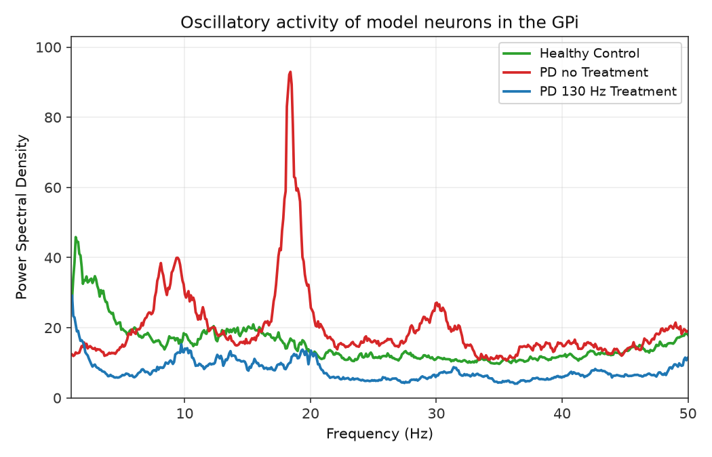
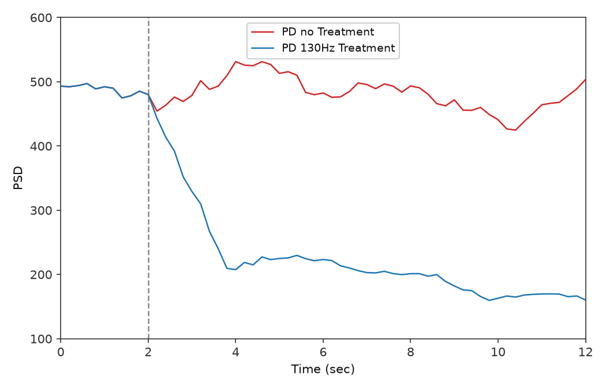

# Current replication figures

Replication PNGs live under `figures/papers/`; JSON caches under `artifacts/figures/papers/`. Comparison panels: [docs/figures/paper_1.md](docs/figures/paper_1.md).

---

## Mehregan et al. (paper 1)

### Figure 1b — GPi PSD (healthy vs PD vs 130 Hz cDBS)



| Field | Value |
|-------|-------|
| **Paper** | Mehregan et al. — adaptive DBS / quantization (paper 1) |
| **Panel** | Fig 1b — oscillatory activity / GPi power spectral density |
| **Title** | Oscillatory activity of model neurons in the GPi |
| **Legend** | Healthy Control; PD no Treatment; PD 130 Hz Treatment |
| **Axes** | x: Frequency (Hz), 1–50; y: Power Spectral Density, auto max + 10% headroom |
| **Paper crop** | `figures/papers/1/1b/paper.png` |
| **Replication PNG** | `figures/papers/1/1b/gpi_psd.png` |
| **Cache** | `artifacts/figures/papers/1/1b/` (`curves.json`, `manifest.json`) |
| **Comparison** | [docs/figures/paper_1.md § Fig 1b](docs/figures/paper_1.md#fig-1b--gpi-psd) |
| **Script** | `scripts/figures/papers/1/1b/plot.py` |
| **Spec** | [plant.md](docs/plant.md) |
| **Generated** | 2026-07-09 |

**Run:**

```bash
# Simulate + plot (~25 min) — writes curves cache
uv run python scripts/figures/papers/1/1b/plot.py

# Restyle only (~1 s) — no plant simulation
uv run python scripts/figures/papers/1/1b/plot.py --plot-only
uv run python scripts/figures/papers/1/1b/plot.py --plot-only --y-max 100
```

**Defaults:** seeds `0–9` (mean PSD), 10 s segment, Python plant, multitaper PSD (`fpass` 1–100 Hz) averaged over 10 GPi neurons per seed.

**Qualitative gate (seeds 0–9, 2026-07-09):** mean $P_\beta$ orders PD ($\approx 487$) > healthy ($\approx 294$); 130 Hz cDBS suppresses beta ($\approx 164$). Single-seed runs can show sharp healthy beta spikes — seed averaging smooths those.

---

### Figure 2a — cDBS effect on GPi beta power over time



| Field | Value |
|-------|-------|
| **Paper** | Mehregan et al. — adaptive DBS / quantization (paper 1) |
| **Panel** | Fig 2a — cDBS effects on beta power of GPi neurons |
| **Legend** | PD no Treatment; PD 130 Hz Treatment |
| **Axes** | x: Time (sec), 0–12; y: PSD (GPi $P_\beta$, 13–35 Hz), default 100–600 |
| **Protocol** | 14 s sim (2 s pre-roll); plot = sim − 2 s; DBS at sim 4 s; 0.2 s trailing / 2 s window (end sim 14 s); Fig 2a GPI spike buffer 904 |
| **Paper crop** | `figures/papers/1/2a/paper.png` |
| **Replication PNG** | `figures/papers/1/2a/beta_power.png` |
| **Cache** | `artifacts/figures/papers/1/2a/` (`series.json`, `manifest.json`) |
| **Comparison** | [docs/figures/paper_1.md § Fig 2a](docs/figures/paper_1.md#fig-2a--gpi-p_beta-time-series) |
| **Script** | `scripts/figures/papers/1/2a/plot.py` |
| **Spec** | [plant.md](docs/plant.md) |
| **Generated** | 2026-07-11 (end sim 14 s, GPI buffer 904, seed 0) |

**Run:**

```bash
# Simulate + plot (~5–10 min per seed) — writes series cache
uv run python scripts/figures/papers/1/2a/plot.py

# Paper step bins (6×2 s)
uv run python scripts/figures/papers/1/2a/plot.py --sampling segment

# Restyle only (~1 s) — no plant simulation
uv run python scripts/figures/papers/1/2a/plot.py --plot-only
uv run python scripts/figures/papers/1/2a/plot.py --seeds 0,1,2,3,4,5,6,7,8,9
```

**Defaults:** seed `0`, **0.2 s** trailing samples, **2 s** overlapping window, 14 s integrate with 2 s pre-roll.

**End protocol note:** windows end at sim 14 s; Fig 2a uses enlarged GPI spike buffer — see [paper_1.md § Fig 2a](docs/figures/paper_1.md#fig-2a--gpi-p_beta-time-series).

**Qualitative gate (seed 0):** shared high baseline at `t=0`; 130 Hz drops after display 2 s; no-treatment stays elevated; trailing windows slide through `t=12` (last window sim `[12, 14]`); red ~503 and blue ~160 at `t=12` with ripple, not a flat tail.

---

## Mehregan et al. — Fig 5 / Fig 6 (beta time series)

See `scripts/figures/plot_beta_psd_paper_figures.py` and artifacts under `artifacts/ddpg/` (`fig5a_beta_psd_45hz.png`, `fig5b_beta_psd_30hz.png`, etc.). Not yet indexed in [paper_1.md](docs/figures/paper_1.md).
