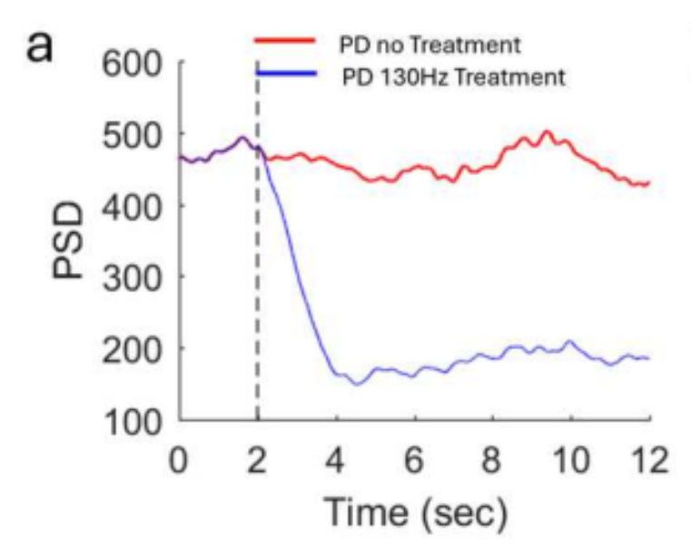
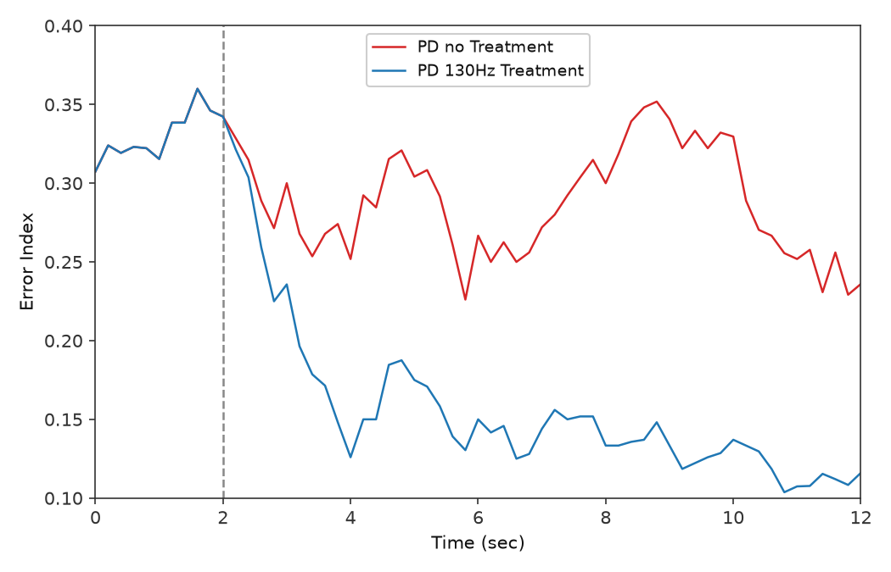
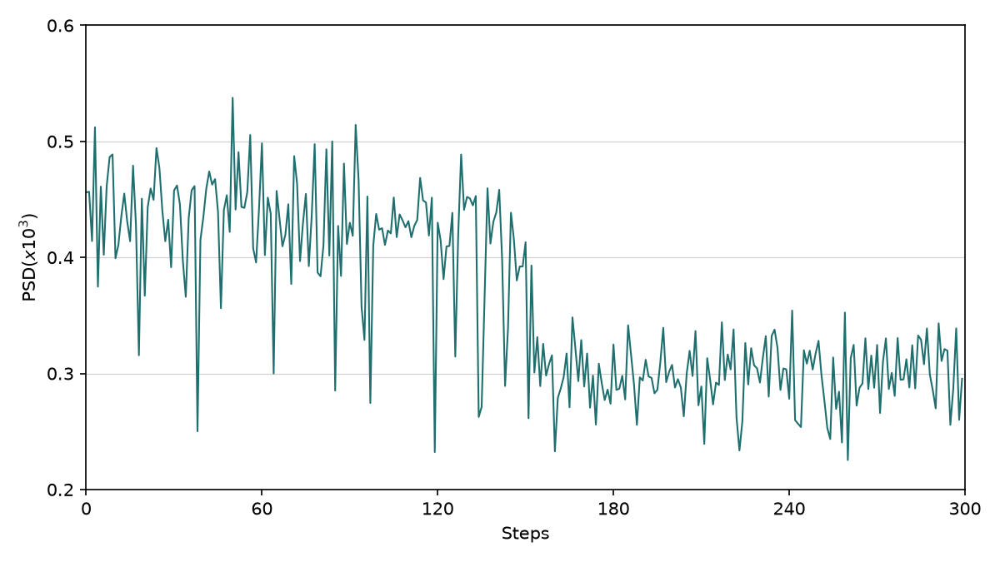
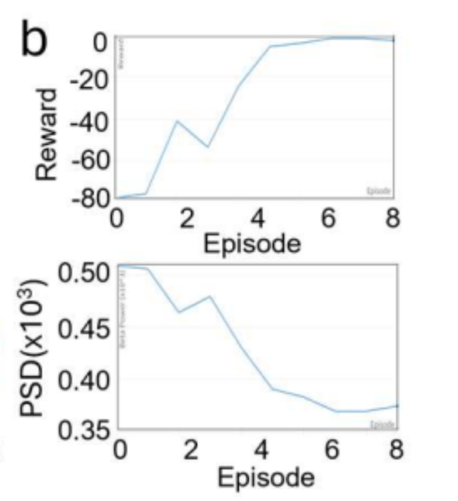
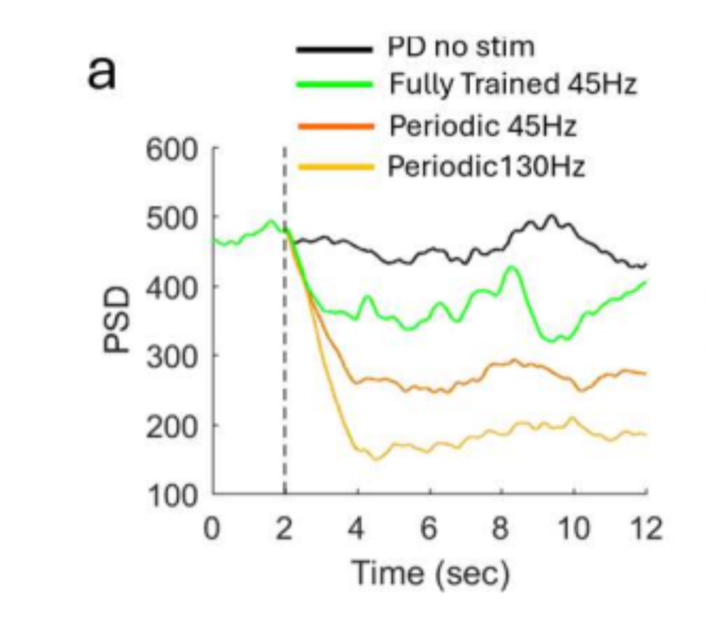
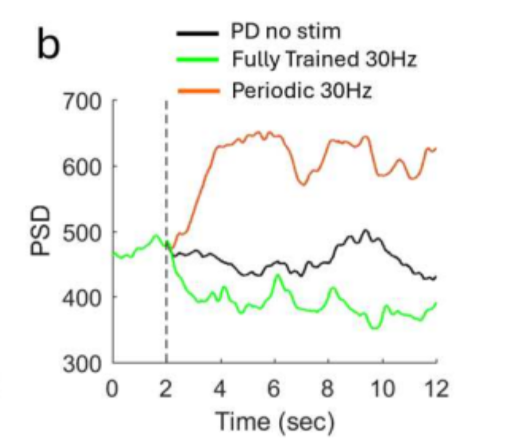
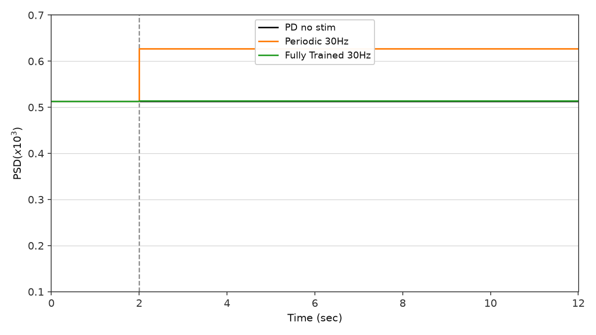
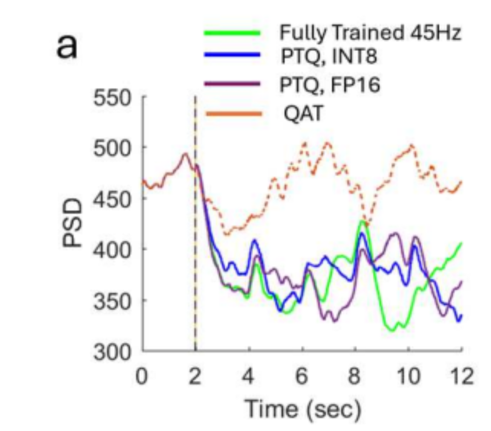

# Mehregan et al. (paper 1) — figure comparisons

Side-by-side **paper panel** vs **our replication** for qualitative checks. Plot scripts write replication PNGs to `figures/papers/`; JSON caches to `artifacts/figures/papers/`.

**Passed panels** (1b, 2a, 2b, 4a) use a short **Status** block. **Open panels** keep a full side-by-side checklist until gates pass.

| Panel | Script | Spec | Status |
|-------|--------|------|--------|
| Fig 1b — GPi PSD | `scripts/figures/papers/1/1b/plot.py` | [plant.md](../plant.md) | Pass |
| Fig 2a — GPi $P_\beta$ time series | `scripts/figures/papers/1/2a/plot.py` | [plant.md](../plant.md) | Pass |
| Fig 2b — Error Index time series | `scripts/figures/papers/1/2b/plot.py` | [plant.md](../plant.md) | Pass |
| Fig 4a — training $P_\beta$ vs step | `scripts/figures/papers/1/4a/plot.py` | [environment.md](../environment.md), [ddpg/replication.md](../controllers/ddpg/replication.md) | Pass (v4) |
| Fig 4b — training reward vs episode | `scripts/figures/papers/1/4b/plot.py` (planned) | [environment.md](../environment.md), [ddpg/replication.md](../controllers/ddpg/replication.md) | Open |
| Fig 5a — post-train efficacy @ 45 Hz | `scripts/figures/papers/1/5a/plot.py` (planned) | [environment.md](../environment.md), [ddpg/replication.md](../controllers/ddpg/replication.md) | Open |
| Fig 5b — post-train efficacy @ 30 Hz | `scripts/figures/papers/1/5b/plot.py` | [environment.md](../environment.md), [ddpg/replication.md](../controllers/ddpg/replication.md) | Open (interim plot) |
| Fig 6a — PTQ / QAT @ 45 Hz | `scripts/figures/papers/1/6a/plot.py` (planned) | [controllers/ddpg/replication.md](../controllers/ddpg/replication.md) | Open |
| Fig 6b — PTQ / QAT @ 30 Hz | `scripts/figures/papers/1/6b/plot.py` (planned) | [controllers/ddpg/replication.md](../controllers/ddpg/replication.md) | Open |

Replication PNGs: `figures/papers/`. JSON caches: `artifacts/figures/papers/`.

---

## Fig 1b — GPi PSD

Mean GPi multitaper power spectral density (1–50 Hz) for three conditions: **healthy control**, **PD no treatment**, and **PD + 130 Hz STN cDBS**. Ordering gate: **PD > healthy** on beta power and **130 Hz cDBS < PD** (see [plant.md](../plant.md)).

### Paper (Mehregan et al.)


### Replication


<!-- caption-1b:start -->
**Caption:** see manifest

**Manifest:** `artifacts/figures/papers/1/1b/manifest.json`
<!-- caption-1b:end -->

**Status:** Pass — condition ordering and beta-peak shape match the paper panel (seeds `0–9` mean).

**Run:**

```bash
uv run python scripts/figures/papers/1/1b/plot.py
uv run python scripts/figures/papers/1/1b/plot.py --plot-only
```

**Defaults:** seeds `0–9` (mean PSD), 10 s segment, Python plant.

---

## Fig 2a — GPi $P_\beta$ time series

GPi beta-band power ($P_\beta$, Eq. 1, 13–35 Hz) over **12 s**: **PD no treatment** (red) vs **PD + 130 Hz cDBS** (blue). Shared baseline 0–2 s; dashed vertical at **2 s** (cDBS onset for blue). After onset, blue falls to a low plateau; red stays elevated.

### Paper (Mehregan et al.)



### Replication


<!-- caption-2a:start -->
**Caption:** 14 s sim (2 s pre-roll), plot = sim − 2 s, 0.2 s trailing / 2 s window (end sim 14 s), seed 0 (2026-07-11)

**Manifest:** `artifacts/figures/papers/1/2a/manifest.json`
<!-- caption-2a:end -->

**Status:** Pass — blue-below-red after $t=2$, shared 0–2 s baseline, dense trailing protocol. Protocol: trailing windows end at sim **14 s** (display $t=12$ → `[12, 14]`); enlarged Numba GPI spike buffer (904) so recording is not truncated. Remaining polish: blue floor slightly below paper at $t=12$; single seed (0).

**Run:**

```bash
uv run python scripts/figures/papers/1/2a/plot.py
uv run python scripts/figures/papers/1/2a/plot.py --plot-only
uv run python scripts/figures/papers/1/2a/plot.py --sampling segment
```

**Defaults:** seed `0`, 0.2 s trailing samples, 2 s overlapping window, 14 s integrate with 2 s pre-roll.

---

## Fig 2b — Error Index time series

Windowed Error Index (EI, Eq. 2) over **12 s** with **So-style SMC pulses into TH** (path A): BoC inverse-gamma on **Iappth**, `iappth_baseline=0`, `ggith=0.112`. **PD no treatment** (red) vs **PD + 130 Hz cDBS** (blue). Same timing as Fig 2a. Y-axis **Error Index** (replication default **0.10–0.4**; paper panel reads ~0–0.4).

### Paper (Mehregan et al.)


### Replication



<!-- caption-2b:start -->
**Caption:** 14 s sim (2 s pre-roll), plot = sim − 2 s, 0.2 s trailing / 2 s EI window (end sim 14 s), SMC BoC inv-gamma Iappth, backend python, seed 0, v2, y-axis 0.10–0.4 (2026-07-13)

**Manifest:** `artifacts/figures/papers/1/2b/manifest.json`
<!-- caption-2b:end -->

**Status:** Pass — blue-below-red after $t=2$, shared baseline, blue floor ~0.12 near paper. Remaining polish: red $t=12$ slightly low (~0.24 vs ~0.30); single seed.

**Run:**

```bash
uv run --group figures python scripts/figures/papers/1/2b/plot.py
uv run --group figures python scripts/figures/papers/1/2b/plot.py --plot-only
```

Each run writes a new ``figures/papers/1/2b/error_index_vN.png`` (N auto-increments) and updates the replication image link above.

**Defaults:** seed `0`, `smc_site='thalamic'`, `iappth_baseline=0`, `ggith=0.112`, `smc_amplitude=3.5`, `smc_schedule='boc'`, `smc_pulse_source='drive'`, backend **python**.

### Convention (path A, 2026-07-12)

**Citations (split roles):** Gao et al. (ICCPS 2020) define the **EI metric** Mehregan uses (exactly one TH spike in $(\mathrm{SMC}_\tau,\mathrm{SMC}_\tau{+}25\,\mathrm{ms})$; windowed $T_\omega{=}2\,\mathrm{s}$). So et al. (2012) define the **TH drive** for that metric (SMC current pulses into TH; TH not spontaneously active). Kumaravelu replaced those pulses with constant $I_{\mathrm{appth}}=1.2$; Fig 2b restores So-style drive: **pulses only** (`iappth_baseline=0`) plus BoC inverse-gamma timing (~14 Hz mean). Cortical `Iappco` SMC remains available but does **not** produce paper ordering (no Cor→TH synapse). Sweep: `artifacts/probes/fig2b_ei_so_path_a_sweep.json`.

---

## Fig 4a — training beta power vs step

Per-step GPi beta-band power during DDPG training of the **45 Hz** mean-frequency model (§IV.A.1): **300** environment steps (10 episodes × 30 steps). Y-axis **PSD(x10³)** = raw $P_\beta / 1000$ (same scale as the paper panel). The paper trace is noisy early (~0.43–0.57), then drops sharply around step **130–150** and settles lower (~0.35–0.45).

### Paper (Mehregan et al.)


### Replication



<!-- caption-4a:start -->
**Caption:** 45 Hz fixed_mean_pattern, within_step L=1, reward=full_segment, softmax, critic=one_hot, seed 0, v4 (same training trace as v3; y-axis auto-fit so late points below 0.3 are visible), init_bias=0.5, early=0.428 late=0.299, trend↓ (2026-07-13). Locked as preferred replication — qualitative high→drop→low shape matches the paper panel.

**Manifest:** `artifacts/figures/papers/1/4a/manifest.json`
<!-- caption-4a:end -->

**Status:** Pass (v4) — same seed-0 training run as v3; plot y-limits extended to show the full trace. Qualitative shape match (noisy early, drop ~130–150, lower late). Late mean sits a bit below the paper’s ~0.35–0.45 band; accepted as polish, not a blocker.

### Side-by-side checklist

Qualitative gates first; numeric bands are approximate (paper read from panel; replication from `artifacts/figures/papers/1/4a/manifest.json`).

| Check | Paper | Replication | Match? |
|-------|-------|-------------|--------|
| **Plot style** | Single noisy line, 0–300 steps | Line trace, 300 steps | ✓ |
| **Axes** | Steps 0–300; y **PSD(x10³)** ~0.3–0.6 | Same labels; y auto-fits full trace (v4: 0.2–0.6) | ✓ |
| **Early band (steps 0–130)** | ~0.43–0.57, high variance | mean 0.428 | ✓ |
| **Drop timing** | Sharp fall ~step 130–150 | mid(120–150) mean 0.403 | ✓ |
| **Late band (steps 150–300)** | ~0.35–0.45 | mean 0.299 (a bit low; shape OK) | ~ |
| **Overall trend** | Mean beta **decreases** over training | end−start window Δ=-0.133 | ✓ |

**Run:**

```bash
uv run python scripts/figures/papers/1/4a/plot.py
uv run python scripts/figures/papers/1/4a/plot.py --plot-only
```

Each run writes a new ``figures/papers/1/4a/training_beta_vN.png`` (N auto-increments) and updates the replication image link above. Prefer keeping the locked **v4** image unless intentionally re-promoting.

Long run (~30–60 min Python plant). Use tmux:

```bash
tmux new-session -d -s fig4a-train \
 "setsid nohup uv run python scripts/figures/papers/1/4a/plot.py >> logs/fig4a-train.log 2>&1 < /dev/null"
```

**Defaults:** seed `0`, **45 Hz** mean init, `state_length=1`, `fixed_mean_pattern`, **softmax** exploration (τ 3→1), **`critic_action_input=one_hot`**, `init_bias_scale=0.5`, `plant.dt_ms=0.02`.

---

## Fig 4b — training reward vs episode

Episode **total reward** during the same **45 Hz** DDPG run as Fig 4a (§IV.A.1: 10 episodes × 30 steps). The paper panel shows reward rising quickly from roughly **−80** toward **0** by episodes **4–6**, then plateauing near zero; a companion trace in the same panel plots episode-mean **PSD(x10³)** falling inversely (~0.50 → ~0.37).

### Paper (Mehregan et al.)



### Replication

*Not yet generated.* Target: `figures/papers/1/4b/training_reward.png`

<!-- caption-4b:start -->
**Caption:** TBD

**Manifest:** `artifacts/figures/papers/1/4b/manifest.json` (planned)
<!-- caption-4b:end -->

**Status:** Open — paper PNG indexed; dedicated plot script not yet promoted.

### Side-by-side checklist

Qualitative gates first; numeric bands are approximate (paper read from panel).

| Check | Paper | Replication | Match? |
|-------|-------|-------------|--------|
| **Plot style** | Episode reward line, episodes 1–10 | TBD | — |
| **Axes** | Episodes ~0–8 (10 total); reward ~−80–0 | TBD | — |
| **Early episodes (1–3)** | Reward still negative (~−80 to ~−55) | TBD | — |
| **Rise timing** | Sharp climb episodes **~3–5** toward ~0 | TBD | — |
| **Late episodes (6–10)** | Plateau near **0** | TBD | — |
| **Episode-mean β (if plotted)** | Decreases as reward rises (~0.50 → ~0.37) | TBD | — |

**Interim run** (episode rewards land in the Fig 4a cache until `4b/plot.py` exists):

```bash
uv run python scripts/figures/papers/1/4a/plot.py
# episode_rewards[] in artifacts/figures/papers/1/4a/manifest.json
```

**Defaults:** same training stack as Fig 4a (45 Hz, seed `0`, `state_length=1`, softmax + one_hot critic, `plant.dt_ms=0.02`).

**Acceptance (automation):** `ep10 > ep1` or peak recovery `> 20` reward units (see `scripts/training/run_task166_pattern_train_30hz_decoupled_fig45.py` `_fig4b_pass`).

---

## Fig 5a — post-train efficacy @ 45 Hz

Post-training evaluation on the **45 Hz** model (§IV.A.2): **12 s** display = **2 s** baseline (shared pre-stim) + **5** repeated **2 s** stimulation steps. Step-function **GPi** $P_\beta$ (raw PSD scale, 100–600 in the paper panel) for four conditions on the **same seed**:

1. **PD no stim** (black)
2. **Fully trained** 45 Hz pattern policy (green)
3. **Periodic 45 Hz** (pattern 0 / regular train init) (orange)
4. **Periodic 130 Hz** cDBS (yellow)

Dashed vertical at **2 s** (stimulation onset). Paper claims: trained stimulation **reduces** beta vs no stim after onset and shows efficacy at the **fixed 45 Hz** mean rate (not necessarily the lowest trace — 130 Hz cDBS is lower).

### Paper (Mehregan et al.)



### Replication

*Not yet generated.* Target: `figures/papers/1/5a/efficacy_45hz.png`

<!-- caption-5a:start -->
**Caption:** TBD

**Manifest:** `artifacts/figures/papers/1/5a/manifest.json` (planned)
<!-- caption-5a:end -->

**Status:** Open — paper PNG indexed; eval/plot pipeline exists but not yet promoted to `figures/papers/1/5a/`.

### Side-by-side checklist

| Check | Paper | Replication | Match? |
|-------|-------|-------------|--------|
| **Protocol** | 2 s baseline + 5×2 s steps; fixed seed | TBD | — |
| **Series** | no stim, trained 45 Hz, periodic 45 Hz, 130 Hz cDBS | TBD | — |
| **Shared baseline (0–2 s)** | Traces overlap pre-onset | TBD | — |
| **Ordering after onset** | **130 Hz** lowest; trained **< no stim** | TBD | — |
| **Trained vs periodic 45 Hz** | Trained above periodic 45 Hz on raw $P_\beta$ but paper-claimed efficacious at same mean rate | TBD | — |

**Interim run:**

```bash
uv run python scripts/run_task108_paper_protocol_eval.py --mean-hz 45 \
  --landscape artifacts/ddpg/pattern_reward_landscape_45hz.json \
  --checkpoint artifacts/ddpg/<trained_45hz_checkpoint>.pt
uv run python scripts/figures/plot_beta_psd_paper_figures.py
```

Writes interim PNG to `artifacts/ddpg/fig5a_beta_psd_45hz.png` until `5a/plot.py` promotes into `figures/papers/1/5a/`.

**Defaults:** seed `0`, `plant.dt_ms=0.02`, `state_length=1`, `fixed_mean_pattern`, `pattern_mean_hz=45`.

---

## Fig 5b — post-train efficacy @ 30 Hz

Same **12 s** paper-protocol eval for the **30 Hz** trained model (§IV.A.2). Three conditions:

1. **PD no stim** (black)
2. **Fully trained** 30 Hz pattern policy (green)
3. **Periodic 30 Hz** (pattern 0) (orange)

Key paper claim: **periodic 30 Hz elevates** beta (stimulation rate inside the beta band); the **trained irregular** pattern **lowers** beta below both no stim and periodic 30 Hz.

### Paper (Mehregan et al.)



### Replication



<!-- caption-5b:start -->
**Caption:** Interim 30 Hz paper-protocol eval (task108 JSON), PSD(x10³) scale, y-axis 0.10–0.70; periodic mean=0.627, trained mean=0.514 (seed 0).

**Manifest:** `artifacts/figures/papers/1/5b/manifest.json`
<!-- caption-5b:end -->

**Status:** Open — hardest computational gate; prior 30 Hz retrains **failed** trained `<` no-stim (see [replication-fidelity.md](../development/replication-fidelity.md)).

### Side-by-side checklist

| Check | Paper | Replication | Match? |
|-------|-------|-------------|--------|
| **Protocol** | 2 s baseline + 5×2 s steps; fixed seed | TBD | — |
| **Periodic 30 Hz vs no stim** | Periodic **>** no stim after $t=2$ | TBD | — |
| **Trained vs no stim** | Trained **<** no stim after $t=2$ | TBD | — |
| **Trained vs periodic 30 Hz** | Trained **<** periodic 30 Hz | TBD | — |
| **Qualitative shape** | Green low band ~350–430; orange high ~580–650 | TBD | — |

**Interim run:**

```bash
uv run python scripts/run_task108_paper_protocol_eval.py --mean-hz 30 \
  --landscape artifacts/ddpg/pattern_reward_landscape_30hz.json \
  --checkpoint artifacts/ddpg/<trained_30hz_checkpoint>.pt
uv run python scripts/figures/plot_beta_psd_paper_figures.py
```

Writes interim PNG to `artifacts/ddpg/fig5b_beta_psd_30hz.png`.

**Defaults:** seed `0`, `plant.dt_ms=0.02`, `pattern_mean_hz=30`; same env stack as 45 Hz except mean init.

**Acceptance (automation):** trained mean $P_\beta$ `<` no-stim **and** `<` periodic 30 Hz (`_fig5b_pass` in training scripts).

---

## Fig 6a — PTQ / QAT @ 45 Hz

Quantization comparison on the **45 Hz** trained policy (§IV.A.3): step-function $P_\beta$ over the same **12 s** eval protocol. Four series:

1. **Fully trained** (fp32) (green)
2. **PTQ, int8** (blue)
3. **PTQ, fp16** (purple)
4. **QAT** (dashed orange)

Paper claim: **PTQ** (fp16 and int8) tracks full-precision beta suppression after onset; **QAT** (10 episodes) **fails** to reduce beta and stays near the pre-stim level.

### Paper (Mehregan et al.)



### Replication

*Not yet generated.* Target: `figures/papers/1/6a/ptq_qat_45hz.png`

<!-- caption-6a:start -->
**Caption:** TBD

**Manifest:** `artifacts/figures/papers/1/6a/manifest.json` (planned)
<!-- caption-6a:end -->

**Status:** Open — depends on a passing 45 Hz trained checkpoint; PTQ/QAT hooks exist in `controllers/ddpg/quantization.py`.

### Side-by-side checklist

| Check | Paper | Replication | Match? |
|-------|-------|-------------|--------|
| **Protocol** | Same 12 s eval as Fig 5a | TBD | — |
| **PTQ fp16 / int8 vs fp32** | Track closely after $t=2$ (~320–430 band) | TBD | — |
| **QAT vs fp32** | QAT stays **elevated** (~420–510); does not suppress beta | TBD | — |
| **Onset marker** | Dashed vertical at **2 s** | TBD | — |

**Interim run:**

```bash
# After fp32 checkpoint + paper-protocol eval JSON exist:
uv run python scripts/figures/plot_beta_psd_paper_figures.py \
  --fig6-json artifacts/ddpg/<eval_45hz_ptq_int8>.json \
  --fig6-json artifacts/ddpg/<eval_45hz_ptq_fp16>.json \
  --fig6-json artifacts/ddpg/<eval_45hz_qat>.json
```

Benchmark slugs: `ptq-fp16`, `ptq-int8`, `qat` ([benchmarking.md](../benchmarking.md)).

**Defaults:** 45 Hz trained actor; eval seed `0`; `plant.dt_ms=0.02`.

---

## Fig 6b — PTQ / QAT @ 30 Hz

Same quantization panel layout as Fig 6a for the **30 Hz** trained model (§IV.A.3): fp32, PTQ int8, PTQ fp16, and QAT. Paper shows the same qualitative split — PTQ tracks fp32 suppression; QAT remains high.

### Paper (Mehregan et al.)


### Replication

*Not yet generated.* Target: `figures/papers/1/6b/ptq_qat_30hz.png`

<!-- caption-6b:start -->
**Caption:** TBD

**Manifest:** `artifacts/figures/papers/1/6b/manifest.json` (planned)
<!-- caption-6b:end -->

**Status:** Open — blocked on passing 30 Hz trained policy (Fig 5b); QAT failure mode should reproduce even if fp32 is weak.

### Side-by-side checklist

| Check | Paper | Replication | Match? |
|-------|-------|-------------|--------|
| **Protocol** | Same 12 s eval as Fig 5b | TBD | — |
| **PTQ fp16 / int8 vs fp32** | Track closely after $t=2$ | TBD | — |
| **QAT vs fp32** | QAT elevated; no beta suppression | TBD | — |
| **Mean-rate context** | 30 Hz fp32 may sit higher than 45 Hz panel | TBD | — |

**Interim run:** same as Fig 6a with `--json-30hz` eval payloads and 30 Hz checkpoints.

**Defaults:** 30 Hz trained actor; eval seed `0`; `plant.dt_ms=0.02`.
