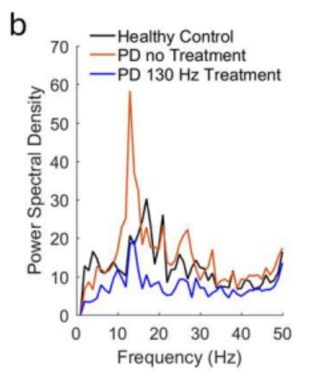
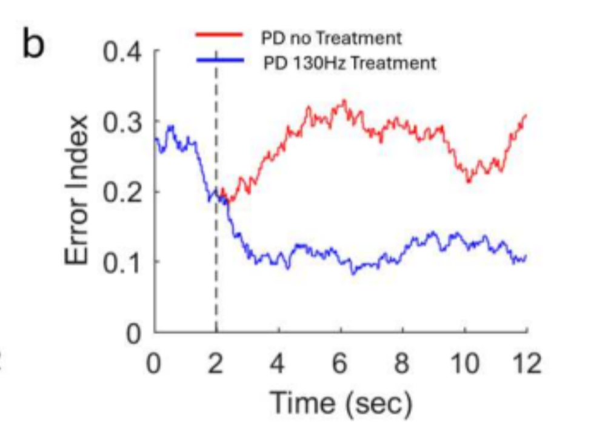
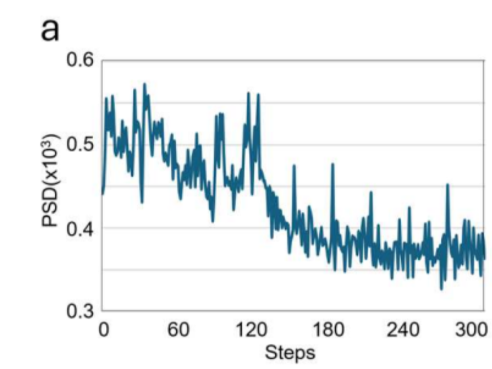
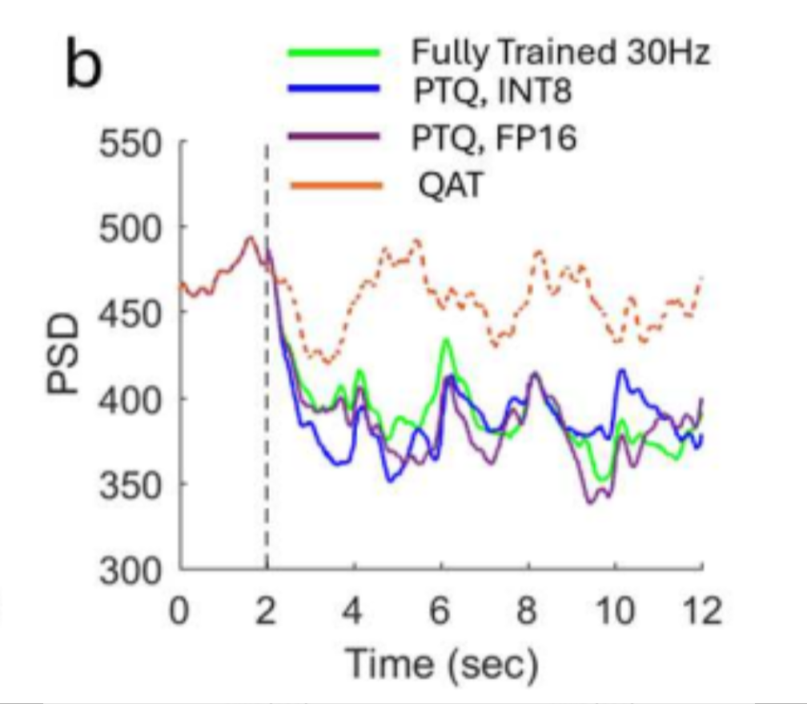

# Mehregan et al. (paper 1) — figure comparisons

**Primary replication tracker** for this repo. Work is scheduled by **panel**, not by roadmap phase: each row below is an exit criterion with qualitative gates, a committed `plot.py`, and side-by-side PNGs.

Side-by-side **paper panel** vs **our replication** for qualitative checks. Plot scripts write replication PNGs to `figures/papers/`; JSON caches to `artifacts/figures/papers/`.

**Passed panels** (1b, 2a, 2b, 4a, 4b, 5a) use a short **Status** block. **Open panels** keep a full side-by-side checklist until gates pass.

| Panel | Script | Spec | Status |
|-------|--------|------|--------|
| Fig 1b — GPi PSD | `scripts/figures/papers/1/1b/plot.py` | [plant.md](../plant.md) | Pass |
| Fig 2a — GPi $P_\beta$ time series | `scripts/figures/papers/1/2a/plot.py` | [plant.md](../plant.md) | Pass |
| Fig 2b — Error Index time series | `scripts/figures/papers/1/2b/plot.py` | [plant.md](../plant.md) | Pass |
| Fig 4a — training $P_\beta$ vs step | `scripts/figures/papers/1/4a/plot.py` | [environment.md](../environment.md), [ddpg/replication.md](../controllers/ddpg/replication.md) | Pass (v4) |
| Fig 4b — training reward vs episode | `scripts/figures/papers/1/4b/plot.py` | [environment.md](../environment.md), [ddpg/replication.md](../controllers/ddpg/replication.md) | Pass |
| Fig 5a — post-train efficacy @ 45 Hz | `scripts/figures/papers/1/5a/plot.py` | [environment.md](../environment.md), [ddpg/replication.md](../controllers/ddpg/replication.md) | Pass |
| Fig 5b — post-train efficacy @ 30 Hz | `scripts/figures/papers/1/5b/plot.py` | [environment.md](../environment.md), [ddpg/replication.md](../controllers/ddpg/replication.md) | Open (retrain in progress) |
| Fig 6a — PTQ / QAT @ 45 Hz | `scripts/figures/papers/1/6a/plot.py` | [controllers/ddpg/replication.md](../controllers/ddpg/replication.md) | Open |
| Fig 6b — PTQ / QAT @ 30 Hz | `scripts/figures/papers/1/6b/plot.py` (planned) | [controllers/ddpg/replication.md](../controllers/ddpg/replication.md) | Open |

Replication PNGs: `figures/papers/`. JSON caches: `artifacts/figures/papers/`.

---

## Fig 1b — GPi PSD

Mean GPi multitaper power spectral density (1–50 Hz) for three conditions: **healthy control**, **PD no treatment**, and **PD + 130 Hz STN cDBS**. Ordering gate: **PD > healthy** on beta power and **130 Hz cDBS < PD** (see [plant.md](../plant.md)).

### Paper (Mehregan et al.)



### Replication


<!-- caption-1b:start -->
**Caption:** see manifest

**Manifest:** `artifacts/figures/papers/1/1b/manifest.json`
<!-- caption-1b:end -->

**Status:** Pass — condition ordering and beta-peak shape match the paper panel (seeds `0–9` mean).

**Run:**

```bash
uv run python scripts/figures/papers/1/1b/plot.py
uv run python scripts/figures/papers/1/1b/plot.py --plot-only
```

**Defaults:** seeds `0–9` (mean PSD), 10 s segment, Python plant.

---

## Fig 2a — GPi $P_\beta$ time series

GPi beta-band power ($P_\beta$, Eq. 1, 13–35 Hz) over **12 s**: **PD no treatment** (red) vs **PD + 130 Hz cDBS** (blue). Shared baseline 0–2 s; dashed vertical at **2 s** (cDBS onset for blue). After onset, blue falls to a low plateau; red stays elevated.

### Paper (Mehregan et al.)


### Replication


<!-- caption-2a:start -->
**Caption:** 14 s sim (2 s pre-roll), plot = sim − 2 s, 0.2 s trailing / 2 s window (end sim 14 s), seed 0 (2026-07-11)

**Manifest:** `artifacts/figures/papers/1/2a/manifest.json`
<!-- caption-2a:end -->

**Status:** Pass — blue-below-red after $t=2$, shared 0–2 s baseline, dense trailing protocol. Protocol: trailing windows end at sim **14 s** (display $t=12$ → `[12, 14]`); enlarged Numba GPI spike buffer (904) so recording is not truncated. Remaining polish: blue floor slightly below paper at $t=12$; single seed (0).

**Run:**

```bash
uv run python scripts/figures/papers/1/2a/plot.py
uv run python scripts/figures/papers/1/2a/plot.py --plot-only
uv run python scripts/figures/papers/1/2a/plot.py --sampling segment
```

**Defaults:** seed `0`, 0.2 s trailing samples, 2 s overlapping window, 14 s integrate with 2 s pre-roll.

---

## Fig 2b — Error Index time series

Windowed Error Index (EI, Eq. 2) over **12 s** with **So-style SMC pulses into TH** (path A): BoC inverse-gamma on **Iappth**, `iappth_baseline=0`, `ggith=0.112`. **PD no treatment** (red) vs **PD + 130 Hz cDBS** (blue). Same timing as Fig 2a. Y-axis **Error Index** (replication default **0.10–0.4**; paper panel reads ~0–0.4).

### Paper (Mehregan et al.)



### Replication


<!-- caption-2b:start -->
**Caption:** 14 s sim (2 s pre-roll), plot = sim − 2 s, 0.2 s trailing / 2 s EI window (end sim 14 s), SMC BoC inv-gamma Iappth, backend python, seed 0, v2, y-axis 0.10–0.4 (2026-07-13)

**Manifest:** `artifacts/figures/papers/1/2b/manifest.json`
<!-- caption-2b:end -->

**Status:** Pass — blue-below-red after $t=2$, shared baseline, blue floor ~0.12 near paper. Remaining polish: red $t=12$ slightly low (~0.24 vs ~0.30); single seed.

**Run:**

```bash
uv run --group figures python scripts/figures/papers/1/2b/plot.py
uv run --group figures python scripts/figures/papers/1/2b/plot.py --plot-only
```

Each run writes a new ``figures/papers/1/2b/error_index_vN.png`` (N auto-increments) and updates the replication image link above.

**Defaults:** seed `0`, `smc_site='thalamic'`, `iappth_baseline=0`, `ggith=0.112`, `smc_amplitude=3.5`, `smc_schedule='boc'`, `smc_pulse_source='drive'`, backend **python**.

### Convention (path A, 2026-07-12)

**Citations (split roles):** Gao et al. (ICCPS 2020) define the **EI metric** Mehregan uses (exactly one TH spike in $(\mathrm{SMC}_\tau,\mathrm{SMC}_\tau{+}25\,\mathrm{ms})$; windowed $T_\omega{=}2\,\mathrm{s}$). So et al. (2012) define the **TH drive** for that metric (SMC current pulses into TH; TH not spontaneously active). Kumaravelu replaced those pulses with constant $I_{\mathrm{appth}}=1.2$; Fig 2b restores So-style drive: **pulses only** (`iappth_baseline=0`) plus BoC inverse-gamma timing (~14 Hz mean). Cortical `Iappco` SMC remains available but does **not** produce paper ordering (no Cor→TH synapse). Sweep: `artifacts/probes/fig2b_ei_so_path_a_sweep.json`.

---

## Fig 4a — training beta power vs step

Per-step GPi beta-band power during DDPG training of the **45 Hz** mean-frequency model (§IV.A.1): **300** environment steps (10 episodes × 30 steps). Y-axis **PSD(x10³)** = raw $P_\beta / 1000$ (same scale as the paper panel). The paper trace is noisy early (~0.43–0.57), then drops sharply around step **130–150** and settles lower (~0.35–0.45).

### Paper (Mehregan et al.)



### Replication


<!-- caption-4a:start -->
**Caption:** 45 Hz fixed_mean_pattern, within_step L=1, reward=full_segment, softmax, critic=one_hot, seed 0, v4, init_bias=0.5, early=0.428 late=0.299, trend↓ (2026-07-13)

**Manifest:** `artifacts/figures/papers/1/4a/manifest.json`
<!-- caption-4a:end -->

**Status:** Pass (v4) — same seed-0 training run as v3; plot y-limits extended to show the full trace. Qualitative shape match (noisy early, drop ~130–150, lower late). Late mean sits a bit below the paper’s ~0.35–0.45 band; accepted as polish, not a blocker.

**Run:**

```bash
uv run python scripts/figures/papers/1/4a/plot.py
uv run python scripts/figures/papers/1/4a/plot.py --plot-only
```

Each run writes a new ``figures/papers/1/4a/training_beta_vN.png`` (N auto-increments) and updates the replication image link above. Prefer keeping the locked **v4** image unless intentionally re-promoting.

Long run (~30–60 min Python plant). Use tmux:

```bash
tmux new-session -d -s fig4a-train \
 "setsid nohup uv run python scripts/figures/papers/1/4a/plot.py >> logs/fig4a-train.log 2>&1 < /dev/null"
```

**Defaults:** seed `0`, **45 Hz** mean init, `state_length=1`, `fixed_mean_pattern`, **softmax** exploration (τ 3→1), **`critic_action_input=one_hot`**, `init_bias_scale=0.5`, `plant.dt_ms=0.02`.

---

## Fig 4b — training reward vs episode

Episode **total reward** and **episode-mean PSD(x10³)** during the same **45 Hz** DDPG run as Fig 4a (§IV.A.1). The paper panel indexes episodes **0–8** (line reaches episode 8; ticks every 2): reward rises from roughly **−80** toward **0** by episodes **4–6**, while episode-mean PSD falls inversely (~0.50 → ~0.37). We plot these as **two separate panels** (9 episodes, indices 0–8).

### Paper (Mehregan et al.)


### Replication

**Reward vs episode**


**Episode-mean PSD vs episode**


<!-- caption-4b:start -->
**Caption:** 9 episodes, 45 Hz fixed_mean_pattern (Fig 4a paired run), seed 0, source series_v4.json, v13, reward ep0=-29.1 ep8=16.1, rise_ep=3, psd 0.437→0.292, gate pass (2026-07-13)

**Manifest:** `artifacts/figures/papers/1/4b/manifest.json`
<!-- caption-4b:end -->

**Status:** Pass — two panels × 9 episodes (indices 0–8), paired with locked Fig 4a v4 (**seed 0**; paper seed unspecified). Qualitative match: reward↑, episode-mean PSD↓, rise by ~ep 3–5. Y-limits snap to data extrema (reward step 10, PSD step 0.05). Numeric bands differ from paper (reward scale, late level, PSD shape); compare **trends**, not pointwise values, across seeds.

**Seed note:** Mehregan et al. do not report the training RNG seed. Our replication locks **seed 0** (Fig 4a v4 cache). Same protocol, different seed → different wiggles and levels; compare **trends**, not pointwise values.

**Run:**

```bash
uv run python scripts/figures/papers/1/4b/plot.py
uv run python scripts/figures/papers/1/4b/plot.py --plot-only
```

Each run writes new ``training_reward_vN.png`` and ``training_psd_vN.png`` (same N) and updates the replication links above.

**Defaults:** **9 episodes** (indices **0–8**) from locked Fig 4a **v4** (`series_v4.json`, **seed 0**). Y-limits: ceil/floor of data extrema (reward tick step 10, PSD step 0.05). Locked replication images: **v13**.

---

## Fig 5a — post-train efficacy @ 45 Hz

Post-training evaluation on the **45 Hz** model (§IV.A.2): **12 s** display = **2 s** baseline (shared pre-stim) + **5** repeated **2 s** stimulation steps. Step-function **GPi** $P_\beta$ (raw PSD scale, 100–600 in the paper panel) for four conditions on the **same seed**:

1. **PD no stim** (black)
2. **Fully trained** 45 Hz pattern policy (green)
3. **Periodic 45 Hz** (pattern 0 / regular train init) (orange)
4. **Periodic 130 Hz** cDBS (yellow)

Dashed vertical at **2 s** (stimulation onset). Paper claims: trained stimulation **reduces** beta vs no stim after onset and shows efficacy at the **fixed 45 Hz** mean rate (not necessarily the lowest trace — 130 Hz cDBS is lower).

### Paper (Mehregan et al.)


### Replication


<!-- caption-5a:start -->
**Caption:** 45 Hz paper-protocol eval, seed 0, checkpoint=checkpoint_skip_regular_02s.pt, skip_regular, 0.2s trailing, v3, trained_mean=395, no_stim_mean=498, periodic_mean=327, trained>periodic, gates pass (2026-07-17)

**Manifest:** `artifacts/figures/papers/1/5a/manifest.json`
<!-- caption-5a:end -->

**Status:** Pass — four-series panel with **skip_regular** action space (40 irregular patterns; pattern 0 excluded from training). **0.2 s trailing / 2 s window** biomarker sampling (same protocol as Fig 2a). Qualitative gates: shared baseline, **130 Hz** lowest, trained **< no stim**, trained **> periodic 45 Hz** (seed 0; greedy action 7 → pattern 8). Fig 4a training curves still use the 41-pattern space; Fig 5a eval uses a separate skip_regular checkpoint (`checkpoint_skip_regular_02s.pt`).

**Convention (skip_regular, 2026-07-16):** At 45 Hz, pattern 0 (regular periodic) is the global open-loop optimum — a 41-pattern agent correctly collapses to it. Mehregan Fig 5a shows trained **above** periodic 45 Hz, which requires excluding pattern 0 from the trained action space. Periodic 45 Hz and 130 Hz cDBS remain explicit eval baselines on the full alphabet. Sweep: `scripts/sweep_45hz_patterns.py`.

**Run:**

```bash
# Step 1 — train skip_regular actor (~60 min):
uv run python scripts/retrain_45hz_skip_regular.py

# Step 2 — eval + plot (paper protocol, 5×2 s steps):
uv run python -m rl_adaptive_dbs.run scripts/figures/papers/1/5a/plot.py
uv run python -m rl_adaptive_dbs.run scripts/figures/papers/1/5a/plot.py --plot-only
```

Each run writes a new ``figures/papers/1/5a/efficacy_45hz_vN.png`` (N auto-increments) and updates the replication image link above. Locked replication: **v1** (trailing + skip_regular).

Long train — use tmux:

```bash
tmux new-session -d -s fig5a-train \
 "setsid nohup uv run python scripts/retrain_45hz_skip_regular.py >> logs/retrain-45hz.log 2>&1 < /dev/null"
```

**Defaults:** seed `0`, **skip_regular** on, **trailing** sampling (0.2 s / 2 s window, 14 s integrate), Python plant, `plant.dt_ms=0.02`, checkpoint `artifacts/figures/papers/1/4a/checkpoint_skip_regular_02s.pt`. Legacy 2 s segment plot: `--sampling segment`. Legacy 41-pattern eval: `--no-skip-regular --checkpoint artifacts/figures/papers/1/4a/checkpoint.pt --seed 1`.

---

## Fig 5b — post-train efficacy @ 30 Hz

Same **12 s** paper-protocol eval for the **30 Hz** trained model (§IV.A.2). Three conditions:

1. **PD no stim** (black)
2. **Fully trained** 30 Hz pattern policy (green)
3. **Periodic 30 Hz** (pattern 0) (orange)

Key paper claim: **periodic 30 Hz elevates** beta (stimulation rate inside the beta band); the **trained irregular** pattern **lowers** beta below both no stim and periodic 30 Hz.

### Paper (Mehregan et al.)


### Replication


<!-- caption-5b:start -->
**Caption:** 30 Hz paper-protocol eval, seed 0, checkpoint=checkpoint.pt, 0.2s trailing, v1, trained_mean=578, no_stim_mean=498, periodic_mean=655, gates open (2026-07-16)

**Manifest:** `artifacts/figures/papers/1/5b/manifest.json`
<!-- caption-5b:end -->

**Status:** Open — 30 Hz retrain + trailing eval in flight; prior interim run failed trained `<` no-stim (see [replication-fidelity.md](../development/replication-fidelity.md)).

### Side-by-side checklist

| Check | Paper | Replication | Match? |
|-------|-------|-------------|--------|
| **Protocol** | 2 s baseline + post-onset stim; fixed seed | Trailing 0.2 s / 2 s window (Fig 2a); 14 s integrate | — |
| **Periodic 30 Hz vs no stim** | Periodic **>** no stim after $t=2$ | TBD | — |
| **Trained vs no stim** | Trained **<** no stim after $t=2$ | TBD | — |
| **Trained vs periodic 30 Hz** | Trained **<** periodic 30 Hz | TBD | — |
| **Qualitative shape** | Green low band ~350–430; orange high ~580–650 | TBD | — |

**Run (panel script — default trailing eval + versioned PNG):**

```bash
# Train (once; ~30–60 min)
tmux new-session -d -s retrain-30hz \
 "setsid nohup uv run python scripts/retrain_30hz_fig5b.py >> logs/retrain-30hz.log 2>&1 < /dev/null"

# Eval + plot (writes efficacy_30hz_vN.png)
uv run python -m rl_adaptive_dbs.run scripts/figures/papers/1/5b/plot.py
uv run python -m rl_adaptive_dbs.run scripts/figures/papers/1/5b/plot.py --plot-only
```

Legacy 2 s segment plot: `--sampling segment`.

**Defaults:** seed `0`, **41 patterns** (no skip_regular), **trailing** sampling, Python plant, `plant.dt_ms=0.02`, checkpoint `artifacts/figures/papers/1/5b/checkpoint.pt`.

**Acceptance (automation):** trained mean $P_\beta$ `<` no-stim **and** `<` periodic 30 Hz (`_fig5b_pass` in training scripts).

---

## Fig 6a — PTQ / QAT @ 45 Hz

Quantization comparison on the **45 Hz** trained policy (§IV.A.3): step-function $P_\beta$ over the same **12 s** eval protocol. Four series:

1. **Fully trained** (fp32) (green)
2. **PTQ, int8** (blue)
3. **PTQ, fp16** (purple)
4. **QAT** (dashed orange)

Paper claim: **PTQ** (fp16 and int8) tracks full-precision beta suppression after onset; **QAT** (10 episodes) **fails** to reduce beta and stays near the pre-stim level.

### Paper (Mehregan et al.)


### Replication


<!-- caption-6a:start -->
**Caption:** 45 Hz paper-protocol eval, seed 1, fp32_post=449, qat_post=284, PTQ tracks fp32, 2026-07-13

**Manifest:** `artifacts/figures/papers/1/6a/manifest.json`
<!-- caption-6a:end -->

**Status:** Open — paired with Fig 4a checkpoint (`artifacts/figures/papers/1/4a/checkpoint.pt`); trains QAT only by default. Qualitative gates: PTQ fp16/int8 track fp32 after onset; QAT stays elevated.

**Run:**

```bash
uv run python scripts/figures/papers/1/4a/plot.py --seed 1
uv run python scripts/figures/papers/1/6a/plot.py --seed 1
uv run python scripts/figures/papers/1/6a/plot.py --plot-only
uv run python scripts/figures/papers/1/6a/plot.py --skip-train \
  --fp32-checkpoint artifacts/figures/papers/1/4a/checkpoint.pt \
  --qat-checkpoint artifacts/figures/papers/1/6a/qat_train1.pt
```

QAT train only (~30–60 min). Use tmux:

```bash
tmux new-session -d -s fig6a-train \
 "setsid nohup uv run python scripts/figures/papers/1/6a/plot.py >> logs/fig6a-train.log 2>&1 < /dev/null"
```

**Defaults:** fp32 from Fig 4a `checkpoint.pt`; QAT 10-episode train; eval protocol matches Fig 5a; raw PSD y-axis.

### Side-by-side checklist

| Check | Paper | Replication | Match? |
|-------|-------|-------------|--------|
| **Protocol** | Same 12 s eval as Fig 5a | TBD | — |
| **PTQ fp16 / int8 vs fp32** | Track closely after $t=2$ (~320–430 band) | TBD | — |
| **QAT vs fp32** | QAT stays **elevated** (~420–510); does not suppress beta | TBD | — |
| **Onset marker** | Dashed vertical at **2 s** | TBD | — |

**Interim run:**

```bash
# After fp32 checkpoint + paper-protocol eval JSON exist:
uv run python scripts/figures/plot_beta_psd_paper_figures.py \
  --fig6-json artifacts/ddpg/<eval_45hz_ptq_int8>.json \
  --fig6-json artifacts/ddpg/<eval_45hz_ptq_fp16>.json \
  --fig6-json artifacts/ddpg/<eval_45hz_qat>.json
```

Benchmark slugs: `ptq-fp16`, `ptq-int8`, `qat` ([benchmarking.md](../benchmarking.md)).

**Defaults:** 45 Hz trained actor; eval seed `0`; `plant.dt_ms=0.02`.

---

## Fig 6b — PTQ / QAT @ 30 Hz

Same quantization panel layout as Fig 6a for the **30 Hz** trained model (§IV.A.3): fp32, PTQ int8, PTQ fp16, and QAT. Paper shows the same qualitative split — PTQ tracks fp32 suppression; QAT remains high.

### Paper (Mehregan et al.)



### Replication

*Not yet generated.* Target: `figures/papers/1/6b/ptq_qat_30hz.png`

<!-- caption-6b:start -->
**Caption:** TBD

**Manifest:** `artifacts/figures/papers/1/6b/manifest.json` (planned)
<!-- caption-6b:end -->

**Status:** Open — blocked on passing 30 Hz trained policy (Fig 5b); QAT failure mode should reproduce even if fp32 is weak.

### Side-by-side checklist

| Check | Paper | Replication | Match? |
|-------|-------|-------------|--------|
| **Protocol** | Same 12 s eval as Fig 5b | TBD | — |
| **PTQ fp16 / int8 vs fp32** | Track closely after $t=2$ | TBD | — |
| **QAT vs fp32** | QAT elevated; no beta suppression | TBD | — |
| **Mean-rate context** | 30 Hz fp32 may sit higher than 45 Hz panel | TBD | — |

**Interim run:** same as Fig 6a with `--json-30hz` eval payloads and 30 Hz checkpoints.

**Defaults:** 30 Hz trained actor; eval seed `0`; `plant.dt_ms=0.02`.
