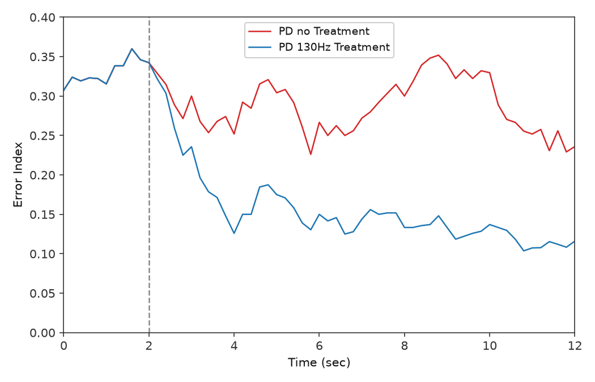

# Mehregan et al. (paper 1) — figure comparisons

Side-by-side **paper panel** vs **our replication** for qualitative checks. Plot scripts write replication PNGs to `figures/papers/`; JSON caches to `artifacts/figures/papers/`.

**Passed panels** (1b, 2a, 2b) use a short **Status** block. **Open panels** keep a full side-by-side checklist until gates pass.

| Panel | Script | Spec | Status |
|-------|--------|------|--------|
| Fig 1b — GPi PSD | `scripts/figures/papers/1/1b/plot.py` | [plant.md](../plant.md) | Pass |
| Fig 2a — GPi $P_\beta$ time series | `scripts/figures/papers/1/2a/plot.py` | [plant.md](../plant.md) | Pass |
| Fig 2b — Error Index time series | `scripts/figures/papers/1/2b/plot.py` | [plant.md](../plant.md) | Pass |
| Fig 4a — training $P_\beta$ vs step | `scripts/figures/papers/1/4a/plot.py` | [environment.md](../environment.md), [ddpg/replication.md](../controllers/ddpg/replication.md) | Open |

Replication PNGs: `figures/papers/`. JSON caches: `artifacts/figures/papers/`.

---

## Fig 1b — GPi PSD

Mean GPi multitaper power spectral density (1–50 Hz) for three conditions: **healthy control**, **PD no treatment**, and **PD + 130 Hz STN cDBS**. Ordering gate: **PD > healthy** on beta power and **130 Hz cDBS < PD** (see [plant.md](../plant.md)).

### Paper (Mehregan et al.)


### Replication


<!-- caption-1b:start -->
**Caption:** see manifest

**Manifest:** `artifacts/figures/papers/1/1b/manifest.json`
<!-- caption-1b:end -->

**Status:** Pass — condition ordering and beta-peak shape match the paper panel (seeds `0–9` mean).

**Run:**

```bash
uv run python scripts/figures/papers/1/1b/plot.py
uv run python scripts/figures/papers/1/1b/plot.py --plot-only
```

**Defaults:** seeds `0–9` (mean PSD), 10 s segment, Python plant.

---

## Fig 2a — GPi $P_\beta$ time series

GPi beta-band power ($P_\beta$, Eq. 1, 13–35 Hz) over **12 s**: **PD no treatment** (red) vs **PD + 130 Hz cDBS** (blue). Shared baseline 0–2 s; dashed vertical at **2 s** (cDBS onset for blue). After onset, blue falls to a low plateau; red stays elevated.

### Paper (Mehregan et al.)


### Replication


<!-- caption-2a:start -->
**Caption:** 14 s sim (2 s pre-roll), plot = sim − 2 s, 0.2 s trailing / 2 s window (end sim 14 s), seed 0 (2026-07-11)

**Manifest:** `artifacts/figures/papers/1/2a/manifest.json`
<!-- caption-2a:end -->

**Status:** Pass — blue-below-red after $t=2$, shared 0–2 s baseline, dense trailing protocol. Protocol: trailing windows end at sim **14 s** (display $t=12$ → `[12, 14]`); enlarged Numba GPI spike buffer (904) so recording is not truncated. Remaining polish: blue floor slightly below paper at $t=12$; single seed (0).

**Run:**

```bash
uv run python scripts/figures/papers/1/2a/plot.py
uv run python scripts/figures/papers/1/2a/plot.py --plot-only
uv run python scripts/figures/papers/1/2a/plot.py --sampling segment
```

**Defaults:** seed `0`, 0.2 s trailing samples, 2 s overlapping window, 14 s integrate with 2 s pre-roll.

---

## Fig 2b — Error Index time series

Windowed Error Index (EI, Eq. 2) over **12 s** with **So-style SMC pulses into TH** (path A): BoC inverse-gamma on **Iappth**, `iappth_baseline=0`, `ggith=0.112`. **PD no treatment** (red) vs **PD + 130 Hz cDBS** (blue). Same timing as Fig 2a. Y-axis **Error Index** (0–0.4 in the paper panel).

### Paper (Mehregan et al.)


### Replication



<!-- caption-2b:start -->
**Caption:** 14 s sim (2 s pre-roll), plot = sim − 2 s, 0.2 s trailing / 2 s EI window (end sim 14 s), So-style Iappth SMC (baseline 0, ggith 0.112), BoC inv-gamma, backend python, seed 0 (2026-07-12)

**Manifest:** `artifacts/figures/papers/1/2b/manifest.json`
<!-- caption-2b:end -->

**Status:** Pass — blue-below-red after $t=2$, shared baseline, blue floor ~0.12 near paper. Remaining polish: red $t=12$ slightly low (~0.24 vs ~0.30); single seed.

**Run:**

```bash
uv run --group figures python scripts/figures/papers/1/2b/plot.py
uv run --group figures python scripts/figures/papers/1/2b/plot.py --plot-only
```

**Defaults:** seed `0`, `smc_site='thalamic'`, `iappth_baseline=0`, `ggith=0.112`, `smc_amplitude=3.5`, `smc_schedule='boc'`, `smc_pulse_source='drive'`, backend **python**.

### Convention (path A, 2026-07-12)

**Citations (split roles):** Gao et al. (ICCPS 2020) define the **EI metric** Mehregan uses (exactly one TH spike in $(\mathrm{SMC}_\tau,\mathrm{SMC}_\tau{+}25\,\mathrm{ms})$; windowed $T_\omega{=}2\,\mathrm{s}$). So et al. (2012) define the **TH drive** for that metric (SMC current pulses into TH; TH not spontaneously active). Kumaravelu replaced those pulses with constant $I_{\mathrm{appth}}=1.2$; Fig 2b restores So-style drive: **pulses only** (`iappth_baseline=0`) plus BoC inverse-gamma timing (~14 Hz mean). Cortical `Iappco` SMC remains available but does **not** produce paper ordering (no Cor→TH synapse). Sweep: `artifacts/probes/fig2b_ei_so_path_a_sweep.json`.

---

## Fig 4a — training beta power vs step

Per-step GPi beta-band power during DDPG training of the **45 Hz** mean-frequency model (§IV.A.1): **300** environment steps (10 episodes × 30 steps). Y-axis **PSD(x10³)** = raw $P_\beta / 1000$ (same scale as the paper panel). The paper trace is noisy early (~0.43–0.57), then drops sharply around step **130–150** and settles lower (~0.35–0.45).

### Paper (Mehregan et al.)


### Replication


<!-- caption-4a:start -->
**Caption:** 45 Hz fixed_mean_pattern, state_length=1, softmax, seed 0, v3, init_bias=0.5, early=0.436 late=0.439, trend flat/↑ (2026-07-12)

**Manifest:** `artifacts/figures/papers/1/4a/manifest.json`
<!-- caption-4a:end -->

### Side-by-side checklist

Qualitative gates first; numeric bands are approximate (paper read from panel; replication from `artifacts/figures/papers/1/4a/manifest.json` once training completes).

| Check | Paper | Replication | Match? |
|-------|-------|-------------|--------|
| **Plot style** | Single noisy line, 0–300 steps | Line trace, 300 steps | ✓ |
| **Axes** | Steps 0–300; y **PSD(x10³)** ~0.3–0.6 | Same labels; y locked 0.3–0.6 | ✓ |
| **Early band (steps 0–130)** | ~0.43–0.57, high variance | mean 0.436 | ✓ |
| **Drop timing** | Sharp fall ~step 130–150 | mid(120–150) mean 0.441 | ✗ |
| **Late band (steps 150–300)** | ~0.35–0.45 | mean 0.439 | ✓ |
| **Overall trend** | Mean beta **decreases** over training | end−start window Δ=0.001 | ✗ |

**Run:**

```bash
uv run python scripts/figures/papers/1/4a/plot.py
uv run python scripts/figures/papers/1/4a/plot.py --plot-only
```

Each run writes a new ``figures/papers/1/4a/training_beta_vN.png`` (N auto-increments) and updates the replication image link above.

Long run (~30–60 min Python plant). Use tmux:

```bash
tmux new-session -d -s fig4a-train \
 "setsid nohup uv run python scripts/figures/papers/1/4a/plot.py >> logs/fig4a-train.log 2>&1 < /dev/null"
```

**Defaults:** seed `0`, **45 Hz** mean init, `state_length=1`, `fixed_mean_pattern`, greedy (ε=0), `critic_action_input=logits`, `plant.dt_ms=0.02`.

**Open:** learning may still collapse to a constant policy (see [replication-fidelity.md](../development/replication-fidelity.md)); if the trace stays flat, try `within_step` + `state_length=16` or exploration variants before calling replication done.
