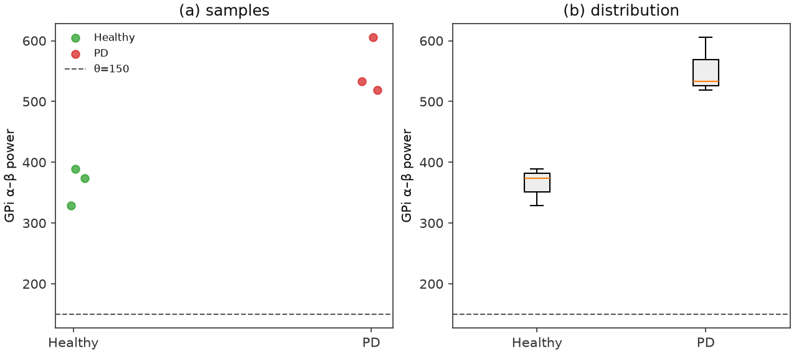
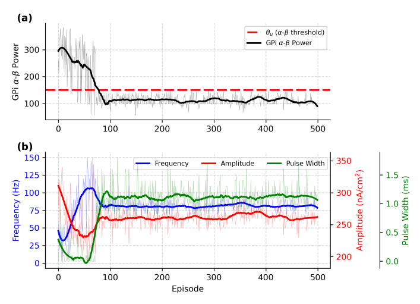
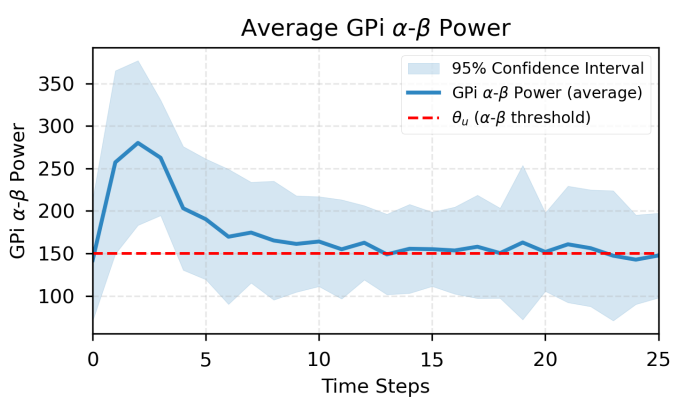

# Nguyen et al. (paper 2) — figure comparisons

**Primary replication tracker** for the DSQN / closed-loop neuromorphic DBS paper. Spec: [controllers/snn/replication.md](../controllers/snn/replication.md). Work proceeds **in parallel** with Mehregan ([paper_1.md](paper_1.md)): each row below is an exit criterion with qualitative gates, a committed `plot.py` (when present), and side-by-side PNGs.

Side-by-side **paper panel** vs **our replication** for qualitative checks. Plot scripts write replication PNGs to `figures/papers/2/`; JSON caches to `artifacts/figures/papers/2/`.

Figs **1–2** are schematics (CBGT circuit diagram; closed-loop block diagram) — **not** replication targets.

| Panel | Script | Spec | Status |
|-------|--------|------|--------|
| Fig 3 — GPi α–β distribution (PD vs healthy) | `scripts/figures/papers/2/3/plot.py` | [snn/replication.md](../controllers/snn/replication.md) §3 | Open (ordering smoke pass; θ-scale open) |
| Fig 4 — training reward + episode length | `scripts/figures/papers/2/4/plot.py` (planned) | [snn/replication.md](../controllers/snn/replication.md) §6–§8 | Open |
| Fig 5 — CBGT spikes + DBS energy over training | `scripts/figures/papers/2/5/plot.py` (planned) | [snn/replication.md](../controllers/snn/replication.md) §8 | Open |
| Fig 6 — α–β + DBS params over training | `scripts/figures/papers/2/6/plot.py` (planned) | [snn/replication.md](../controllers/snn/replication.md) §8 | Open |
| Fig 7 — 50-episode eval (25 steps) | `scripts/figures/papers/2/7/plot.py` (planned) | [snn/replication.md](../controllers/snn/replication.md) §8 | Open |

Replication PNGs: `figures/papers/2/`. JSON caches: `artifacts/figures/papers/2/`.

---

## Fig 3 — GPi α–β oscillation power distribution

Distribution of GPi **α–β** oscillation power (**7–35 Hz**: α 7–13 Hz + β 13–35 Hz) for **PD** vs **healthy / no-PD** (no DBS). Paper panel: **(a)** sample scatter, **(b)** boxplot summary. Control threshold **θ = 150** is chosen near the PD first quartile (§IV).

Unlike Mehregan $P_\beta$ (13–35 Hz only), Nguyen’s feedback band is the full **7–35 Hz** α–β index — see [snn/replication.md](../controllers/snn/replication.md) §3. Exact PSD estimator is **intentionally open** in the paper; v1 uses the repo `alpha_beta_power` helper on GPi spikes.

### Paper (Nguyen et al.)


### Replication



<!-- caption-3:start -->
**Caption:** GPi α–β (7–35 Hz); PD median=532.8739580221315, healthy median=373.53581650081395, PD Q1=526.0; ordering_pass=True

**Manifest:** `artifacts/figures/papers/2/3/manifest.json`
<!-- caption-3:end -->

**Status:** Open — short-smoke **ordering** gate pass (PD median above healthy). Soft **θ ≈ PD Q1** gate open: paper picks θ = 150; our short 1 s / few-seed samples sit near ~500 on the current α–β index. Treat scale calibration as follow-up, not a blocker for the DSQN train path.

### Side-by-side checklist

| Check | Paper | Replication | Match? |
|-------|-------|-------------|--------|
| **Layout** | (a) samples + (b) boxplot; PD vs healthy | Two-panel scatter + boxplot | Yes |
| **Ordering** | PD mass **above** healthy | PD median ≈533 vs healthy ≈374 | Yes |
| **Threshold** | θ = 150 near PD Q1 | PD Q1 ≈526; θ=150 far below | No (scale) |
| **No DBS** | Untreated distributions | `DbsSpec.none()` | Yes |

**Run:**

```bash
uv run python -m rl_adaptive_dbs.run scripts/figures/papers/2/3/plot.py
uv run python -m rl_adaptive_dbs.run scripts/figures/papers/2/3/plot.py --seeds 0,1,2 --duration-s 1.0
uv run python -m rl_adaptive_dbs.run scripts/figures/papers/2/3/plot.py --plot-only
```

**Defaults:** seeds `0–9` (smoke often uses `0,1,2`), duration **1.0 s** per condition, Python plant, θ reference line at **150**.

---

## Fig 4 — Training rewards and lengths

Episode **rewards** (a) and **lengths** (b) over **500** training episodes (§IV; Fig. 4). Each episode starts from init DBS **40 Hz / 0.3 ms / 300 nA/cm²**. Paper claim: high variance (exploration) roughly episodes **0–100**, then a shift toward exploitation / optimization.

### Paper (Nguyen et al.)


### Replication

*Not yet generated.* Target: `figures/papers/2/4/training_reward_length.png`

<!-- caption-4:start -->
**Caption:** TBD

**Manifest:** `artifacts/figures/papers/2/4/manifest.json` (planned)
<!-- caption-4:end -->

**Status:** Open — `DSQNTrainer` + `rl-dbs train --controller snn` exist; needs a real plant train + `scripts/figures/papers/2/4/plot.py`.

### Side-by-side checklist

| Check | Paper | Replication | Match? |
|-------|-------|-------------|--------|
| **Protocol** | 500 episodes; init 40 Hz / 0.3 ms / 300 nA/cm² | TBD | — |
| **Early phase** | High variance ~episodes 0–100 (exploration) | TBD | — |
| **Later phase** | Shift toward exploitation; reward/length stabilize | TBD | — |
| **Seed note** | Paper seed unspecified | Lock one seed for gates | — |

**Run (planned):**

```bash
tmux new-session -d -s fig2-4-train \
 "setsid nohup uv run python -m rl_adaptive_dbs.run --max-threads 2 \
   scripts/figures/papers/2/4/plot.py >> logs/fig2-4-train.log 2>&1 < /dev/null"
uv run python -m rl_adaptive_dbs.run scripts/figures/papers/2/4/plot.py --plot-only
```

**Defaults (planned):** 500 episodes; seed `0`; early-stop streak $t_u=3$; θ = 150 (once scale is locked or documented).

---

## Fig 5 — Network spikes and DBS energy

Per-episode **CBGT spike counts** (a) and approximate **DBS energy** (b, Eq. (6)) over the same **500** training episodes (§IV; Fig. 5).

### Paper (Nguyen et al.)


### Replication

*Not yet generated.* Target: `figures/papers/2/5/spikes_energy.png`

<!-- caption-5:start -->
**Caption:** TBD

**Manifest:** `artifacts/figures/papers/2/5/manifest.json` (planned)
<!-- caption-5:end -->

**Status:** Open — paired with Fig 4 training logs once the panel script exists.

### Side-by-side checklist

| Check | Paper | Replication | Match? |
|-------|-------|-------------|--------|
| **Protocol** | Same 500-episode train as Fig 4 | TBD | — |
| **Spikes panel** | CBGT spike counts readable over episodes | TBD | — |
| **Energy panel** | Energy responds as DBS parameters move | TBD | — |
| **Shape vs digits** | Rough trend / ordering | Not digit match | — |

**Run (planned):** same train cache as Fig 4; `scripts/figures/papers/2/5/plot.py` (or shared `--plot-only` from Fig 4 artifacts).

**Defaults (planned):** Eq. (6) energy on STN DBS current; Python plant.

---

## Fig 6 — α–β and DBS parameters over training

GPi **α–β** (a) and the three **DBS parameters** — amplitude, frequency, pulse width — (b) over **500** episodes (§IV; Fig. 6). Paper end-of-training anchors (~**262 nA/cm²**, ~**78.65 Hz**, ~**1 ms**) are **evaluation anchors**, not hard gates until one-seed qualitative shape passes. Paper also claims ~**22%** energy reduction vs open-loop **130 Hz** (report after shape passes).

### Paper (Nguyen et al.)



### Replication

*Not yet generated.* Target: `figures/papers/2/6/alpha_beta_params.png`

<!-- caption-6:start -->
**Caption:** TBD

**Manifest:** `artifacts/figures/papers/2/6/manifest.json` (planned)
<!-- caption-6:end -->

**Status:** Open.

### Side-by-side checklist

| Check | Paper | Replication | Match? |
|-------|-------|-------------|--------|
| **α–β trend** | Decreases vs PD baseline / toward or below θ | TBD | — |
| **Params leave init** | Leave 40 Hz / 0.3 ms / 300 nA/cm² | TBD | — |
| **Therapeutic band** | Settle near clinical-ish settings | TBD | — |
| **Paper readouts** | ~262 nA/cm², ~78.65 Hz, ~1 ms | Optional after shape | — |

**Run (planned):** train cache shared with Figs 4–5; `scripts/figures/papers/2/6/plot.py`.

**Defaults (planned):** init triple as Fig 4; factored ternary actions (v1).

---

## Fig 7 — Evaluation (50 episodes × 25 steps)

Seeded eval of the trained policy: average **50** test episodes across **25** time steps with **different seeds** per episode (§IV; Fig. 7). Paper claim: learned policy keeps α–β below untreated PD reference from Fig 3.

### Paper (Nguyen et al.)



### Replication

*Not yet generated.* Target: `figures/papers/2/7/eval_50ep.png`

<!-- caption-7:start -->
**Caption:** TBD

**Manifest:** `artifacts/figures/papers/2/7/manifest.json` (planned)
<!-- caption-7:end -->

**Status:** Open — needs a locked Fig 4–6 checkpoint + `rl-dbs eval --controller snn` + panel script.

### Side-by-side checklist

| Check | Paper | Replication | Match? |
|-------|-------|-------------|--------|
| **Protocol** | 50 episodes × 25 steps; varying seeds | TBD | — |
| **α–β vs untreated** | Mean under policy **below** Fig 3 PD reference | TBD | — |
| **Stability** | Readable mean ± spread over steps | TBD | — |

**Run (planned):**

```bash
uv run rl-dbs eval --controller snn --checkpoint artifacts/snn/<ckpt>.pt
uv run python -m rl_adaptive_dbs.run scripts/figures/papers/2/7/plot.py --plot-only
```

**Defaults (planned):** 50 episodes, 25 steps, Python plant.

---

## Conventions (v1)

Documented choices for paper-silent knobs (see [snn/replication.md](../controllers/snn/replication.md) §12 and `SNNConfig`):

| Knob | v1 choice |
|------|-----------|
| Observation | GPi-only binary spike matrix |
| Action head | `factored` (3× ternary argmax) |
| Early-stop streak $t_u$ | 3 |
| LIF θ_th | 1.0 |
| Target net | hard copy on a fixed period |
| Reward coeffs δ, τ | `energy_penalty=0.01`, `threshold_reward=1.0` |
| Fig 3 α–β scale | Current helper scale; θ=150 soft until recalibrated |
