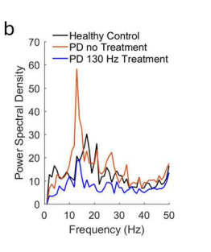
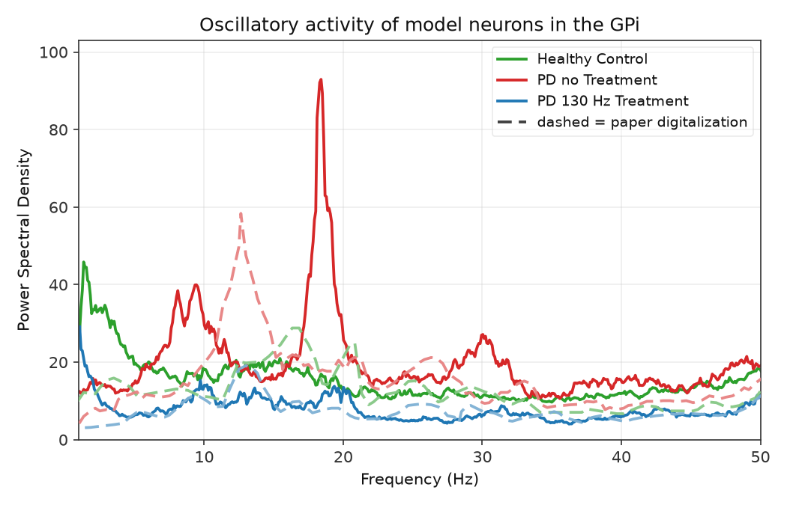
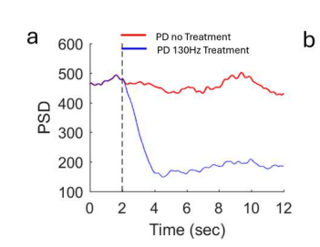
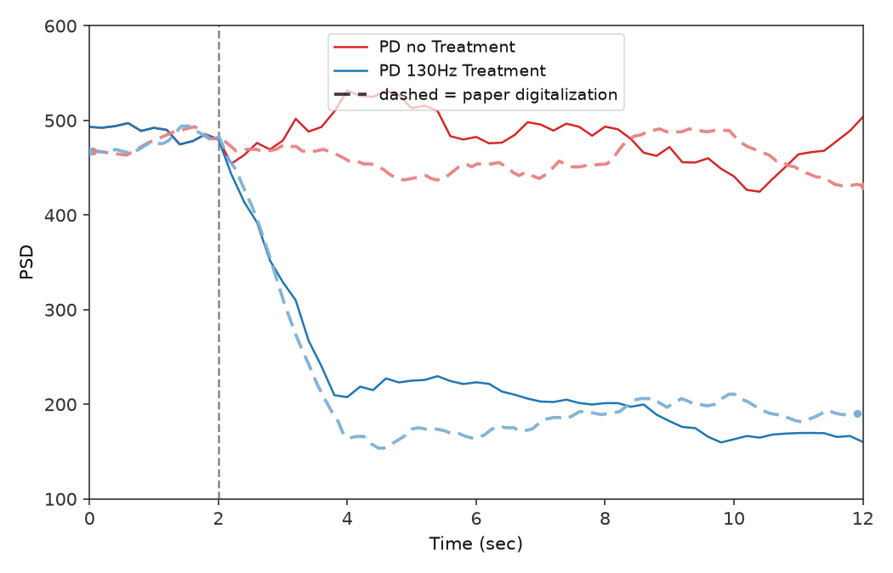
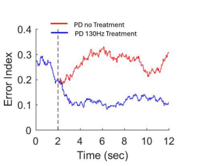
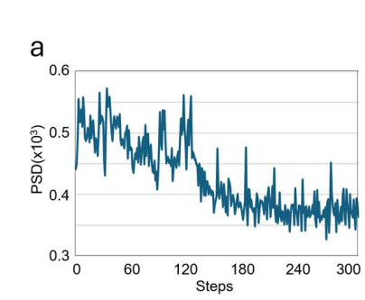
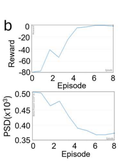
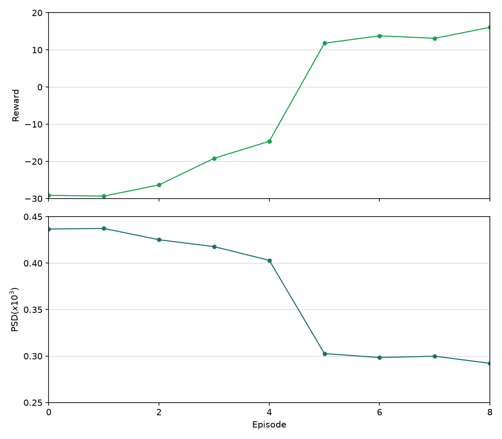

# Figure replication showcase: Mehregan et al.

**Enhancing Adaptive Deep Brain Stimulation via Efficient Reinforcement Learning**

This is a short, visual summary of my **qualitative replications** of the paper's plant and training panels (Fig. 1b through Fig. 4b). Each section shows the **original paper panel** next to **my reproduction**, with a plain-language note on what I checked. These are still rough. I'm not claiming these are 100% correct, but I wanted to show the progress I've made so far. There's a lot of refactoring, cleaning up, organizing, and small improvements I want to add everywhere, so these will keep getting refined.

I built this from the paper text and figures (no released training or environment source). The shared dynamics use the **Kumaravelu et al. (2016)** cortex-basal ganglia-thalamus model. Full run commands, manifests, and internal gates live in [figures/mehregan/replications.md](https://github.com/wilzen3476/rl-adaptive-dbs/blob/main/figures/mehregan/replications.md).

**Status (August 10, 2026):** Figs 1b–6b pass automated qualitative gates in the Mehregan tracker.

---

## At a glance

| Panel | What it shows | Result |
|-------|---------------|--------|
| **Fig. 1b** | GPi power spectrum, healthy, PD, PD + 130 Hz cDBS | Pass |
| **Fig. 2a** | GPi beta power over time, PD vs PD + cDBS | Pass |
| **Fig. 2b** | Error Index over time, PD vs PD + cDBS | Pass |
| **Fig. 4a** | Training curve, beta power vs RL step (45 Hz init) | Pass |
| **Fig. 4b** | Training curves, reward and episode-mean beta vs episode | Pass |

---

## Fig. 1b: GPi power spectral density

**Paper claim:** Parkinson's disease elevates GPi beta-band power relative to healthy controls; **130 Hz** continuous STN-DBS suppresses that elevation.

**What I checked:** Correct **ordering** across the three conditions (PD > healthy on beta power; cDBS < untreated PD).

| Paper | My replication |
|:-----:|:---------------:|
|  |  |

**Notes:** Mean PSD over seeds 0-9, 10 s segment, native Python plant port of the Kumaravelu model.

<div style="page-break-after: always;"></div>

## Fig. 2a: GPi beta power time series

**Paper claim:** After cDBS turns on at **2 s**, beta power in the treated (blue) trace **falls** and stays below the untreated PD (red) trace. Both traces share the same pre-stimulus baseline.

**What I checked:** Shared 0-2 s baseline, blue below red after onset, dense trailing-window protocol aligned with the paper's 12 s display window.

| Paper | My replication |
|:-----:|:---------------:|
|  |  |

**Notes:** Seed 0; 14 s simulation with 2 s pre-roll (display window 0-12 s). Minor polish: blue floor slightly below the paper at late times.

---

## Fig. 2b: Error Index time series

**Paper claim:** Same timing as Fig. 2a, but the biomarker is the **Error Index** (windowed thalamic spike-timing metric). Treated PD (blue) sits **below** untreated PD (red) after cDBS onset.

**What I checked:** Ordering after $t = 2$ s and a shared 0–2 s baseline.

| Paper | My replication |
|:-----:|:---------------:|
|  |  |

**Notes:** The Kumaravelu reference uses constant thalamic bias current instead of the So et al. (2012) SMC pulse drive the Error Index metric assumes. For this panel I restored **So-style SMC pulses into thalamus** (documented hybrid convention in [plant.md](https://github.com/wilzen3476/rl-adaptive-dbs/blob/main/docs/plant.md)). Seed 0.

<div style="page-break-after: always;"></div>

## Fig. 4a: Training beta power vs step

**Paper claim:** During **45 Hz** DDPG training, per-step GPi beta power is noisy early, then **drops sharply** around steps 130-150 and settles lower.

**What I checked:** Qualitative training **shape**, high early variance, mid-run drop, lower late plateau, on the same PSD scale as the paper panel.

| Paper | My replication |
|:-----:|:---------------:|
|  |  |

**Notes:** Seed 0, 300 steps (10 episodes x 30 steps), fixed-mean pulse-pattern action space, softmax exploration with one-hot critic input. Late mean sits a bit below the paper band; I treat that as numeric polish, not a gate failure.

---

## Fig. 4b: Training reward and episode-mean beta

**Paper claim:** Over **9 episodes** (indices 0-8), **total reward rises** toward zero while **episode-mean beta power falls**, the inverse relationship expected from the reward definition.

**What I checked:** Paired with the Fig. 4a training run: reward trend up by roughly episodes 3-5, episode-mean PSD trend down. Same stacked layout as the paper (reward top, PSD bottom).

| Paper | My replication |
|:-----:|:---------------:|
|  |  |

**Notes:** Same seed-0 training cache as Fig. 4a v4. Separate reward/PSD PNGs remain in the repo for debugging (`training_reward_v14.png`, `training_psd_v14.png`). The paper does not report the training RNG seed; different seeds change wiggles and levels. I compare **trends**, not pointwise values.

<div style="page-break-after: always;"></div>

## How this was produced

1. **Plant.** Kumaravelu et al. (2016) CBGT model (MATLAB reference + native Python port); GPi beta biomarker per Mehregan Eq. (1), 13-35 Hz.
2. **Environment.** Gymnasium-style 2 s steps, reward Eq. (8), fixed-mean pulse-pattern alphabet at 45 Hz for section IV.A.1 training panels.
3. **Controller.** DDPG actor-critic architecture per Fig. 3; hyperparameters from section IV.A.1.
4. **Validation.** Qualitative gates (ordering, onset timing, training shape) documented in [figures/mehregan/replications.md](https://github.com/wilzen3476/rl-adaptive-dbs/blob/main/figures/mehregan/replications.md) and [replication-fidelity.md](https://github.com/wilzen3476/rl-adaptive-dbs/blob/main/docs/development/replication-fidelity.md).

**Reproduce any panel:**

```bash
git clone https://github.com/wilzen3476/rl-adaptive-dbs.git
cd rl-adaptive-dbs

uv run python scripts/figures/papers/mehregan/1b/plot.py   # Fig. 1b
uv run python scripts/figures/papers/mehregan/2a/plot.py   # Fig. 2a
uv run --group figures python scripts/figures/papers/mehregan/2b/plot.py   # Fig. 2b
uv run python scripts/figures/papers/mehregan/4a/plot.py   # Fig. 4a (long run)
uv run python scripts/figures/papers/mehregan/4b/plot.py --plot-only   # Fig. 4b from 4a cache
```

**Environment:** I ran these on my local checkout with `uv`. I have **not** recently re-checked `scripts/setup.sh` on a clean machine; if you try to reproduce and hit install issues, I'm happy to help.

---

## What's next

| Panel set | Topic | Status |
|-----------|-------|--------|
| Nguyen Fig 4–7 | DSQN train / eval panels | Open (Fig 3 Pass) — [figures/nguyen/replications.md](../../figures/nguyen/replications.md) |
| Ravivarapu Figs 5–7 | SEA-DBS inference / PTQ / ablation | Open (4a/4b Pass) — [figures/ravivarapu/replications.md](../../figures/ravivarapu/replications.md) |
