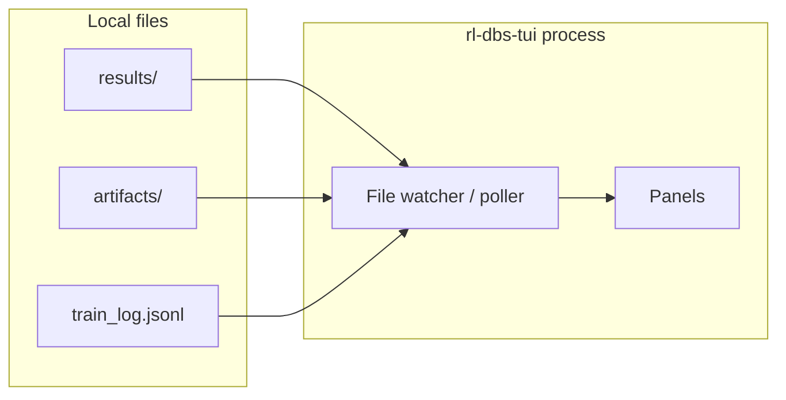

# Terminal user interface specification

This document defines the **`rl-dbs-tui`** terminal UI: monitor training, browse benchmark results, inspect rollouts, and tail logs—**without** a background server. **Phase 4** starts implementation: results loader + **Benchmarks** tab over `results/` from `rl-dbs benchmark` ([cli.md](cli.md), [benchmarking.md](benchmarking.md)). Training monitor, eval drill-down, and logs tabs land in later phases ([development/roadmap.md](development/roadmap.md)).

**Related specs:** [cli.md](cli.md) (commands and output paths), [benchmarking.md](benchmarking.md) (results layout, metrics), [environment.md](environment.md) ($P_\beta$, eval protocol), [plant.md](plant.md) (biomarker bands).

---

## 1. Goals

| Goal | Notes |
|------|--------|
| **Read-only monitoring** | No training or benchmark execution inside the TUI; use `rl-dbs` ([cli.md](cli.md)). |
| **Stateless** | Process reads files from disk; safe to quit anytime. |
| **Cross-platform** | Windows Terminal, macOS Terminal/iTerm2, Linux and WSL consoles; 80-column minimum. |
| **Spec-aligned views** | Labels and metrics match [benchmarking.md](benchmarking.md) §4; $P_\beta$ band per active suite/protocol. |

---

## 2. Distribution and invocation

Separate entry point from the CLI (lighter dependencies acceptable):

```toml
[project.scripts]
rl-dbs-tui = "rl_adaptive_dbs.tui:main"
```

Recommended:

```bash
uv run rl-dbs-tui [options]
uv run rl-dbs-tui --results-dir results/
```

| Option | Description |
|--------|-------------|
| `--results-dir` | Root for benchmark output (default: `./results`). |
| `--artifacts-dir` | Training checkpoints and `train_log.jsonl` (default: `./artifacts`). |
| `--refresh` | File poll interval in seconds (default **1.0**). |
| `--color` | Enable color (default is monochrome). |
| `--no-color` | Force monochrome (default; redundant with omitting `--color`). |

Optional: `rl-dbs tui` as an alias subcommand later—**intentionally open**; primary binary is `rl-dbs-tui` to keep CLI dependencies minimal.

---

## 3. Architecture



- **No network**, no subprocess management of training jobs (user runs `uv run rl-dbs train` in another terminal).
- **Watcher:** Poll mtime/size on `results/`, `artifacts/`, and explicit log paths; optional `watchdog` dependency is **intentionally open** (stdlib polling is sufficient for v1).
- **Parsing:** Load `manifest.json`, `metrics.json`, `config.json`, and optional `timeseries/` per [benchmarking.md](benchmarking.md) §6.

---

## 4. Layout

### 4.1 Screen regions

Minimum terminal: **80×24** characters. Recommended: **100×30+**.

```
┌─ rl-dbs-tui ───────────────────────────────────────────────────────────────┐
│ [Training] [Eval] [Benchmarks] [Logs]                    suite: mehregan_eval │
├────────────────────────────────────────────────────────────────────────────┤
│                                                                              │
│  (active tab content)                                                        │
│                                                                              │
├────────────────────────────────────────────────────────────────────────────┤
│ ↑↓ scroll  Tab next panel 1-4 tabs  / filter  r refresh  q quit             │
└──────────────────────────────────────────────────────────────────────────────┘
```

### 4.2 Tabs (panels)

| Tab | Purpose | Primary data sources |
|-----|---------|----------------------|
| **Training** | Live training metrics, loss/return curves | `artifacts/<controller>/<variant>/train_log.jsonl`, checkpoint dir mtime |
| **Eval** | Rollout stats, $P_\beta$ traces for a selected run | `results/<suite>/runs/.../timeseries/`, `metrics.json` |
| **Benchmarks** | Suite-level table: controller × variant × seed | `results/<suite>/manifest.json`, `runs/*/metrics.json` |
| **Logs** | Tail structured logs | User-selected `.log` / JSONL paths, stderr capture files if present |

Only one tab is visible at a time; the status bar shows the active suite filter (Benchmarks tab) or controller/variant (Training tab).

### 4.3 Training tab detail

| Element | Behavior |
|---------|----------|
| **Run selector** | List subdirs under `--artifacts-dir` with recent `train_log.jsonl`. |
| **Progress** | Episode `current / total` (from log or config; default total **30** per [environment.md](environment.md) §5). |
| **Sparkline** | Episode return or critic loss (last *N* episodes, default **40**). |
| **Progress bar** | Training episodes completed vs planned. |
| **Metadata** | `controller`, `variant`, `seed`, wall time from last log line. |

If no training log exists, show: *No training logs in artifacts/. Start training with `uv run rl-dbs train ...`*

### 4.4 Eval tab detail

| Element | Behavior |
|---------|----------|
| **Run picker** | Browse `results/<suite>/runs/`; sort by `run_id` desc. |
| **Summary** | `p_beta_mean`, `p_beta_final`, `reward_sum`, `stim_frequency_mean` per [benchmarking.md](benchmarking.md) §4. |
| **$P_\beta$ sparkline** | Per-step or per-segment series from `timeseries/p_beta.json` (or equivalent)—**filename intentionally open**. |
| **Protocol note** | Display `protocol` from suite manifest (`mehregan`, `nguyen`, `sea_dbs`, `cross_paper`). |

Cross-paper warning when `reward_sum` is not comparable (banner referencing [benchmarking.md](benchmarking.md) §3.3).

### 4.5 Benchmarks tab detail

| Element | Behavior |
|---------|----------|
| **Suite selector** | Subdirs of `--results-dir` with `manifest.json`. |
| **Comparison table** | Columns: `controller`, `variant`, `seed`, `p_beta_mean`, `p_beta_final`, `reward_sum`†, `stim_frequency_mean`, `run_id`. |
| **Sorting** | Default sort: `p_beta_mean` ascending (lower beta often better for symptom proxy). |
| **Filtering** | `/` opens filter on `controller` or `variant` substring. |

† Hide or gray `reward_sum` when manifest `protocol` is `cross_paper` or metrics list excludes it.

### 4.6 Logs tab detail

| Element | Behavior |
|---------|----------|
| **File list** | JSONL and plain logs under `results/`, `artifacts/`, user bookmarks. |
| **View** | Last *K* lines (default **200**), auto-scroll until user scrolls up. |
| **Level colors** | `ERROR` red, `WARNING` yellow, `INFO` default (when color enabled). |

---

## 5. Visual elements

| Element | Use |
|---------|-----|
| **Sparkline** | Unicode block chars (`▀▄▂`) or ASCII `_.-` fallback in monochrome mode or narrow width. |
| **Progress bar** | Training episode fraction; benchmark suite run completion (count `metrics.json` vs planned runs in manifest). |
| **Tables** | Fixed-width columns; truncate `run_id` with ellipsis in middle. |
| **Color** | **Default: monochrome** (`NO_COLOR=1` before Textual starts). Use `--color` for the theme palette; respect existing `NO_COLOR` / `TERM=dumb` when `--color` is not passed. |

**Math in UI:** Show $P_\beta$ as label `P_beta` in plain terminals; optional Unicode β when encoding is UTF-8.

---

## 6. Keyboard navigation

Global bindings (Vi-style alternatives **intentionally open** for v1):

| Key | Action |
|-----|--------|
| `Tab` | Next tab (Training → Eval → Benchmarks → Logs → wrap). |
| `Shift+Tab` | Previous tab. |
| `1`–`4` | Jump to tab by index. |
| `↑` / `↓` | Move selection in lists/tables. |
| `PgUp` / `PgDn` | Page scroll in active panel. |
| `/` | Open filter prompt (Benchmarks, Logs). |
| `Esc` | Clear filter / close prompt. |
| `r` | Force refresh from disk. |
| `Enter` | Open detail view (run → Eval tab series). |
| `b` | Bookmark log file path for Logs tab. |
| `q` | Quit (no save). |
| `?` | Toggle help overlay (this table). |

When a filter prompt is open, other keys route to the prompt until `Esc` or `Enter`.

---

## 7. Data contract (files the TUI reads)

| File | Required | Parser notes |
|------|----------|--------------|
| `results/<suite>/manifest.json` | For Benchmarks tab | `name`, `version`, `protocol`, `controllers`, `seeds` |
| `results/<suite>/runs/<id>/metrics.json` | Per run | Core metrics §4 in [benchmarking.md](benchmarking.md) |
| `results/<suite>/runs/<id>/config.json` | Per run | `controller`, `variant`, `seed`, `checkpoint` |
| `results/.../timeseries/*.json` | Optional | Arrays `{ "t": float, "p_beta": float, ... }` |
| `artifacts/.../train_log.jsonl` | Optional | One JSON object per line: `episode`, `return`, `loss`, `timestamp` |

Invalid JSON: show row-level error badge; do not crash the TUI.

---

## 8. Terminal compatibility

| Requirement | Detail |
|-------------|--------|
| **Width** | Layout degrades at &lt; 80 columns: hide `reward_sum`, shorten headers. |
| **Height** | Minimum 24 rows; help overlay needs 30+. |
| **Color** | Default monochrome; `--color` enables Textual theme colors. Respects [NO_COLOR](https://no-color.org/) when color is off. |
| **Mouse** | Optional click on tabs—not required v1. |
| **Windows** | Use `colorama` or library-native Windows console support if needed. |
| **SSH / WSL** | Same as Linux when `TERM` supports Unicode; ASCII fallback mandatory. |

---

## 9. Implementation notes

### 9.1 Library choice (intentionally open)

| Library | Pros | Cons |
|---------|------|------|
| **[Textual](https://textual.textualize.io/)** | Modern Python, widgets, CSS layout, good docs | Heavier dependency; Python 3.11+ |
| **[urwid](http://urwid.org/)** | Mature, lower level, long history | More boilerplate for tables/sparklines |
| **curses (stdlib)** | No extra deps | Harder cross-platform (Windows needs `windows-curses`) |

**Recommendation for implementers:** Prefer **Textual** unless dependency weight blocks CI; document the choice in code when the TUI lands. Keep view logic separate from file parsing so the data layer is testable without a terminal.

### 9.2 Cross-platform testing

- Smoke test: import data loaders with fixture `results/` tree under `tests/fixtures/tui/`.
- Manual matrix: Windows Terminal, Ubuntu, macOS—verify 80-column layout; default monochrome and `--color` smoke check.
- Do not require a TTY in unit tests; mock the renderer interface.

### 9.3 Performance

- Poll, do not re-parse unchanged files (compare mtime + size).
- Cap in-memory series length (e.g. last **10_000** points) for sparklines.

---

## 10. Mock layout (Benchmarks tab, 80 cols)

```
┌─ Benchmarks: mehregan_eval v1 ────────────────────────────────────────────┐
│ protocol: mehregan    seeds: 0-4    runs: 15/15                             │
├────────────┬──────────┬──────┬───────────┬───────────┬─────────────────────┤
│ controller │ variant  │ seed │ p_beta_mu │ reward_sum│ run_id              │
├────────────┼──────────┼──────┼───────────┼───────────┼─────────────────────┤
│ baseline   │ cdbs-130 │  0   │   142.1   │    n/a    │ 20260524-120001-a1  │
│ baseline   │ per-45hz │  0   │   198.4   │    n/a    │ 20260524-120015-b2  │
│ ddpg       │ paper    │  0   │    89.2   │   -12.4   │ 20260524-120030-c3  │
│ ddpg       │ ptq-int8 │  0   │    94.7   │   -11.8   │ 20260524-120045-d4  │
├────────────┴──────────┴──────┴───────────┴───────────┴─────────────────────┤
│ / filter   r refresh   q quit                                                │
└──────────────────────────────────────────────────────────────────────────────┘
```

---

## 11. Implementation roadmap

| Step | Phase | Status |
|------|-------|--------|
| Spec (this document) | 1 | Done |
| Fixture `results/` tree + loader unit tests | 4 | Done (`tests/fixtures/benchmark_results/`) |
| Benchmarks tab only | 4 | Done (Textual) |
| Eval tab + timeseries sparklines | 5–6 | Not started |
| Training tab + artifacts watcher | 8+ | Not started |
| Logs tab + bookmarks | 8+ | Not started |

---

## 12. Consistency checklist

- [ ] TUI never starts plant integration or training loops.
- [ ] Metric names match [benchmarking.md](benchmarking.md) §4.
- [ ] Cross-paper suite shows plant-level metrics only when manifest says so.
- [ ] Invocation documented as `uv run rl-dbs-tui`.
- [x] Default monochrome UI (`NO_COLOR`); `--color` opt-in documented.
- [ ] 80-column layout tested on all target platforms.

---

## 13. Open questions / TBD

### 1. Single vs dual entry point

**Fixed:** `rl-dbs-tui` binary. **Open:** `rl-dbs tui` alias. **Decide in** packaging.

### 2. Timeseries file naming

**Fixed:** optional `timeseries/` per run. **Open:** `p_beta.json` vs Parquet. **Decide in** benchmark runner with CLI.

### 3. Training log schema

**Fixed:** JSONL under artifacts. **Open:** field names for loss components (actor/critic). **Decide in** `ddpg` training loop.

### 4. Live attach to running train

**Fixed:** poll-only v1. **Open:** follow partial JSONL line. **Decide in** if flush-per-episode is guaranteed.

### 5. Library lock-in

**Fixed:** Textual vs urwid tradeoffs documented. **Open:** final choice. **Decide in** first TUI PR.

### 6. Detail drill-down

**Fixed:** `Enter` opens Eval-style series. **Open:** separate modal vs tab switch. **Decide in** UI implementation.
