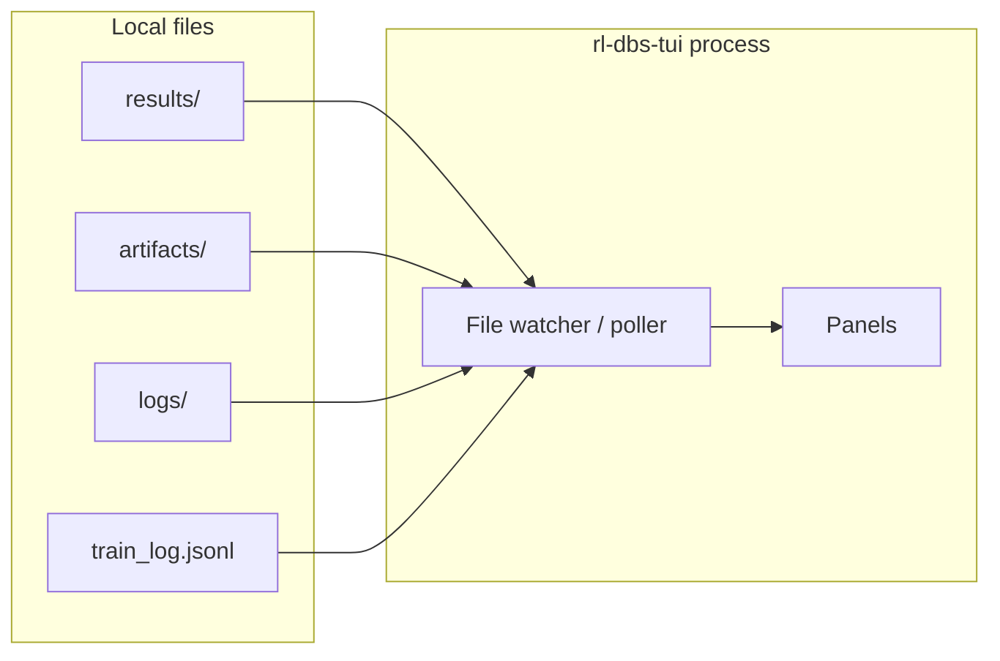

# Terminal user interface specification

This document defines the **`rl-dbs-tui`** terminal UI: **launch detached jobs**, monitor training, browse benchmark results, inspect rollouts, and tail logs—**without** a background server. Six tabs are implemented in Textual: **Run**, **Training**, **Eval**, **Benchmarks**, **Logs**, and **Settings** over `artifacts/` and `results/` from `rl-dbs train`, `rl-dbs eval`, `rl-dbs benchmark`, and repo scripts ([cli.md](cli.md), [benchmarking.md](benchmarking.md)).

**Related specs:** [cli.md](cli.md) (commands and output paths), [benchmarking.md](benchmarking.md) (results layout, metrics), [environment.md](environment.md) ($P_\beta$, eval protocol), [plant.md](plant.md) (biomarker bands).

---

## 1. Goals

| Goal | Notes |
|------|--------|
| **Monitor + launch** | Training/benchmark tabs are read-only monitors. **Run** tab starts detached `rl-dbs` commands and repo scripts; output lands in `artifacts/tui-runs/` and appears on **Logs**. |
| **Stateless** | Process reads files from disk; safe to quit anytime. Launched jobs survive TUI exit (`setsid` / new session on POSIX). |
| **Cross-platform** | Windows Terminal, macOS Terminal/iTerm2, Linux and WSL consoles; 80-column minimum. |
| **Spec-aligned views** | Labels and metrics match [benchmarking.md](benchmarking.md) §4; $P_\beta$ band per active suite/protocol. |

---

## 2. Distribution and invocation

Separate entry point from the CLI (lighter dependencies acceptable):

```toml
[project.scripts]
rl-dbs-tui = "rl_adaptive_dbs.tui:main"
```

Recommended:

```bash
uv run rl-dbs-tui [options]
uv run rl-dbs-tui --results-dir results/
uv run rl-dbs-tui --dev --results-dir results/   # auto-restart on TUI code edits
```

| Option | Description |
|--------|-------------|
| `--results-dir` | Root for benchmark output (default: `./results`). |
| `--artifacts-dir` | Training checkpoints and `train_log.jsonl` (default: `./artifacts`). |
| `--logs-dir` | Manual tmux / probe stdout logs (default: `./logs`; shared across worktrees). |
| `--refresh` | File poll interval in seconds (default **1.0**; overridden by Settings when persisted). |
| `--dev` | Restart the TUI when `rl_adaptive_dbs/tui/*.py` changes (development). |
| `--color` | Enable color (default is monochrome). |
| `--no-color` | Force monochrome (default; redundant with omitting `--color`). |

Optional: `rl-dbs tui` as an alias subcommand later—**intentionally open**; primary binary is `rl-dbs-tui` to keep CLI dependencies minimal.

---

## 3. Architecture



- **No network.** Launched jobs use a detached local subprocess (`setsid` / new session on POSIX); the TUI does not manage remote workers.
- **Watcher:** Poll mtime/size on `results/`, `artifacts/`, `logs/`, and explicit log paths; optional `watchdog` dependency is **intentionally open** (stdlib polling is sufficient for v1).
- **Parsing:** Load `manifest.json`, `metrics.json`, `config.json`, and optional `timeseries/` per [benchmarking.md](benchmarking.md) §6.

---

## 4. Layout

### 4.1 Screen regions

Minimum terminal: **80×24** characters. Recommended: **100×30+**.

```
┌─ rl-dbs-tui ───────────────────────────────────────────────────────────────┐
│ [Run] [Training] [Eval] [Benchmarks] [Logs] [Settings]   suite: mehregan_eval │
├────────────────────────────────────────────────────────────────────────────┤
│                                                                              │
│  (active tab content)                                                        │
│                                                                              │
├────────────────────────────────────────────────────────────────────────────┤
│ ↑↓ scroll  Tab next panel 1-6 tabs  / filter  x launch  r refresh  q quit   │
└──────────────────────────────────────────────────────────────────────────────┘
```

### 4.2 Tabs (panels)

| Tab | Purpose | Primary data sources |
|-----|---------|----------------------|
| **Run** | Launch detached `rl-dbs` commands and repo scripts | **figure replication**, **CLI**, **training**, **diagnostics**, **replication** (see §4.3) |
| **Training** | Live training metrics, loss/return curves | `artifacts/<controller>/<variant>/train_log.jsonl`, checkpoint dir mtime |
| **Eval** | Rollout stats, $P_\beta$ traces for a selected run | `results/<suite>/runs/.../timeseries/`, `metrics.json` |
| **Benchmarks** | Suite-level table: controller × variant × seed | `results/<suite>/manifest.json`, `runs/*/metrics.json` |
| **Logs** | Tail structured logs | User-selected `.log` / JSONL paths, stderr capture files if present |
| **Settings** | Edit persisted TUI preferences | `artifacts/.tui-settings.json` |

Only one tab is visible at a time; the status bar shows the active suite filter (Benchmarks tab) or controller/variant (Training tab).

### 4.3 Run tab detail

| Element | Behavior |
|---------|----------|
| **Recipe list** | Five categories (sorted): **figure replication** (`scripts/figures/**/plot.py`), **CLI** (built-in `rl-dbs` shortcuts), **training** (`scripts/training/run_*.py`), **diagnostics** (`scripts/probes/*.py`), **replication** (`scripts/replication/` when present). Figure labels parse panel titles from script docstrings. |
| **Filter** | `/` filters label, category, or command substring. |
| **Launch** | **Enter** or **`x`** opens a confirmation dialog, then starts the command detached. Stdout/stderr go to `artifacts/tui-runs/<recipe>-<timestamp>.log` with `# rl-dbs-run-meta:` header (same format as shell launchers). |
| **Follow output** | After launch, the TUI can **auto-follow** the new log. In the confirm dialog, press **`f`** to cycle: **Logs tab** (default), **Terminal** (`tail -f` in a tmux split pane), or **Don't follow**. Default is controlled by **Settings → Launch follow output** (`logs`, `terminal`, `none`, or `ask`). Terminal follow requires running the TUI inside **tmux**; otherwise it falls back to the Logs tab and shows the manual `tail -f` command. |
| **Logs link** | New log paths are bookmarked automatically. With follow mode **Logs tab**, the TUI switches to **Logs** and opens a live tail (auto-scroll). |
| **Survival** | Detached runs survive TUI quit and SSH disconnect (POSIX: new session). Long plant-heavy jobs should still be started from **tmux** when you need an attachable shell — the Run tab records the current tmux session name in metadata when launched inside tmux. |

### 4.4 Training tab detail

| Element | Behavior |
|---------|----------|
| **Run selector** | List subdirs under `--artifacts-dir` with recent `train_log.jsonl`. **`[` / `]`** cycle runs when multiple logs exist. |
| **Progress** | Episode `current / total` (from log or config; default total **30** per [environment.md](environment.md) §5). |
| **Sparkline** | Episode return or critic loss (last *N* episodes; default **40**, configurable in Settings). |
| **Progress bar** | Training episodes completed vs planned. |
| **Metadata** | `controller`, `variant`, `seed`, wall time from last log line. |

If no training log exists, show: *No training logs in artifacts/. Start training with `uv run rl-dbs train ...`* or launch from the **Run** tab.

**Training tab (implemented):** also reads script-style **JSON episode arrays** (`[{ "episode", "reward", ... }]`) and **stdout `.log` captures** (`episode N/M, reward: …`). When both exist for the same run stem, **JSON/JSONL wins** over `.log`.

### 4.5 Eval tab detail

| Element | Behavior |
|---------|----------|
| **Run picker** | Browse `results/<suite>/runs/`; sort by `run_id` desc. |
| **Summary** | `p_beta_mean`, `p_beta_final`, `reward_sum`, `stim_frequency_mean` per [benchmarking.md](benchmarking.md) §4. |
| **$P_\beta$ sparkline** | Per-step or per-segment series from `timeseries/p_beta.json` (or equivalent)—**filename intentionally open**. |
| **Protocol note** | Display `protocol` from suite manifest (`mehregan`, `nguyen`, `sea_dbs`, `cross_paper`). |

Cross-paper warning when `reward_sum` is not comparable (banner referencing [benchmarking.md](benchmarking.md) §3.3).

### 4.6 Benchmarks tab detail

| Element | Behavior |
|---------|----------|
| **Suite selector** | Subdirs of `--results-dir` with `manifest.json`. |
| **Comparison table** | Columns: `controller`, `variant`, `seed`, `p_beta_mean`, `p_beta_final`, `reward_sum`†, `stim_frequency_mean`, `run_id`. |
| **Sorting** | Default sort: `p_beta_mean` ascending (lower beta often better for symptom proxy). |
| **Filtering** | `/` opens filter on `controller` or `variant` substring. |

† Hide or gray `reward_sum` when manifest `protocol` is `cross_paper` or metrics list excludes it.

### 4.7 Logs tab detail

| Element | Behavior |
|---------|----------|
| **File list** | JSONL and plain logs under `results/`, `artifacts/` (including figure runs such as `artifacts/figures/.../run.log`), **`logs/`** (tmux / probe stdout from `>> logs/foo.log`), and user bookmarks. Plain `.log` files may start with an `# rl-dbs-run-meta:` header (pid, tmux session, command) so the TUI can show **running** / **finished** state and tail live output while a job is in progress. |
| **Run column** | When a log has run metadata, shows `running pid … tmux:…`, `finished`, or `failed (exit N)`. |
| **Open** | Highlight with ↑↓; **Enter** opens a full-screen tail view. |
| **View** | Last *K* lines (default **200**; configurable in Settings); scroll ↑↓←→ and PgUp/PgDn (focus stays on the Logs pane); **Esc** returns to the file list. |
| **Level colors** | Not shown in the tail viewer (plain text); level coloring remains a future enhancement. |

### 4.8 Settings tab detail

| Element | Behavior |
|---------|----------|
| **Preferences table** | Poll interval (s), log tail lines, training sparkline episodes, launch follow mode, color on/off. |
| **Edit** | **Enter** opens an input for the selected row; **+** / **-** step numeric values; **space** toggles color. |
| **Persistence** | Changes save immediately to `artifacts/.tui-settings.json`. Paths (`--results-dir`, `--artifacts-dir`, `--logs-dir`) stay CLI-only. |
| **Apply** | Poll interval, tail size, and sparkline window apply live to open tabs. Color requires **Ctrl+R** restart. |
| **Info panel** | Shows resolved `results/`, `artifacts/`, and `logs/` paths, settings file, and bookmarks file. |

---

## 5. Visual elements

| Element | Use |
|---------|-----|
| **Sparkline** | Unicode block chars (`▀▄▂`) or ASCII `_.-` fallback in monochrome mode or narrow width. |
| **Progress bar** | Training episode fraction; benchmark suite run completion (count `metrics.json` vs planned runs in manifest). |
| **Tables** | Fixed-width columns; truncate `run_id` with ellipsis in middle. |
| **Color** | **Default: monochrome** (`NO_COLOR=1` before Textual starts). Use `--color` for the theme palette; respect existing `NO_COLOR` / `TERM=dumb` when `--color` is not passed. |

**Math in UI:** Show $P_\beta$ as label `P_beta` in plain terminals; optional Unicode β when encoding is UTF-8.

---

## 6. Keyboard navigation

Global bindings (Vi-style alternatives **intentionally open** for v1):

| Key | Action |
|-----|--------|
| `Tab` | Next tab (Run → Training → Eval → Benchmarks → Logs → Settings → wrap). |
| `Shift+Tab` | Previous tab. |
| `1`–`6` | Jump to tab by index (`1` = Run, `2` = Training, …, `6` = Settings). |
| `↑` / `↓` | Move selection in lists/tables. |
| `PgUp` / `PgDn` | Page scroll in active panel. |
| `/` | Open filter prompt (Run, Benchmarks, Logs). |
| `Esc` | Clear filter / close prompt / back to log list. |
| `r` | Force refresh from disk. |
| `Ctrl+R` | Restart the TUI (reload Python modules; use with `--dev` or after code edits). |
| `Enter` | Run: launch (with confirm) / Logs: open tail / Benchmarks: Eval drill-down / Settings: edit row. |
| `f` | Cycle launch follow mode in the Run confirm dialog (Logs tab / Terminal / Don't follow). |
| `x` | Launch selected Run recipe (with confirm). |
| `b` | Toggle bookmark for selected log (Logs tab). |
| `+` / `-` | Adjust selected Settings value. |
| `[` / `]` | Previous / next training or eval run (when multiple runs). |
| `space` | Toggle color (Settings tab). |
| `q` | Quit (no save). |
| `?` | Toggle help overlay (this table). |

When a filter prompt is open, other keys route to the prompt until `Esc` or `Enter`.

---

## 7. Data contract (files the TUI reads)

| File | Required | Parser notes |
|------|----------|--------------|
| `results/<suite>/manifest.json` | For Benchmarks tab | `name`, `version`, `protocol`, `controllers`, `seeds` |
| `results/<suite>/runs/<id>/metrics.json` | Per run | Core metrics §4 in [benchmarking.md](benchmarking.md) |
| `results/<suite>/runs/<id>/config.json` | Per run | `controller`, `variant`, `seed`, `checkpoint` |
| `results/.../timeseries/*.json` | Optional | Arrays `{ "t": float, "p_beta": float, ... }` |
| `artifacts/.../train_log.jsonl` | Optional | One JSON object per line: `episode`, `return`, `loss`, `timestamp` |
| `artifacts/.tui-settings.json` | Optional | Persisted poll interval, tail lines, sparkline window, launch follow mode, color |
| `artifacts/.tui-log-bookmarks.json` | Optional | Bookmarked log paths for Logs tab |

Invalid JSON: show row-level error badge; do not crash the TUI.

---

## 8. Terminal compatibility

| Requirement | Detail |
|-------------|--------|
| **Width** | Layout degrades at &lt; 80 columns: hide `reward_sum`, shorten headers. |
| **Height** | Minimum 24 rows; help overlay needs 30+. |
| **Color** | Default monochrome; `--color` enables Textual theme colors. Respects [NO_COLOR](https://no-color.org/) when color is off. |
| **Mouse** | Optional click on tabs—not required v1. |
| **Windows** | Use `colorama` or library-native Windows console support if needed. |
| **SSH / WSL** | Same as Linux when `TERM` supports Unicode; ASCII fallback mandatory. |

---

## 9. Implementation notes

### 9.1 Library choice

**Fixed:** [Textual](https://textual.textualize.io/) (Python 3.11+, dev dependency). View logic lives in `rl_adaptive_dbs.tui.*_data` modules so loaders are testable without a terminal. Status strings that include keyboard hints (`[n/m]`, `[/]`) pass through `escape_brackets()` so Rich markup does not mis-parse them.

### 9.2 Cross-platform testing

- Smoke test: import data loaders with fixture `results/` tree under `tests/fixtures/benchmark_results/`.
- Manual matrix: Windows Terminal, Ubuntu, macOS—verify 80-column layout; default monochrome and `--color` smoke check.
- Do not require a TTY in unit tests; mock the renderer interface.

### 9.3 Performance

- Poll, do not re-parse unchanged files (compare mtime + size).
- Cap in-memory series length (e.g. last **10_000** points) for sparklines.

---

## 10. Mock layout (Benchmarks tab, 80 cols)

```
┌─ Benchmarks: mehregan_eval v1 ────────────────────────────────────────────┐
│ protocol: mehregan    seeds: 0-4    runs: 15/15                             │
├────────────┬──────────┬──────┬───────────┬───────────┬─────────────────────┤
│ controller │ variant  │ seed │ p_beta_mu │ reward_sum│ run_id              │
├────────────┼──────────┼──────┼───────────┼───────────┼─────────────────────┤
│ baseline   │ cdbs-130 │  0   │   142.1   │    n/a    │ 20260524-120001-a1  │
│ baseline   │ per-45hz │  0   │   198.4   │    n/a    │ 20260524-120015-b2  │
│ ddpg       │ paper    │  0   │    89.2   │   -12.4   │ 20260524-120030-c3  │
│ ddpg       │ ptq-int8 │  0   │    94.7   │   -11.8   │ 20260524-120045-d4  │
├────────────┴──────────┴──────┴───────────┴───────────┴─────────────────────┤
│ / filter   r refresh   Ctrl+R restart   q quit                                │
└──────────────────────────────────────────────────────────────────────────────┘
```

---

## 11. Implementation roadmap

| Step | Phase | Status |
|------|-------|--------|
| Spec (this document) | 1 | Done |
| Fixture `results/` tree + loader unit tests | 4 | Done (`tests/fixtures/benchmark_results/`) |
| Benchmarks tab | 4 | Done (Textual) |
| Eval tab + timeseries sparklines | 5–6 | Done |
| Training tab + artifacts watcher | 8+ | Done (JSONL, JSON array, `.log`) |
| Logs tab + bookmarks + run metadata | 8+ | Done |
| Run tab + detached launch | 8+ | Done (`artifacts/tui-runs/`, `run_log_meta`) |
| Settings tab + persistence | 8+ | Done (`artifacts/.tui-settings.json`) |

---

## 12. Consistency checklist

- [x] Launched jobs write `run_log_meta` headers and appear on Logs tab.
- [ ] Metric names match [benchmarking.md](benchmarking.md) §4.
- [ ] Cross-paper suite shows plant-level metrics only when manifest says so.
- [x] Invocation documented as `uv run rl-dbs-tui`.
- [x] Default monochrome UI (`NO_COLOR`); `--color` opt-in documented.
- [ ] 80-column layout tested on all target platforms.

---

## 13. Open questions / TBD

### 1. Single vs dual entry point

**Fixed:** `rl-dbs-tui` binary. **Open:** `rl-dbs tui` alias. **Decide in** packaging.

### 2. Timeseries file naming

**Fixed:** optional `timeseries/` per run. **Open:** `p_beta.json` vs Parquet. **Decide in** benchmark runner with CLI.

### 3. Training log schema

**Fixed:** JSONL under artifacts. **Open:** field names for loss components (actor/critic). **Decide in** `ddpg` training loop.

### 4. Live attach to running train

**Fixed:** poll-only v1. **Open:** follow partial JSONL line. **Decide in** if flush-per-episode is guaranteed.

### 5. Detail drill-down

**Fixed:** `Enter` on a Benchmarks row switches to the **Eval** tab with that run selected (not a modal).
