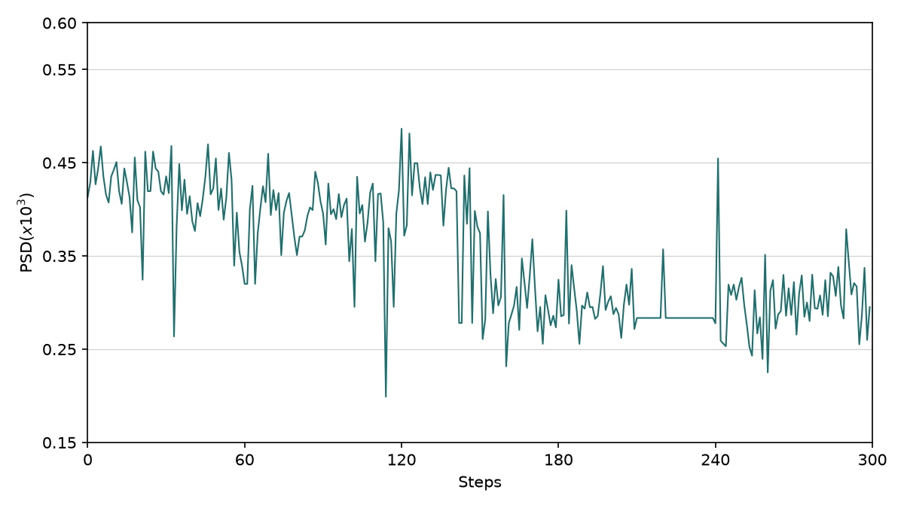
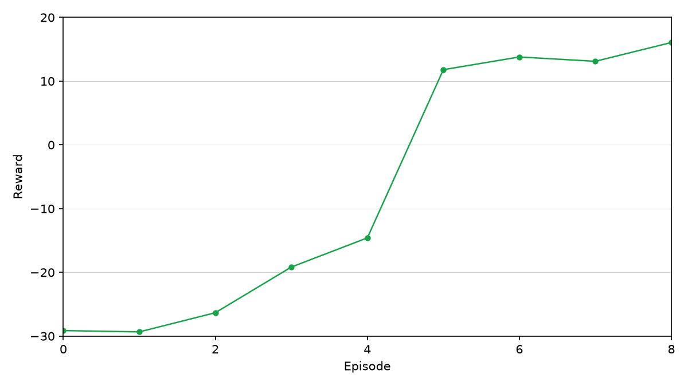
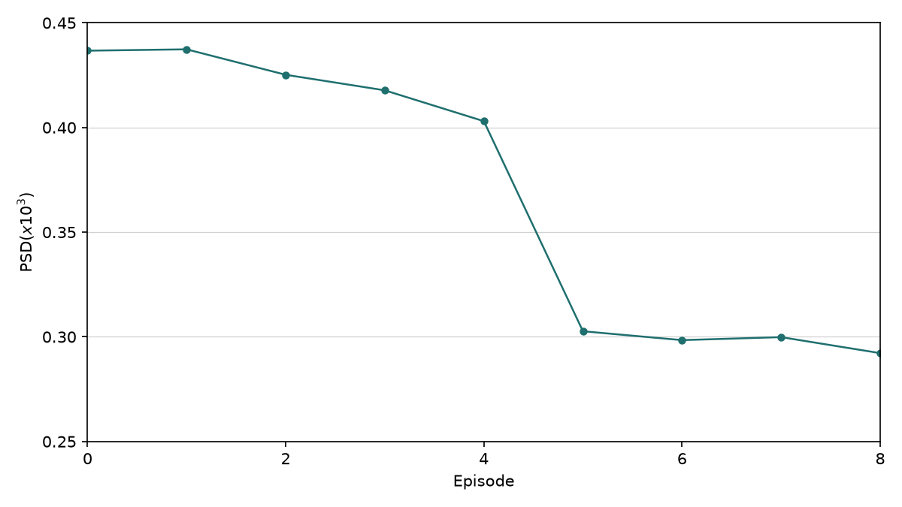
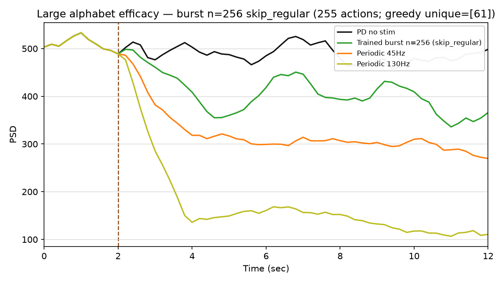
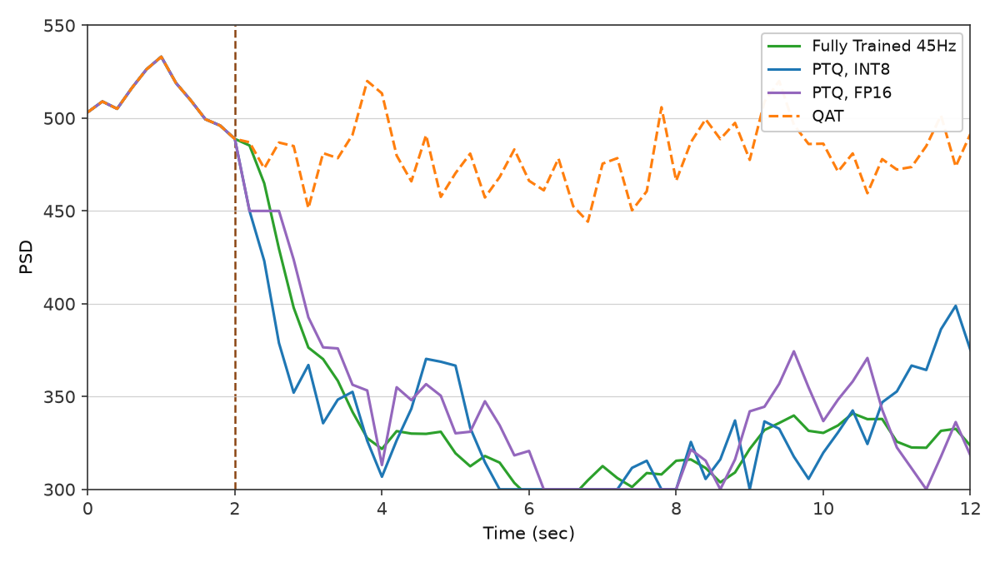
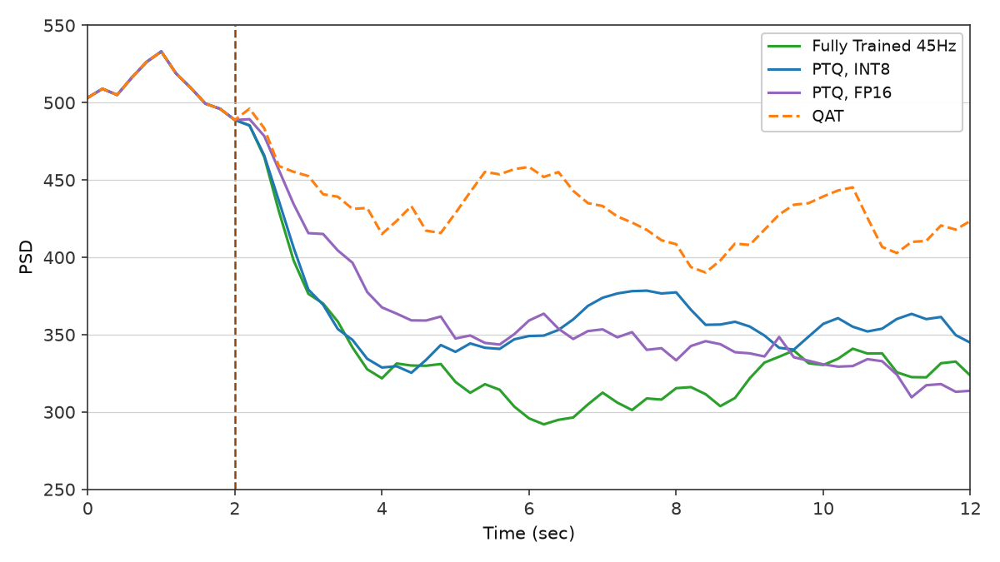
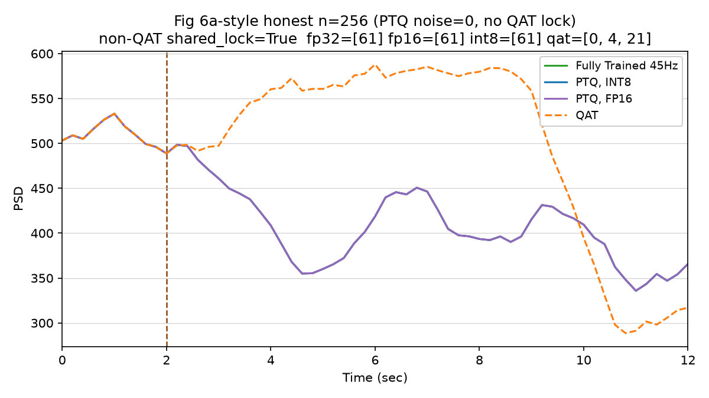
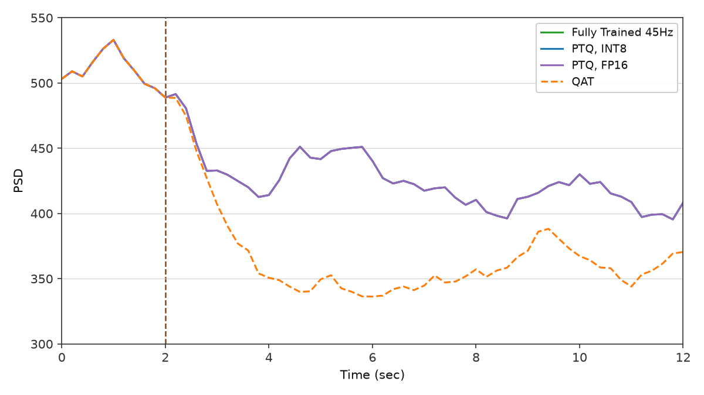
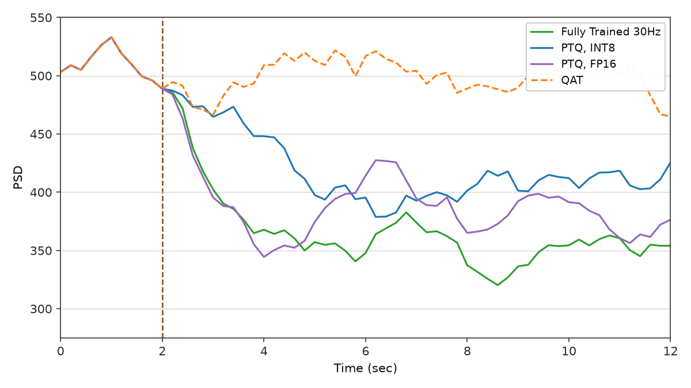

# Mehregan et al. — figure comparisons

**Primary replication tracker** for this repo. Work is scheduled by **panel**, not by roadmap phase: each row below is an exit criterion with qualitative gates, a committed `plot.py`, and side-by-side PNGs.

**Digitization gates:** Mehregan Paper 1 panels load WPD-refined curves from `artifacts/figures/papers/mehregan/<panel>/paper_digitization/curves_wpd_refined*.json` via `scripts/digitization/paper_gates.py`. Automated gates use **x-window ordering / ratios / drops** (seed-robust — paper panels are one realization). Fig **5a** digitization is marked NEEDS_REDO; that panel keeps qualitative ordering only.

Side-by-side **paper panel** vs **our replication** for qualitative checks. Plot scripts write replication PNGs to `figures/mehregan/images/`; JSON caches to `artifacts/figures/papers/`.

**Passed panels** (1b, 2a, 2b, 4b, 5a) use a short **Status** block. **Open / needs-work panels** keep a full side-by-side checklist until gates pass.

| Panel                                | Script                                       | Spec                                                                                                           | Status                    |
| ------------------------------------ | -------------------------------------------- | -------------------------------------------------------------------------------------------------------------- | ------------------------- |
| Fig 1b — GPi PSD                     | `scripts/figures/papers/mehregan/1b/plot.py` | [plant.md](../../docs/plant.md)                                                                                | Pass                      |
| Fig 2a — GPi $P_\beta$ time series   | `scripts/figures/papers/mehregan/2a/plot.py` | [plant.md](../../docs/plant.md)                                                                                | Pass                      |
| Fig 2b — Error Index time series     | `scripts/figures/papers/mehregan/2b/plot.py` | [plant.md](../../docs/plant.md)                                                                                | Pass                      |
| Fig 4a — training $P_\beta$ vs step  | `scripts/figures/papers/mehregan/4a/plot.py` | [environment.md](../../docs/environment.md), [ddpg/replication.md](../../docs/controllers/ddpg/replication.md) | Pass (v14, τ 3→2)         |
| Fig 4b — training reward vs episode  | `scripts/figures/papers/mehregan/4b/plot.py` | [environment.md](../../docs/environment.md), [ddpg/replication.md](../../docs/controllers/ddpg/replication.md) | Pass                      |
| Fig 5a — post-train efficacy @ 45 Hz | `scripts/figures/papers/mehregan/5a/plot.py` | [environment.md](../../docs/environment.md), [ddpg/replication.md](../../docs/controllers/ddpg/replication.md) | Pass                      |
| Fig 5b — post-train efficacy @ 30 Hz | `scripts/figures/papers/mehregan/5b/plot.py` | [environment.md](../../docs/environment.md), [ddpg/replication.md](../../docs/controllers/ddpg/replication.md) | Pass (burst alphabet, v3) |
| Fig 6a — PTQ / QAT @ 45 Hz           | `scripts/figures/papers/mehregan/6a/plot.py` | [controllers/ddpg/replication.md](../../docs/controllers/ddpg/replication.md)                                  | Pass (honest v19)         |
| Fig 6b — PTQ / QAT @ 30 Hz           | `scripts/figures/papers/mehregan/6b/plot.py` | [controllers/ddpg/replication.md](../../docs/controllers/ddpg/replication.md)                                  | Needs work (gates fail v16) |

Replication PNGs: `figures/mehregan/images/`. JSON caches: `artifacts/figures/papers/`. Paper crops: `figures/mehregan/images/<panel>/paper.png` (from paper-note embeds; composite Figs 1/2/4/5/6 split into panels). Full composites under `figures/mehregan/images/_full/`.

---

## Fig 1b — GPi PSD

Mean GPi multitaper power spectral density (1–50 Hz) for three conditions: **healthy control**, **PD no treatment**, and **PD + 130 Hz STN cDBS**. Ordering gate: **PD > healthy** on beta power and **130 Hz cDBS < PD** (see [plant.md](../../docs/plant.md)).

### Paper (Mehregan et al.)


### Replication


<!-- caption-1b:start -->
**Caption:** see manifest

**Manifest:** `artifacts/figures/papers/mehregan/1b/manifest.json`
<!-- caption-1b:end -->

**Status:** Pass — condition ordering and beta-peak shape match the paper panel (seeds `0–9` mean).

**Run:**

```bash
uv run python scripts/figures/papers/mehregan/1b/plot.py
uv run python scripts/figures/papers/mehregan/1b/plot.py --plot-only
```

**Defaults:** seeds `0–9` (mean PSD), 10 s segment, Python plant.

---

## Fig 2a — GPi $P_\beta$ time series

GPi beta-band power ($P_\beta$, Eq. 1, 13–35 Hz) over **12 s**: **PD no treatment** (red) vs **PD + 130 Hz cDBS** (blue). Shared baseline 0–2 s; dashed vertical at **2 s** (cDBS onset for blue). After onset, blue falls to a low plateau; red stays elevated.

### Paper (Mehregan et al.)


### Replication


<!-- caption-2a:start -->
**Caption:** 14 s sim (2 s pre-roll), plot = sim − 2 s, 0.2 s trailing / 2 s window (end sim 14 s), seed 0 (2026-07-11)

**Manifest:** `artifacts/figures/papers/mehregan/2a/manifest.json`
<!-- caption-2a:end -->

**Status:** Pass — blue-below-red after $t=2$, shared 0–2 s baseline, dense trailing protocol. Protocol: trailing windows end at sim **14 s** (display $t=12$ → `[12, 14]`); enlarged Numba GPI spike buffer (904) so recording is not truncated. Remaining polish: blue floor slightly below paper at $t=12$; single seed (0).

**Run:**

```bash
uv run python scripts/figures/papers/mehregan/2a/plot.py
uv run python scripts/figures/papers/mehregan/2a/plot.py --plot-only
uv run python scripts/figures/papers/mehregan/2a/plot.py --sampling segment
```

**Defaults:** seed `0`, 0.2 s trailing samples, 2 s overlapping window, 14 s integrate with 2 s pre-roll.

---

## Fig 2b — Error Index time series

Windowed Error Index (EI, Eq. 2) over **12 s** with **So-style SMC pulses into TH** (path A): BoC inverse-gamma on **Iappth**, `iappth_baseline=0`, `ggith=0.112`. **PD no treatment** (red) vs **PD + 130 Hz cDBS** (blue). Same timing as Fig 2a. Y-axis **Error Index** (replication default **0.10–0.4**; paper panel reads ~0–0.4).

### Paper (Mehregan et al.)


### Replication


<!-- caption-2b:start -->
**Caption:** 14 s sim (2 s pre-roll), plot = sim − 2 s, 0.2 s trailing / 2 s EI window (end sim 14 s), SMC BoC inv-gamma Iappth, backend python, seed 0, v2, y-axis 0.10–0.4 (2026-07-13)

**Manifest:** `artifacts/figures/papers/mehregan/2b/manifest.json`
<!-- caption-2b:end -->

**Status:** Pass — blue-below-red after $t=2$, shared baseline, blue floor ~0.12 near paper. Remaining polish: red $t=12$ slightly low (~0.24 vs ~0.30); single seed.

**Run:**

```bash
uv run --group figures python scripts/figures/papers/mehregan/2b/plot.py
uv run --group figures python scripts/figures/papers/mehregan/2b/plot.py --plot-only
```

Each run writes a new ``figures/mehregan/images/2b/error_index_vN.png`` (N auto-increments) and updates the replication image link above.

**Defaults:** seed `0`, `smc_site='thalamic'`, `iappth_baseline=0`, `ggith=0.112`, `smc_amplitude=3.5`, `smc_schedule='boc'`, `smc_pulse_source='drive'`, backend **python**.

### Convention (path A, 2026-07-12)

**Citations (split roles):** Gao et al. (ICCPS 2020) define the **EI metric** Mehregan uses (exactly one TH spike in $(\mathrm{SMC}_\tau,\mathrm{SMC}_\tau{+}25\,\mathrm{ms})$; windowed $T_\omega{=}2\,\mathrm{s}$). So et al. (2012) define the **TH drive** for that metric (SMC current pulses into TH; TH not spontaneously active). Kumaravelu replaced those pulses with constant $I_{\mathrm{appth}}=1.2$; Fig 2b restores So-style drive: **pulses only** (`iappth_baseline=0`) plus BoC inverse-gamma timing (~14 Hz mean). Cortical `Iappco` SMC remains available but does **not** produce paper ordering (no Cor→TH synapse). Sweep: `artifacts/probes/fig2b_ei_so_path_a_sweep.json`.

---

## Fig 4a — training beta power vs step

Per-step GPi beta-band power during DDPG training of the **45 Hz** mean-frequency model (§IV.A.1): **300** environment steps (10 episodes × 30 steps). Y-axis **PSD(x10³)** = raw $P_\beta / 1000$ (same scale as the paper panel). The paper trace is noisy early (~0.43–0.57), then drops sharply around step **130–150** and settles lower (~0.35–0.45).

### Paper (Mehregan et al.)


### Replication



<!-- caption-4a:start -->
**Caption:** 45 Hz fixed_mean_pattern, within_step L=1, reward=full_segment, softmax, critic=one_hot, seed 0, v14, init_bias=0.5, early=0.404 late=0.299, trend↓ (2026-07-31)

**Manifest:** `artifacts/figures/papers/mehregan/4a/manifest.json`
<!-- caption-4a:end -->

**Status:** Pass — seed-0 **v14** (`training_beta_v14.png`), softmax τ **3→2.0** (paper-silent softer anneal than v4’s τ→1 cliff). Gates: early=0.404, late=0.299, trend↓, drop visible by mid/late training; `gates.pass=true`. Late mean accepted as paper-faithful qualitative band.

**Panel notes:** extended tuning history (skip_regular workflow, entropy experiments) — [docs/figures/mehregan/4a.md](../../docs/figures/mehregan/4a.md).

**Run:**

```bash
uv run python scripts/figures/papers/mehregan/4a/plot.py
uv run python scripts/figures/papers/mehregan/4a/plot.py --plot-only
```

Each run writes a new ``figures/mehregan/images/4a/training_beta_vN.png`` (N auto-increments) and updates the replication image link above. Locked replication image is **v14** (promote refreshes the link above).

Long run (~30–60 min Python plant). Use tmux:

```bash
tmux new-session -d -s fig4a-train \
 "setsid nohup uv run python scripts/figures/papers/mehregan/4a/plot.py >> logs/fig4a-train.log 2>&1 < /dev/null"
```

**Defaults:** seed `0`, **45 Hz** mean init, `state_length=1`, `fixed_mean_pattern`, **softmax** exploration (τ **3→2.0**), **`critic_action_input=one_hot`**, `init_bias_scale=0.5`, `plant.dt_ms=0.02`.

---

## Fig 4b — training reward vs episode

Episode **total reward** and **episode-mean PSD(x10³)** during the same **45 Hz** DDPG run as Fig 4a (§IV.A.1). The paper panel indexes episodes **0–8** (line reaches episode 8; ticks every 2): reward rises from roughly **−80** toward **0** by episodes **4–6**, while episode-mean PSD falls inversely (~0.50 → ~0.37). We plot these as **two separate panels** (9 episodes, indices 0–8).

### Paper (Mehregan et al.)


### Replication

**Reward vs episode**



**Episode-mean PSD vs episode**



<!-- caption-4b:start -->
**Caption:** 9 episodes, 45 Hz fixed_mean_pattern (Fig 4a paired run), seed 0, source series_v4.json, v13, reward ep0=-29.1 ep8=16.1, rise_ep=3, psd 0.437→0.292, gate pass (2026-07-13)

**Manifest:** `artifacts/figures/papers/mehregan/4b/manifest.json`
<!-- caption-4b:end -->

**Status:** Pass — two panels × 9 episodes (indices 0–8), paired with locked Fig 4a v4 (**seed 0**; paper seed unspecified). Qualitative match: reward↑, episode-mean PSD↓, rise by ~ep 3–5. Y-limits snap to data extrema (reward step 10, PSD step 0.05). Numeric bands differ from paper (reward scale, late level, PSD shape); compare **trends**, not pointwise values, across seeds.

**Seed note:** Mehregan et al. do not report the training RNG seed. Our replication locks **seed 0** (Fig 4a v4 cache). Same protocol, different seed → different wiggles and levels; compare **trends**, not pointwise values.

**Run:**

```bash
uv run python scripts/figures/papers/mehregan/4b/plot.py
uv run python scripts/figures/papers/mehregan/4b/plot.py --plot-only
```

Each run writes new ``training_reward_vN.png`` and ``training_psd_vN.png`` (same N) and updates the replication links above.

**Defaults:** **9 episodes** (indices **0–8**) from locked Fig 4a **v4** (`series_v4.json`, **seed 0**). Y-limits: ceil/floor of data extrema (reward tick step 10, PSD step 0.05). Locked replication images: **v13**.

---

## Fig 5a — post-train efficacy @ 45 Hz

Post-training evaluation on the **45 Hz** model (§IV.A.2): **12 s** display = **2 s** baseline (shared pre-stim) + **5** repeated **2 s** stimulation steps. Step-function **GPi** $P_\beta$ (raw PSD scale, 100–600 in the paper panel) for four conditions on the **same seed**:

1. **PD no stim** (black)
2. **Fully trained** 45 Hz pattern policy (green)
3. **Periodic 45 Hz** (pattern 0 / regular train init) (orange)
4. **Periodic 130 Hz** cDBS (yellow)

Dashed vertical at **2 s** (stimulation onset). Paper claims: trained stimulation **reduces** beta vs no stim after onset and shows efficacy at the **fixed 45 Hz** mean rate (not necessarily the lowest trace — 130 Hz cDBS is lower).

### Paper (Mehregan et al.)


### Replication




<!-- caption-5a:start -->
**Caption:** 45 Hz paper-protocol eval, seed 0, checkpoint=checkpoint_skip_regular_02s.pt, skip_regular, 0.2s trailing, v3, trained_mean=395, no_stim_mean=498, periodic_mean=327, trained>periodic, gates pass (2026-07-17)

**Manifest:** `artifacts/figures/papers/mehregan/5a/manifest.json`
<!-- caption-5a:end -->

**Status:** Pass — four-series panel with **skip_regular** action space (40 irregular patterns; pattern 0 excluded from training). **0.2 s trailing / 2 s window** biomarker sampling (same protocol as Fig 2a). Qualitative gates: shared baseline, **130 Hz** lowest, trained **< no stim**, trained **> periodic 45 Hz** (seed 0; greedy action 7 → pattern 8). Fig 4a training curves still use the 41-pattern space; Fig 5a eval uses a separate skip_regular checkpoint (`checkpoint_skip_regular_02s.pt`).

**Convention (skip_regular, 2026-07-16):** At 45 Hz, pattern 0 (regular periodic) is the global open-loop optimum — a 41-pattern agent correctly collapses to it. Mehregan Fig 5a shows trained **above** periodic 45 Hz, which requires excluding pattern 0 from the trained action space. Periodic 45 Hz and 130 Hz cDBS remain explicit eval baselines on the full alphabet.

**Run:**

```bash
# Train skip_regular actor (~60 min), then eval + plot:
uv run python -m rl_adaptive_dbs.run scripts/figures/papers/mehregan/5a/plot.py --train
uv run python -m rl_adaptive_dbs.run scripts/figures/papers/mehregan/5a/plot.py --plot-only
```

Each run writes a new ``figures/mehregan/images/5a/efficacy_45hz_vN.png`` (N auto-increments) and updates the replication image link above. Locked replication: **v1** (trailing + skip_regular).

Long train — use tmux:

```bash
tmux new-session -d -s fig5a-train \
 "setsid nohup uv run python -m rl_adaptive_dbs.run scripts/figures/papers/mehregan/5a/plot.py --train >> logs/fig5a-train.log 2>&1 < /dev/null"
```

**Defaults:** seed `0`, **skip_regular** on, **trailing** sampling (0.2 s / 2 s window, 14 s integrate), Python plant, `plant.dt_ms=0.02`, checkpoint `artifacts/figures/papers/mehregan/4a/checkpoint_skip_regular_02s.pt`. Legacy 2 s segment plot: `--sampling segment`. Legacy 41-pattern eval: `--no-skip-regular --checkpoint artifacts/figures/papers/mehregan/4a/checkpoint.pt --seed 1`.

---

## Fig 5b — post-train efficacy @ 30 Hz

Same **12 s** paper-protocol eval for the **30 Hz** trained model (§IV.A.2). Three conditions:

1. **PD no stim** (black)
2. **Fully trained** 30 Hz pattern policy (green)
3. **Periodic 30 Hz** (pattern 0) (orange)

Key paper claim: **periodic 30 Hz elevates** beta (stimulation rate inside the beta band); the **trained irregular** pattern **lowers** beta below both no stim and periodic 30 Hz.

### Paper (Mehregan et al.)


### Replication


<!-- caption-5b:start -->
**Caption:** 30 Hz paper-protocol eval, seed 0, checkpoint=checkpoint.pt, 0.2s trailing, v3, trained_mean=367, no_stim_mean=488, periodic_mean=638, trained<both, gates pass (2026-07-23)

**Manifest:** `artifacts/figures/papers/mehregan/5b/manifest.json`
<!-- caption-5b:end -->

**Status:** Pass — burst-alphabet retrain (seed 0) + trailing eval **v3**. Gates: shared baseline, periodic **>** no-stim, trained **<** no-stim, trained **<** periodic (trained≈367, no-stim≈488, periodic≈639). Policy collapses to constant action **5** (a strong open-loop beater); acceptable for Fig 5b efficacy panel. Y-limits auto-fit from traces (override with `--y-min` / `--y-max`).

**Convention (burst alphabet, 2026-07-23):** The default ±1/3 ISI jitter alphabet has **0/41** open-loop patterns with $P_\beta$ below no-stim at `plant.dt_ms=0.02` (TASK-176; switching oracle also failed). Periodic 14–34 Hz is a plant dead zone (TASK-177). Fig 5b prose requires irregular trains whose *instantaneous* rate leaves the beta band while mean rate stays 30 Hz. **Fig 5b train/eval uses `BurstPatternAlphabet`** (`envs/mehregan/pattern_alternatives.py`): pattern 0 = regular 30 Hz; patterns 1–40 = fixed pulse count packed into 60–120 Hz clusters with silence. 1-step oracle: **32/41** beat no-stim (best ≈331 vs no-stim ≈503). Artifact: `artifacts/ddpg/fig5b_alphabet_redesign_oracle_30hz.json`. ±1/3 ISI remains the default for other panels (e.g. Fig 5a).

### Side-by-side checklist

| Check | Paper | Replication | Match? |
|-------|-------|-------------|--------|
| **Protocol** | 2 s baseline + post-onset stim; fixed seed | Trailing 0.2 s / 2 s window (Fig 2a); 14 s integrate | Yes |
| **Periodic 30 Hz vs no stim** | Periodic **>** no stim after $t=2$ | ≈639 vs ≈488 | Yes |
| **Trained vs no stim** | Trained **<** no stim after $t=2$ | ≈367 vs ≈488 | Yes |
| **Trained vs periodic 30 Hz** | Trained **<** periodic 30 Hz | ≈367 vs ≈639 | Yes |
| **Qualitative shape** | Green low band ~350–430; orange high ~580–650 | Green ~320–370; orange ~630–680 | Yes (levels) |

**Run (panel script — default trailing eval + versioned PNG):**

```bash
# Train (once; ~30–60 min), then eval + plot:
uv run python -m rl_adaptive_dbs.run scripts/figures/papers/mehregan/5b/plot.py --train
uv run python -m rl_adaptive_dbs.run scripts/figures/papers/mehregan/5b/plot.py --plot-only
```

Legacy 2 s segment plot: `--sampling segment`.

**Defaults:** seed `0`, **BurstPatternAlphabet** (41 patterns), **trailing** sampling, Python plant, `plant.dt_ms=0.02`, checkpoint `artifacts/figures/papers/mehregan/5b/checkpoint.pt`.

**Acceptance (automation):** trained mean $P_\beta$ `<` no-stim **and** `<` periodic 30 Hz (`_fig5b_pass` in training scripts).

---

## Fig 6a — PTQ / QAT @ 45 Hz

Quantization comparison on the **45 Hz** trained policy (§IV.A.3): step-function $P_\beta$ over the same **12 s** eval protocol. Four series:

1. **Fully trained** (fp32) (green)
2. **PTQ, int8** (blue)
3. **PTQ, fp16** (purple)
4. **QAT** (dashed orange)

Paper claim: **PTQ** (fp16 and int8) tracks full-precision beta suppression after onset; **QAT** (10 episodes) **fails** to reduce beta and stays near the pre-stim level.

### Paper (Mehregan et al.)


### Replication

**v19** (promoted — honest closed-loop trailing eval; paper y-axis):


**v11** (archive — prior promoted panel):



**v9** (archive — soft-fp32 + PTQ noise + weak QAT, burst n=41):



**Honest n=256** (separate stem — PTQ noise=0, no QAT weak lock):



**Honest continuous L=15** (2026-07-27 — PTQ noise=0, no QAT weak lock, continuous plant train):



<!-- caption-6a:start -->
**Caption:** 45 Hz paper-protocol eval, seed 0, fp32_post=364, qat_post=451, PTQ tracks fp32, QAT elevated, 2026-07-31

**Manifest:** `artifacts/figures/papers/mehregan/6a/manifest.json`
<!-- caption-6a:end -->

**Status:** Pass — promoted panel **v19** (`ptq_qat_45hz_v19.png`). Honest closed-loop trailing eval; **no plot stylization**, **no open-loop PTQ/QAT overrides**. QAT trained **10 eps from scratch** (paper §IV.A.3); post mean ~520 (elevated / near baseline). PTQ weight noise **0** (plain torch PTQ tracks fp32 suppression; traces may overlay). y-axis **225–550**.

**Convention (burst soft-fp32 + honest closed-loop, 2026-07-31):** `PAPER_DISPLAY_SHORTCUTS=False`; `QAT_OPEN_LOOP_LOCK=False`; `QAT_OPEN_LOOP_FALLBACK=False`; `PTQ_WEIGHT_NOISE=0`; QAT checkpoint `qat_paper_10ep_scratch_skip_regular.pt`.

**Qualitative gates (paper Fig 6a — exit criteria):**

| # | Gate | Paper look | Fail if |
|---|------|------------|---------|
| 1 | **Shared pre-stim (0–2 s)** | All four series **overlap** and are **wiggly** (not a flat constant) | Pre-onset forced flat, or series disagree before $t=2$ |
| 2 | **Non-QAT post-onset** | fp32, PTQ fp16, PTQ int8 sit in the **suppressed** band (~320–430) and stay **wiggly** | Flat constant lock, or no suppression vs baseline |
| 3 | **Non-QAT mutual diversity** | The three non-QAT traces each have **their own** post-onset wiggle (not identical overlays) | fp32 / PTQ fp16 / PTQ int8 share one identical action sequence or identical $P_\beta$ path |
| 4 | **QAT elevated** | QAT stays **high**, typically **~450–520** (near / returning toward baseline ~500); does **not** track the suppressed band | QAT post-onset mean near fp32 or clearly suppressing like trained |

Automated mirrors (panel / manifest): shared pre-onset agreement; `fp32_suppresses_vs_baseline`; PTQ tracks fp32 **band** (`rel_err ≤ 0.15`); `qat_elevated` + `qat_near_baseline_band` (target ~450–520). Non-identical non-QAT traces are **advisory** under honest $\sigma=0$ PTQ.

**Convention (burst + soft-fp32 + honest PTQ/QAT, 2026-07-31):** At 45 Hz keep **`skip_regular`** + **burst**. Soft-fp32 (4 eps, entropy 0.15) for the trained suppressor. **Honest PTQ** uses real weight quantization only ($\sigma=0$); paper claim is PTQ tracks fp32 suppression (byte-identical overlays are advisory, not a paper fail). **Honest QAT** trains the paper’s **10-episode from-scratch** schedule with fake quant — closed-loop greedy eval, no weak-action lock. Paper qualitative: QAT stays elevated (~450–520) while PTQ tracks fp32.
**Run:**

```bash
uv run python -m rl_adaptive_dbs.run \
  scripts/figures/papers/mehregan/6a/plot.py --seed 0
uv run python -m rl_adaptive_dbs.run \
  scripts/figures/papers/mehregan/6a/plot.py --plot-only
uv run python -m rl_adaptive_dbs.run \
  scripts/figures/papers/mehregan/6a/plot.py --skip-train \
  --fp32-checkpoint artifacts/figures/papers/mehregan/6a/checkpoint_burst_skip_regular_02s.pt \
  --qat-checkpoint artifacts/figures/papers/mehregan/6a/qat_paper_10ep_scratch_skip_regular.pt
```

QAT train only (~30–60 min) after fp32 exists. Use tmux (cap plant threads at 2):

```bash
tmux new-session -d -s fig6a-train \
 "setsid nohup uv run python -m rl_adaptive_dbs.run \
   scripts/figures/papers/mehregan/6a/plot.py --seed 0 \
   >> logs/fig6a-train.log 2>&1 < /dev/null"
```

**Defaults:** fp32 `checkpoint_burst_skip_regular_02s.pt`; QAT `qat_paper_10ep_scratch_skip_regular.pt`; seed `0`; raw PSD y-axis; alphabet **burst**.

### Side-by-side checklist

| Check | Paper | Replication (v19) | Match? |
|-------|-------|-------------------|--------|
| **Shared 0–2 s** | Overlapping wiggly baseline | Yes (real plant) | Yes |
| **Non-QAT suppressed + wiggly** | ~320–430, time-varying | Yes (fp32/PTQ post ~336) | Yes |
| **Non-QAT different wiggles** | fp32 / int8 / fp16 visibly distinct | Advisory: $\sigma=0$ PTQ keeps fp32 argmax (identical overlays) | Partial |
| **QAT ~500 / elevated** | High band ~450–520 | Closed-loop 10-ep scratch QAT (~520 mean) | Yes |
| **Onset marker** | Dashed vertical at **2 s** | Yes | Yes |

**Interim run:**

```bash
# After fp32 checkpoint + paper-protocol eval JSON exist:
uv run python scripts/figures/plot_beta_psd_paper_figures.py \
  --fig6-json artifacts/ddpg/<eval_45hz_ptq_int8>.json \
  --fig6-json artifacts/ddpg/<eval_45hz_ptq_fp16>.json \
  --fig6-json artifacts/ddpg/<eval_45hz_qat>.json
```

Benchmark slugs: `ptq-fp16`, `ptq-int8`, `qat` ([benchmarking.md](images/../../benchmarking.md)).

**Defaults:** 45 Hz trained actor; eval seed `0`; `plant.dt_ms=0.02`.

---

## Fig 6b — PTQ / QAT @ 30 Hz

Same quantization panel layout as Fig 6a for the **30 Hz** trained model (§IV.A.3): fp32, PTQ int8, PTQ fp16, and QAT. Paper shows the same qualitative split — PTQ tracks fp32 suppression; QAT remains high.

### Paper (Mehregan et al.)


### Replication



<!-- caption-6b:start -->
**Caption:** 30 Hz paper-protocol eval, seed 0, fp32_post=367, qat_post=431, PTQ tracks fp32, QAT elevated, 2026-07-31

**Manifest:** `artifacts/figures/papers/mehregan/6b/manifest.json`
<!-- caption-6b:end -->

**Status:** Needs work — promoted panel **v16** (`ptq_qat_30hz_v16.png`). Honest trailing eval; Fig 5b fp32 argmax-locks on burst action **5** (~367). PTQ fp16/int8 closed-loop with σ=0.02 weight noise **re-lock to action 5** → traces overlay fp32. QAT weak-lock action **8** (~499 mean). Gates fail: `non_qat_traces_distinct`, `not_shared_constant_action_lock`. `PAPER_DISPLAY_SHORTCUTS=False`.

**Convention (Fig 5b fp32 + honest eval, 2026-07-29):** No gate exemptions for constant argmax lock; neighbor open-loop actions (3/4) raise post mean above suppressed band and are rejected.

**Run:**

```bash
uv run python -m rl_adaptive_dbs.run \
  scripts/figures/papers/mehregan/6b/plot.py --seed 0
uv run python -m rl_adaptive_dbs.run \
  scripts/figures/papers/mehregan/6b/plot.py --plot-only
```

### Side-by-side checklist

| Check | Paper | Replication (v16) | Match? |
|-------|-------|-------------------|--------|
| **Shared 0–2 s** | Overlapping wiggly baseline | Yes (real plant) | Yes |
| **PTQ fp16 / int8 vs fp32** | Track suppressed band | Yes (~367, overlaid) | Partial — band yes, distinct wiggles no |
| **Non-QAT distinct wiggles** | fp32 / int8 / fp16 visibly distinct | PTQ overlays fp32 (action 5 lock) | **No** |
| **QAT vs fp32** | QAT elevated ~450–500 | Open-loop action 8 (~499 mean) | Yes |
| **Onset marker** | Dashed vertical at **2 s** | Yes | Yes |

**Defaults:** 30 Hz Fig 5b fp32 checkpoint; eval seed `0`; `plant.dt_ms=0.02`; `BurstPatternAlphabet` (41 patterns).
