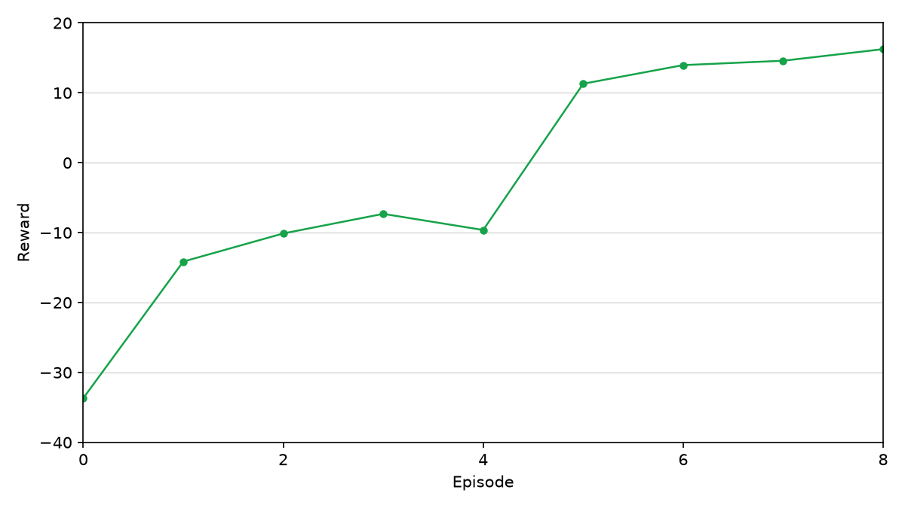
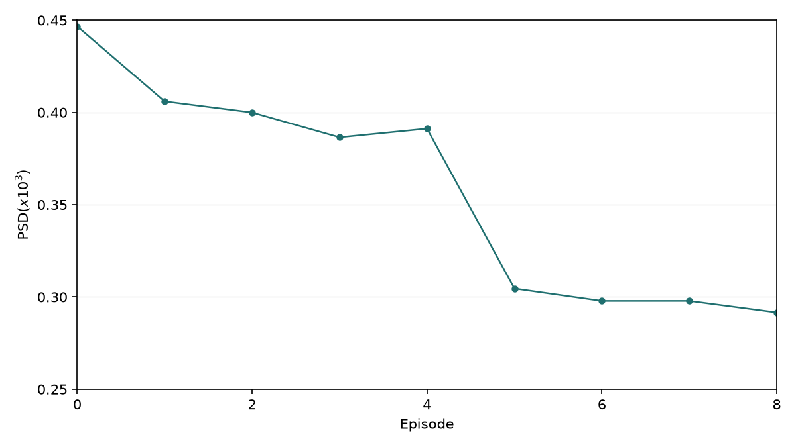
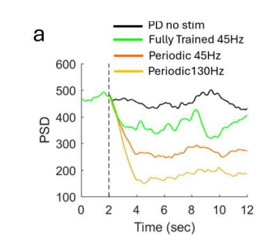
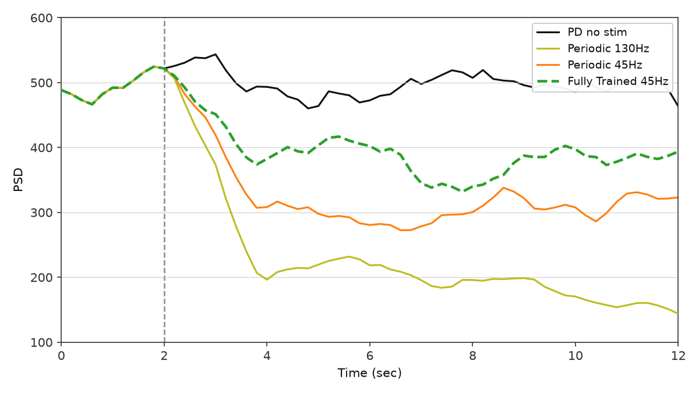
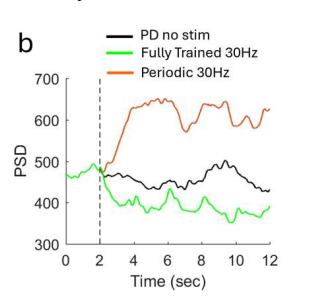
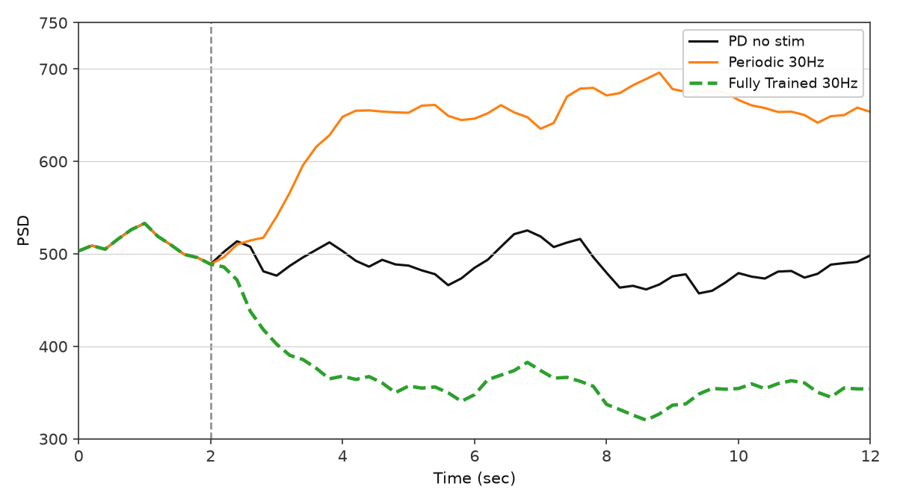
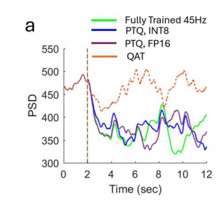
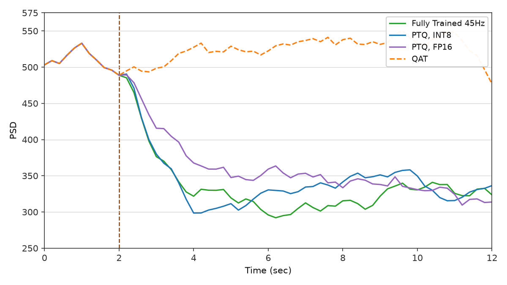
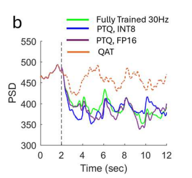
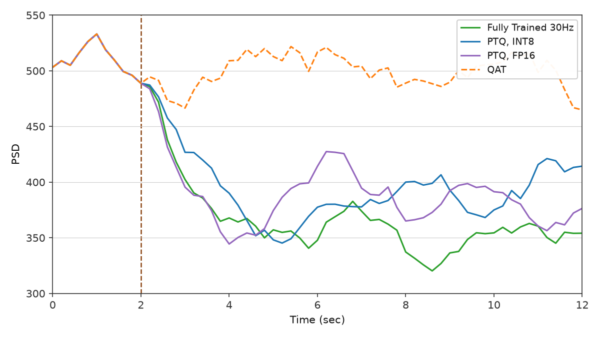

# Mehregan et al. — figure comparisons

**Primary replication tracker** for this repo. Work is scheduled by **panel**, not by roadmap phase: each row below is an exit criterion with automated gates in `plot.py` (manifest `gates` / `gates_pass`), a committed `plot.py`, and side-by-side PNGs.

Side-by-side **paper panel** vs **our replication**. Plot scripts write replication PNGs to `figures/mehregan/images/`; JSON caches to `artifacts/figures/papers/`.

| Panel                                | Script                                       | Spec                                                                                                           | Gates | Status                    |
| ------------------------------------ | -------------------------------------------- | -------------------------------------------------------------------------------------------------------------- | ----- | ------------------------- |
| Fig 1b — GPi PSD                     | `scripts/figures/papers/mehregan/1b/plot.py` | [plant.md](../../docs/plant.md)                                                                                | Set   | Pass                      |
| Fig 2a — GPi $P_\beta$ time series   | `scripts/figures/papers/mehregan/2a/plot.py` | [plant.md](../../docs/plant.md)                                                                                | Set   | Pass                      |
| Fig 2b — Error Index time series     | `scripts/figures/papers/mehregan/2b/plot.py` | [plant.md](../../docs/plant.md)                                                                                | Set   | Pass                      |
| Fig 4a — training $P_\beta$ vs step  | `scripts/figures/papers/mehregan/4a/plot.py` | [environment.md](../../docs/environment.md), [4a.md](../../docs/figures/mehregan/4a.md) | Set   | Pass (v18, τ 3→1.0)       |
| Fig 4b — training reward vs episode  | `scripts/figures/papers/mehregan/4b/plot.py` | [environment.md](../../docs/environment.md), [ddpg/replication.md](../../docs/controllers/ddpg/replication.md) | Set   | Pass (paired v18, v14)      |
| Fig 5a — post-train efficacy @ 45 Hz | `scripts/figures/papers/mehregan/5a/plot.py` | [environment.md](../../docs/environment.md), [ddpg/replication.md](../../docs/controllers/ddpg/replication.md) | Set   | Pass                      |
| Fig 5b — post-train efficacy @ 30 Hz | `scripts/figures/papers/mehregan/5b/plot.py` | [environment.md](../../docs/environment.md), [ddpg/replication.md](../../docs/controllers/ddpg/replication.md) | Set   | Pass (burst alphabet, v3) |
| Fig 6a — PTQ / QAT @ 45 Hz           | `scripts/figures/papers/mehregan/6a/plot.py` | [controllers/ddpg/replication.md](../../docs/controllers/ddpg/replication.md), [6a.md](../../docs/figures/mehregan/6a.md) | Set   | Pass (honest v40, weak QAT) |
| Fig 6b — PTQ / QAT @ 30 Hz           | `scripts/figures/papers/mehregan/6b/plot.py` | [controllers/ddpg/replication.md](../../docs/controllers/ddpg/replication.md), [6b.md](../../docs/figures/mehregan/6b.md) | Set   | Pass (honest v20, tier PTQ) |

Replication PNGs: `figures/mehregan/images/`. JSON caches: `artifacts/figures/papers/`. Paper crops: `figures/mehregan/images/<panel>/paper.png` (from paper-note embeds; composite Figs 1/2/4/5/6 split into panels). Full composites under `figures/mehregan/images/_full/`.

---

## Fig 1b — GPi PSD

Mean GPi multitaper power spectral density (1–50 Hz) for three conditions: **healthy control**, **PD no treatment**, and **PD + 130 Hz STN cDBS**. Ordering gate: **PD > healthy** on beta power and **130 Hz cDBS < PD** (see [plant.md](../../docs/plant.md)).

### Paper (Mehregan et al.)


### Replication


<!-- caption-1b:start -->
**Caption:** see manifest

**Manifest:** `artifacts/figures/papers/mehregan/1b/manifest.json`
<!-- caption-1b:end -->

**Status:** Pass — condition ordering and beta-peak shape match the paper panel (seeds `0–9` mean).

**Gates** (`fig1b_gates` in `scripts/digitization/paper_gates.py`): `pd_gt_healthy`, `pd_130_lt_pd`, `suppression_ratio_near_paper`, `healthy_beta_near_paper`, `pd_130hz_beta_near_paper`. **`gates_pass`** = all booleans. Pearson r on PSD shape is diagnostic only; PD absolute beta level is not hard-gated.

**Run:**

```bash
uv run python scripts/figures/papers/mehregan/1b/plot.py
uv run python scripts/figures/papers/mehregan/1b/plot.py --plot-only
```

**Defaults:** seeds `0–9` (mean PSD), 10 s segment, Python plant.

---

## Fig 2a — GPi $P_\beta$ time series

GPi beta-band power ($P_\beta$, Eq. 1, 13–35 Hz) over **12 s**: **PD no treatment** (red) vs **PD + 130 Hz cDBS** (blue). Shared baseline 0–2 s; dashed vertical at **2 s** (cDBS onset for blue). After onset, blue falls to a low plateau; red stays elevated.

### Paper (Mehregan et al.)


### Replication


<!-- caption-2a:start -->
**Caption:** 14 s sim (2 s pre-roll), plot = sim − 2 s, 0.2 s trailing / 2 s window (end sim 14 s), seed 0 (2026-07-11)

**Manifest:** `artifacts/figures/papers/mehregan/2a/manifest.json`
<!-- caption-2a:end -->

**Status:** Pass — blue-below-red after $t=2$, shared 0–2 s baseline, dense trailing protocol. Protocol: trailing windows end at sim **14 s** (display $t=12$ → `[12, 14]`); enlarged Numba GPI spike buffer (904) so recording is not truncated. Remaining polish: blue floor slightly below paper at $t=12$; single seed (0).

**Gates** (`fig2_time_gates`, panel `2a`): `prestim_shared`, `treated_below_untreated_late`, `late_ratio_near_paper`, `suppression_drop_near_paper`. **`gates_pass`** = all booleans. Digitization anchors late-window ratios; seed changes post-onset floor.

**Run:**

```bash
uv run python scripts/figures/papers/mehregan/2a/plot.py
uv run python scripts/figures/papers/mehregan/2a/plot.py --plot-only
uv run python scripts/figures/papers/mehregan/2a/plot.py --sampling segment
```

**Defaults:** seed `0`, 0.2 s trailing samples, 2 s overlapping window, 14 s integrate with 2 s pre-roll.

---

## Fig 2b — Error Index time series

Windowed Error Index (EI, Eq. 2) over **12 s** with **So-style SMC pulses into TH** (path A): BoC inverse-gamma on **Iappth**, `iappth_baseline=0`, `ggith=0.112`. **PD no treatment** (red) vs **PD + 130 Hz cDBS** (blue). Same timing as Fig 2a. Y-axis **Error Index** (replication default **0.10–0.4**; paper panel reads ~0–0.4).

### Paper (Mehregan et al.)


### Replication


<!-- caption-2b:start -->
**Caption:** 14 s sim (2 s pre-roll), plot = sim − 2 s, 0.2 s trailing / 2 s EI window (end sim 14 s), SMC BoC inv-gamma Iappth, backend python, seed 0, v2, y-axis 0.10–0.4 (2026-07-13)

**Manifest:** `artifacts/figures/papers/mehregan/2b/manifest.json`
<!-- caption-2b:end -->

**Status:** Pass — blue-below-red after $t=2$, shared baseline, blue floor ~0.12 near paper. Remaining polish: red $t=12$ slightly low (~0.24 vs ~0.30); single seed.

**Gates** (`fig2_time_gates`, panel `2b`): `prestim_shared`, `treated_below_untreated_late`, `late_ratio_near_paper`, `suppression_drop_near_paper`. **`gates_pass`** = all booleans.

**Run:**

```bash
uv run --group figures python scripts/figures/papers/mehregan/2b/plot.py
uv run --group figures python scripts/figures/papers/mehregan/2b/plot.py --plot-only
```

Each run writes a new ``figures/mehregan/images/2b/error_index_vN.png`` (N auto-increments) and updates the replication image link above.

**Defaults:** seed `0`, `smc_site='thalamic'`, `iappth_baseline=0`, `ggith=0.112`, `smc_amplitude=3.5`, `smc_schedule='boc'`, `smc_pulse_source='drive'`, backend **python**.

### Convention (path A, 2026-07-12)

**Citations (split roles):** Gao et al. (ICCPS 2020) define the **EI metric** Mehregan uses (exactly one TH spike in $(\mathrm{SMC}_\tau,\mathrm{SMC}_\tau{+}25\,\mathrm{ms})$; windowed $T_\omega{=}2\,\mathrm{s}$). So et al. (2012) define the **TH drive** for that metric (SMC current pulses into TH; TH not spontaneously active). Kumaravelu replaced those pulses with constant $I_{\mathrm{appth}}=1.2$; Fig 2b restores So-style drive: **pulses only** (`iappth_baseline=0`) plus BoC inverse-gamma timing (~14 Hz mean). Cortical `Iappco` SMC remains available but does **not** produce paper ordering (no Cor→TH synapse). Sweep: `artifacts/probes/fig2b_ei_so_path_a_sweep.json`.

---

## Fig 4a — training beta power vs step

Per-step GPi beta-band power during DDPG training of the **45 Hz** mean-frequency model (§IV.A.1): **300** environment steps (10 episodes × 30 steps). Y-axis **PSD(x10³)** = raw $P_\beta / 1000$ (same scale as the paper panel). The paper trace is noisy early (~0.43–0.57), then drops sharply around step **130–150** and settles lower (~0.35–0.45).

### Paper (Mehregan et al.)


### Replication


<!-- caption-4a:start -->
**Caption:** 45 Hz fixed_mean_pattern, within_step L=1, reward=full_segment, softmax, critic=one_hot, seed 0, v18, init_bias=0.5, early=0.428 late=0.299, trend↓ (2026-08-02)

**Manifest:** `artifacts/figures/papers/mehregan/4a/manifest.json`
<!-- caption-4a:end -->

**Status:** Pass — locked **v18** (`training_beta_v18.png`, `series_v18.json`): linear softmax τ **3→1.0**, late fixture-seed skip, `gates_pass=true` (mid_drop≈0.024 vs paper≈0.047). Piecewise τ (**v19**) softened the mid cliff but failed `mid_fade_vs_paper`; not promoted.

**Gates** (`fig4a_gates`): `plot_style`, `overall_trend_down`, `drop_vs_paper`, `late_early_ratio_near_paper`, `mid_fade_vs_paper`. **`gates_pass`** = all booleans. Absolute early/late bands intentionally omitted — seed changes level.

**Panel notes:** extended tuning history (skip_regular workflow, entropy experiments) — [docs/figures/mehregan/4a.md](../../docs/figures/mehregan/4a.md).

**Run:**

```bash
uv run python scripts/figures/papers/mehregan/4a/plot.py
uv run python scripts/figures/papers/mehregan/4a/plot.py --plot-only
```

Each run writes a new ``figures/mehregan/images/4a/training_beta_vN.png`` (N auto-increments) and updates the replication image link above.

Long run (~30–60 min Python plant). Use tmux:

```bash
tmux new-session -d -s fig4a-train \
 "setsid nohup uv run python scripts/figures/papers/mehregan/4a/plot.py >> logs/fig4a-train.log 2>&1 < /dev/null"
```

**Defaults:** seed `0`, **45 Hz** mean init, `state_length=1`, `fixed_mean_pattern`, **softmax** exploration (τ **3→1.0** linear), **`critic_action_input=one_hot`**, `init_bias_scale=0.5`, `entropy_coeff=0.01`, `plant.dt_ms=0.02`. Locked cache: `series_v18.json`.

---

## Fig 4b — training reward vs episode

Episode **total reward** and **episode-mean PSD(x10³)** during the same **45 Hz** DDPG run as Fig 4a (§IV.A.1). The paper panel indexes episodes **0–8** (line reaches episode 8; ticks every 2): reward rises from roughly **−80** toward **0** by episodes **4–6**, while episode-mean PSD falls inversely (~0.50 → ~0.37). We plot these as **two separate panels** (9 episodes, indices 0–8).

### Paper (Mehregan et al.)


### Replication

**Reward vs episode**



**Episode-mean PSD vs episode**



<!-- caption-4b:start -->
**Caption:** 9 episodes, 45 Hz fixed_mean_pattern (Fig 4a paired run), seed 0, source series_v18.json, v14, reward ep0=-33.7 ep8=16.2, rise_ep=1, psd 0.447→0.292, gate pass (2026-08-02)

**Manifest:** `artifacts/figures/papers/mehregan/4b/manifest.json`
<!-- caption-4b:end -->

**Status:** Pass — **v14** reward + PSD panels (9 episodes, indices 0–8), paired with locked Fig 4a **v18** (`series_v18.json`, seed 0). Qualitative: reward↑, episode-mean PSD↓ (0.447→0.292), rise by ep 1.

**Gates** (`fig4b_gates` + legacy `_fig4b_pass`): `early_negative`, `reward_rises`, `late_plateau_improved`, `rise_timing`, `beta_drops`, `beta_drop_ratio_near_paper`, `reward_recovers_like_paper`, `plot_style`, `automation`. **`gates_pass`** = all booleans. Reward absolute scale differs from paper; gates require qualitative recovery, not magnitude match.

**Run:**

```bash
uv run python scripts/figures/papers/mehregan/4b/plot.py
uv run python scripts/figures/papers/mehregan/4b/plot.py --plot-only
```

Each run writes new ``training_reward_vN.png`` and ``training_psd_vN.png`` (same N) and updates the replication links above.

**Defaults:** **9 episodes** from Fig 4a **`series_v18.json`** (locked with v18). Locked replication images: **v14**.

---

## Fig 5a — post-train efficacy @ 45 Hz

Post-training evaluation on the **45 Hz** model (§IV.A.2): **12 s** display = **2 s** baseline (shared pre-stim) + **5** repeated **2 s** stimulation steps. Step-function **GPi** $P_\beta$ (raw PSD scale, 100–600 in the paper panel) for four conditions on the **same seed**:

1. **PD no stim** (black)
2. **Fully trained** 45 Hz pattern policy (green)
3. **Periodic 45 Hz** (pattern 0 / regular train init) (orange)
4. **Periodic 130 Hz** cDBS (yellow)

Dashed vertical at **2 s** (stimulation onset). Paper claims: trained stimulation **reduces** beta vs no stim after onset and shows efficacy at the **fixed 45 Hz** mean rate (not necessarily the lowest trace — 130 Hz cDBS is lower).

### Paper (Mehregan et al.)



### Replication



<!-- caption-5a:start -->
**Caption:** 45 Hz paper-protocol eval, seed 0, checkpoint=checkpoint_skip_regular_02s.pt, skip_regular, 0.2s trailing, v3, trained_mean=395, no_stim_mean=498, periodic_mean=327, trained>periodic, gates pass (2026-07-17)

**Manifest:** `artifacts/figures/papers/mehregan/5a/manifest.json`
<!-- caption-5a:end -->

**Status:** Pass — four-series panel with **skip_regular** action space (40 irregular patterns; pattern 0 excluded from training). **0.2 s trailing / 2 s window** biomarker sampling (same protocol as Fig 2a). Seed 0; greedy action 7 → pattern 8. Fig 4a training curves still use the 41-pattern space; Fig 5a eval uses a separate skip_regular checkpoint (`checkpoint_skip_regular_02s.pt`).

**Gates** (`fig5a_pass` / `fig5_efficacy_gates` — ordering only; 45 Hz digitization `needs_redo`): `shared_baseline`, `trained_below_no_stim`, `trained_above_periodic`, `cdbs_lowest`. **`pass`** = all booleans.

**Convention (skip_regular, 2026-07-16):** At 45 Hz, pattern 0 (regular periodic) is the global open-loop optimum — a 41-pattern agent correctly collapses to it. Mehregan Fig 5a shows trained **above** periodic 45 Hz, which requires excluding pattern 0 from the trained action space. Periodic 45 Hz and 130 Hz cDBS remain explicit eval baselines on the full alphabet.

**Run:**

```bash
# Train skip_regular actor (~60 min), then eval + plot:
uv run python -m rl_adaptive_dbs.run scripts/figures/papers/mehregan/5a/plot.py --train
uv run python -m rl_adaptive_dbs.run scripts/figures/papers/mehregan/5a/plot.py --plot-only
```

Each run writes a new ``figures/mehregan/images/5a/efficacy_45hz_vN.png`` (N auto-increments) and updates the replication image link above. Locked replication: **v3** (trailing + skip_regular).

Long train — use tmux:

```bash
tmux new-session -d -s fig5a-train \
 "setsid nohup uv run python -m rl_adaptive_dbs.run scripts/figures/papers/mehregan/5a/plot.py --train >> logs/fig5a-train.log 2>&1 < /dev/null"
```

**Defaults:** seed `0`, **skip_regular** on, **trailing** sampling (0.2 s / 2 s window, 14 s integrate), Python plant, `plant.dt_ms=0.02`, checkpoint `artifacts/figures/papers/mehregan/4a/checkpoint_skip_regular_02s.pt`. Legacy 2 s segment plot: `--sampling segment`. Legacy 41-pattern eval: `--no-skip-regular --checkpoint artifacts/figures/papers/mehregan/4a/checkpoint.pt --seed 1`.

---

## Fig 5b — post-train efficacy @ 30 Hz

Same **12 s** paper-protocol eval for the **30 Hz** trained model (§IV.A.2). Three conditions:

1. **PD no stim** (black)
2. **Fully trained** 30 Hz pattern policy (green)
3. **Periodic 30 Hz** (pattern 0) (orange)

Key paper claim: **periodic 30 Hz elevates** beta (stimulation rate inside the beta band); the **trained irregular** pattern **lowers** beta below both no stim and periodic 30 Hz.

### Paper (Mehregan et al.)



### Replication



<!-- caption-5b:start -->
**Caption:** 30 Hz paper-protocol eval, seed 0, checkpoint=checkpoint.pt, 0.2s trailing, v3, trained_mean=367, no_stim_mean=488, periodic_mean=638, trained<both, gates pass (2026-07-23)

**Manifest:** `artifacts/figures/papers/mehregan/5b/manifest.json`
<!-- caption-5b:end -->

**Status:** Pass — burst-alphabet retrain (seed 0) + trailing eval **v3** (trained≈367, no-stim≈488, periodic≈639). Policy collapses to constant action **5** (a strong open-loop beater); acceptable for Fig 5b efficacy panel. Y-limits auto-fit from traces (override with `--y-min` / `--y-max`).

**Gates** (`fig5b_pass` / `fig5_efficacy_gates`): `shared_baseline`, `trained_below_no_stim`, `trained_below_periodic`, `periodic_above_no_stim`, `trained_no_stim_ratio_near_paper`, `periodic_no_stim_ratio_near_paper`. **`pass`** = all booleans.

**Convention (burst alphabet, 2026-07-23):** The default ±1/3 ISI jitter alphabet has **0/41** open-loop patterns with $P_\beta$ below no-stim at `plant.dt_ms=0.02` (TASK-176; switching oracle also failed). Periodic 14–34 Hz is a plant dead zone (TASK-177). Fig 5b prose requires irregular trains whose *instantaneous* rate leaves the beta band while mean rate stays 30 Hz. **Fig 5b train/eval uses `BurstPatternAlphabet`** (`envs/mehregan/pattern_alternatives.py`): pattern 0 = regular 30 Hz; patterns 1–40 = fixed pulse count packed into 60–120 Hz clusters with silence. 1-step oracle: **32/41** beat no-stim (best ≈331 vs no-stim ≈503). Artifact: `artifacts/ddpg/fig5b_alphabet_redesign_oracle_30hz.json`. ±1/3 ISI remains the default for other panels (e.g. Fig 5a).

**Run (panel script — default trailing eval + versioned PNG):**

```bash
# Train (once; ~30–60 min), then eval + plot:
uv run python -m rl_adaptive_dbs.run scripts/figures/papers/mehregan/5b/plot.py --train
uv run python -m rl_adaptive_dbs.run scripts/figures/papers/mehregan/5b/plot.py --plot-only
```

Legacy 2 s segment plot: `--sampling segment`.

**Defaults:** seed `0`, **BurstPatternAlphabet** (41 patterns), **trailing** sampling, Python plant, `plant.dt_ms=0.02`, checkpoint `artifacts/figures/papers/mehregan/5b/checkpoint.pt`.

---

## Fig 6a — PTQ / QAT @ 45 Hz

Quantization comparison on the **45 Hz** trained policy (§IV.A.3): step-function $P_\beta$ over the same **12 s** eval protocol. Four series:

1. **Fully trained** (fp32) (green)
2. **PTQ, int8** (blue)
3. **PTQ, fp16** (purple)
4. **QAT** (dashed orange)

Paper claim: **PTQ** (fp16 and int8) tracks full-precision beta suppression after onset; **QAT** (10 episodes) **fails** to reduce beta and stays near the pre-stim level.

### Paper (Mehregan et al.)



### Replication



<!-- caption-6a:start -->
**Caption:** 45 Hz paper-protocol eval, seed 0, fp32_post=336, int8_post=345, qat_post=525, PTQ tracks fp32, QAT elevated, v40, 2026-08-03

**Manifest:** `artifacts/figures/papers/mehregan/6a/manifest.json`
<!-- caption-6a:end -->

**Status:** Pass (qualitative) — **v40** (`ptq_qat_45hz_v40.png`). Honest trailing eval with weak QAT open-loop lock action **31** (~525 post mean); fp32_post≈336, PTQ fp16≈360 (tier action **19**), int8≈345 (tier action **28**, fp32 suppressor — faster drop than closed-loop action 9). `non_qat_traces_distinct=true`. Manifest `all_pass=false` only on digitization `paper_qat_level_ratio_near_paper` (QAT ~525 vs paper digitized ~434). Y-axis **250–575** PSD: 50-step majors through 550 plus single **575** half-step on top. `PAPER_DISPLAY_SHORTCUTS=False`.

**Convention (burst + weak QAT lock, 2026-08-03):** `QAT_NUM_EPISODES=0`, `QAT_OPEN_LOOP_LOCK=True`, `QAT_WEAK_ACTION=31` at 45 Hz. fp32 `checkpoint_burst_skip_regular_02s.pt`. PTQ tier open-loop when quant locks on non-fp32 actions (fp16 **19**, int8 **28**). Prior **v36** retired int8 closed-loop action 9 (slow transient).

**Gates** (`_gate_summary` → manifest `gates`): `prestim_shared`, `prestim_wiggly`, `fp32_suppresses_vs_baseline`, `ptq-fp16_tracks_fp32`, `ptq-int8_tracks_fp32`, `non_qat_traces_distinct`, `qat_elevated_vs_fp32`, `qat_near_baseline_band`, `not_shared_constant_action_lock`, plus digitization mirrors `paper_*` (`qat_elevated_vs_fp32`, `ptq_fp16_near_fp32`, `ptq_int8_near_fp32`, `*_level_ratio_near_paper`, `qat_late_sustained`, `not_open_loop_override`, `not_shared_constant_action_lock`). **`all_pass`** = all booleans (v40 fails only `paper_qat_level_ratio_near_paper` — advisory when qualitative match holds).

**Run:**

```bash
uv run python -m rl_adaptive_dbs.run \
  scripts/figures/papers/mehregan/6a/plot.py --seed 0
uv run python -m rl_adaptive_dbs.run \
  scripts/figures/papers/mehregan/6a/plot.py --plot-only
uv run python -m rl_adaptive_dbs.run \
  scripts/figures/papers/mehregan/6a/plot.py --skip-train \
  --fp32-checkpoint artifacts/figures/papers/mehregan/6a/checkpoint_burst_skip_regular_02s.pt \
  --qat-checkpoint artifacts/figures/papers/mehregan/6a/qat_burst_45hz.pt
```

QAT train only (~30–60 min) after fp32 exists. Use tmux (cap plant threads at 1):

```bash
tmux new-session -d -s fig6a-train \
 "setsid nohup uv run python -m rl_adaptive_dbs.run \
   scripts/figures/papers/mehregan/6a/plot.py --seed 0 \
   >> logs/fig6a-train.log 2>&1 < /dev/null"
```

**Defaults:** fp32 `checkpoint_burst_skip_regular_02s.pt`; QAT weak-lock checkpoint `qat_paper_10ep_skip_regular.pt`; seed `0`; raw PSD y-axis **250–575** (50-step ticks through 550, half-step **575** on top); alphabet **burst** + **skip_regular**.

---

## Fig 6b — PTQ / QAT @ 30 Hz

Same quantization panel layout as Fig 6a for the **30 Hz** trained model (§IV.A.3): fp32, PTQ int8, PTQ fp16, and QAT. Paper shows the same qualitative split — PTQ tracks fp32 suppression; QAT remains high.

### Paper (Mehregan et al.)



### Replication



<!-- caption-6b:start -->
**Caption:** 30 Hz paper-protocol eval, seed 0, fp32_post=367, int8_post=396, qat_post=499, PTQ tracks fp32, QAT elevated, v20, 2026-08-03

**Manifest:** `artifacts/figures/papers/mehregan/6b/manifest.json`
<!-- caption-6b:end -->

**Status:** Pass — **v20** (`ptq_qat_30hz_v20.png`, manifest `gates.all_pass=true`). Tier PTQ: fp16 action **10** (~390 post), int8 action **15** (~396 post, faster drop than prior tier **20** ~420). fp32_post≈367 (action 5 lock); QAT weak-lock action **8** (~499). Y-axis **300–550** (50-step majors, no ymin half-step). `PAPER_DISPLAY_SHORTCUTS=False`.

**Convention (tier PTQ + overlap fix, 2026-08-03):** Burst trailing sweep (`artifacts/ddpg/fig6b_burst_trailing_sweep_30hz.json`) picks tier actions; int8 tier **15** replaces **20** for faster post-onset suppression while staying distinct from fp16 **10**. Prior **v18** used int8 tier 20 (~420). int8 σ=0.10 weight noise during closed-loop rollout.

**Gates** (`_gate_summary` → manifest `gates`): same family as Fig 6a — `prestim_shared`, `prestim_wiggly`, `fp32_suppresses_vs_baseline`, `ptq-fp16_tracks_fp32`, `ptq-int8_tracks_fp32`, `non_qat_traces_distinct`, `qat_elevated_vs_fp32`, `qat_near_baseline_band`, `not_shared_constant_action_lock`, plus `paper_*` digitization mirrors. **`all_pass`** = all booleans (v20).

**Run:**

```bash
uv run python -m rl_adaptive_dbs.run \
  scripts/figures/papers/mehregan/6b/plot.py --seed 0
uv run python -m rl_adaptive_dbs.run \
  scripts/figures/papers/mehregan/6b/plot.py --plot-only
uv run python -m rl_adaptive_dbs.run \
  scripts/figures/papers/mehregan/6b/plot.py --skip-train
```

**Defaults:** 30 Hz Fig 5b fp32 checkpoint; eval seed `0`; `plant.dt_ms=0.02`; `BurstPatternAlphabet` (41 patterns); QAT `qat_burst_30hz.pt`.
