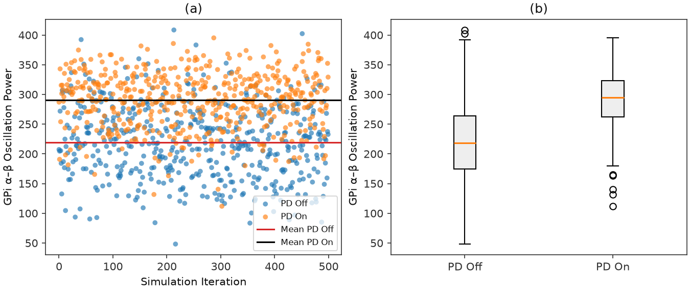
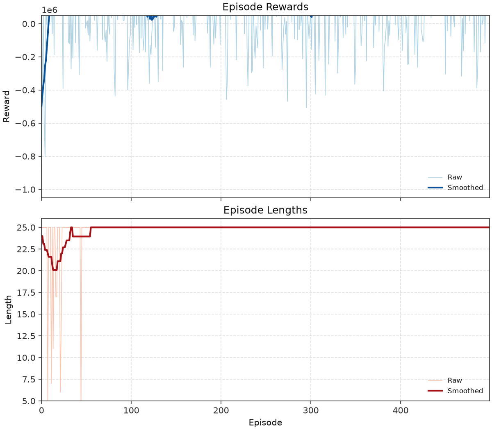

# Nguyen et al. — figure comparisons

**Primary replication tracker** for the DSQN / closed-loop neuromorphic DBS paper. Spec: [controllers/snn/replication.md](../../docs/controllers/snn/replication.md). Work proceeds **in parallel** with Mehregan ([Mehregan replications](../mehregan/replications.md)): each row is an exit criterion with automated gates, a committed `plot.py` (when present), and side-by-side PNGs.

Plot scripts write replication PNGs to `figures/nguyen/images/`; JSON caches to `artifacts/figures/papers/nguyen/`. Paper panels: `figures/nguyen/images/<panel>/paper.png`. Full composites under `figures/nguyen/images/_full/`.

Figs **1–2** are schematics — **not** replication targets.

| Panel | Script | Spec | Status |
|-------|--------|------|--------|
| Fig 3 — GPi α–β distribution (PD Off vs PD On) | `scripts/figures/papers/nguyen/3/plot.py` | [snn/replication.md](../../docs/controllers/snn/replication.md) §3 | Pass |
| Fig 4 — training reward + episode length | `scripts/figures/papers/nguyen/4/plot.py` | [snn/replication.md](../../docs/controllers/snn/replication.md) §6.5 | Open |
| Fig 5 — CBGT spikes + DBS energy over training | `scripts/figures/papers/nguyen/5/plot.py` | [snn/replication.md](../../docs/controllers/snn/replication.md) §8 | Open |
| Fig 6 — α–β + DBS params over training | `scripts/figures/papers/nguyen/6/plot.py` | [snn/replication.md](../../docs/controllers/snn/replication.md) §8 | Open |
| Fig 7 — 50-episode eval (25 steps) | `scripts/figures/papers/nguyen/7/plot.py` | [snn/replication.md](../../docs/controllers/snn/replication.md) §8 | Open |

**Gates:** manifest `gates` in `artifacts/figures/papers/nguyen/<panel>/manifest.json`. Tables below refresh from manifest on each `promote` run (`scripts/figures/papers/promote.py` `refresh_nguyen_gate_tables`). Heuristic keys from each `plot.py` plus digitization mirrors from `scripts/digitization/nguyen_gates.py` (`attach_digitization` — overall `pass` = both layers). Digitization loads `artifacts/figures/papers/nguyen/paper_digitization/curves_*.json`.

---

## Fig 3 — GPi α–β oscillation power distribution

Distribution of GPi **α–β** oscillation power (**7–35 Hz**) for **PD On** vs **PD Off** (no DBS). **PD On** = parkinsonian (`pd=1`); **PD Off** = healthy (`pd=0`). Reward threshold θ = 150 is **not** drawn on this panel.

### Paper (Nguyen et al.)


### Replication



<!-- caption-3:start -->
**Caption:** GPi α–β (7–35 Hz), 500 iters × 0.1 s; PD On mean=290.8, PD Off mean=219.5, PD On Q1=262.3; ordering_pass=True (v5)

**Manifest:** `artifacts/figures/papers/nguyen/3/manifest.json`
<!-- caption-3:end -->

**Status:** Pass — 500 × 100 ms samples; see `alpha_beta_dist_v5.png`.

<!-- gates-3:start -->
**Gates** (`artifacts/figures/papers/nguyen/3/manifest.json`; overall **pass**)

| Key | Blocks `pass` | Current |
|-----|---------------|---------|
| `ordering_pd_on_above_pd_off` | yes | pass |
| `threshold_near_pd_on_q1` — informational | no | pass |
| `paper_ordering_pd_on_above_pd_off` — digitization | yes | pass |
| `paper_mean_ratio_near_paper_readout` — digitization; no curves_fig3 yet | no | pass |
| `paper_means_separated` — logged | no | pass |
<!-- gates-3:end -->

**Run:**

```bash
tmux new-session -d -s fig2-3 \
 "setsid nohup uv run python -m rl_adaptive_dbs.run \
   scripts/figures/papers/nguyen/3/plot.py >> logs/fig2-3.log 2>&1 < /dev/null"
uv run python -m rl_adaptive_dbs.run scripts/figures/papers/nguyen/3/plot.py --n-iterations 50
uv run python -m rl_adaptive_dbs.run scripts/figures/papers/nguyen/3/plot.py --plot-only
```

**Defaults:** 500 iterations per condition, 0.1 s per sample, seeds `0…499`. Writes `alpha_beta_dist_vN.png`.

---

## Fig 4 — Training rewards and lengths

Episode **rewards** (a) and **lengths** (b) over **500** training episodes. Init DBS **40 Hz / 0.3 ms / 300 nA/cm²**; seed **0**; max **25** steps/episode; early-stop streak $t_u=3$; θ = 150.

### Paper (Nguyen et al.)


### Replication



<!-- caption-4:start -->
**Caption:** DSQN train 500 ep, seed=0; late_reward=179880, late_len=25.0; pass=False (v14)

**Manifest:** `artifacts/figures/papers/nguyen/4/manifest.json`
<!-- caption-4:end -->

**Status:** Open — see `training_reward_length_v14.png`.

<!-- gates-4:start -->
**Gates** (`artifacts/figures/papers/nguyen/4/manifest.json`; overall **fail**)

| Key | Blocks `pass` | Current |
|-----|---------------|---------|
| `reward_scale_paper` — |mean reward ep 0–50| ≥ 5×10⁴ | yes | pass |
| `late_reward_above_early` | yes | fail |
| `late_reward_near_zero` — late mean > −2×10⁵ | yes | pass |
| `length_decreases` — late mean < early mean − 1 step | yes | fail |
| `late_length_paper_band` — late mean ≤ 12 | yes | fail |
| `early_near_max_length` — median first 50 ≥ max_steps − 2 | yes | pass |
| `early_high_variance` — logged | no | pass |
| `paper_early_reward_mag_near_paper` — digitization | yes | fail |
| `paper_reward_improves_like_paper` — digitization | yes | fail |
| `paper_late_reward_ratio_near_paper` — digitization | yes | fail |
| `paper_length_decreases_like_paper` — digitization | yes | fail |
| `paper_late_length_near_paper` — digitization | yes | fail |
| `paper_early_near_max_length` — digitization | yes | pass |
<!-- gates-4:end -->

`--smoke` sets `smoke_override` (CI only).

**Run:**

```bash
tmux new-session -d -s fig2-4-train \
 "setsid nohup uv run python -m rl_adaptive_dbs.run \
   scripts/figures/papers/nguyen/4/plot.py >> logs/fig2-4-train.log 2>&1 < /dev/null"
uv run python -m rl_adaptive_dbs.run scripts/figures/papers/nguyen/4/plot.py --plot-only
```

---

## Fig 5 — Network spikes and DBS energy

Per-episode **CBGT spike counts** (a) and **DBS energy** (b, Eq. (6)) from the same **500**-episode train as Fig 4 (`artifacts/figures/papers/nguyen/4/series.json`).

### Paper (Nguyen et al.)


### Replication

*Not yet generated from a passing Fig 4 train.* Target: `figures/nguyen/images/5/spikes_energy_vN.png`

<!-- caption-5:start -->
**Caption:** TBD

**Manifest:** `artifacts/figures/papers/nguyen/5/manifest.json`
<!-- caption-5:end -->

**Status:** Open — needs Fig 4 train `gates.pass`, then `scripts/figures/papers/nguyen/5/plot.py`.

<!-- gates-5:start -->
**Gates** (no manifest at `artifacts/figures/papers/nguyen/5/manifest.json`; overall **—**)

| Key | Blocks `pass` | Current |
|-----|---------------|---------|
| `shared_train` — Fig 4 passed + same n_episodes | yes | — |
| `spike_series_has_variance` | yes | — |
| `energy_series_has_variance` | yes | — |
| `energy_not_constant` | yes | — |
| `spike_in_paper_band` — mean spikes 400–950/ep | yes | — |
| `energy_in_paper_band` — mean 300–3200/ep, max ≤ 3520 | yes | — |
| `paper_spike_mean_near_paper` — digitization | yes | — |
| `paper_energy_mean_near_paper` — digitization | yes | — |
| `paper_spike_trend_near_paper` — digitization | yes | — |
| `paper_energy_trend_near_paper` — digitization | yes | — |
| `paper_spike_series_has_variance` — digitization | yes | — |
| `paper_energy_not_constant` — digitization | yes | — |
<!-- gates-5:end -->

**Run:** plot from Fig 4 series cache; `scripts/figures/papers/nguyen/5/plot.py --plot-only` after train.

---

## Fig 6 — α–β and DBS parameters over training

GPi **α–β** (a) and DBS amplitude / frequency / pulse width (b) over **500** episodes; shared train with Figs 4–5.

### Paper (Nguyen et al.)


### Replication

*Not yet generated.* Target: `figures/nguyen/images/6/alpha_beta_params_vN.png`

<!-- caption-6:start -->
**Caption:** TBD

**Manifest:** `artifacts/figures/papers/nguyen/6/manifest.json`
<!-- caption-6:end -->

**Status:** Open.

<!-- gates-6:start -->
**Gates** (no manifest at `artifacts/figures/papers/nguyen/6/manifest.json`; overall **—**)

| Key | Blocks `pass` | Current |
|-----|---------------|---------|
| `shared_train` | yes | — |
| `paper_alpha_beta_decreases_like_paper` — digitization | yes | — |
| `paper_late_alpha_beta_below_theta` — late mean α–β ≤ 150 | yes | — |
| `paper_late_alpha_beta_near_paper` — digitization | yes | — |
| `paper_params_left_init` — amp / freq / pw each >5% off init | yes | — |
| `paper_amp_late_near_paper` — digitization | yes | — |
| `paper_freq_late_near_paper` — digitization | yes | — |
| `paper_pw_late_near_paper` — digitization | yes | — |
| `paper_late_params_stable` — std last 50 ep ≤ 20% of mean | yes | — |
<!-- gates-6:end -->

Paper end anchors (~262 nA/cm², ~78.65 Hz, ~1 ms) and ~22% energy vs open-loop 130 Hz are **report** items in manifest metrics, not separate pass keys.

**Run:** shared Fig 4 series; `scripts/figures/papers/nguyen/6/plot.py`.

---

## Fig 7 — Evaluation (50 episodes × 25 steps)

Seeded eval of the trained policy: **50** episodes × **25** steps, different seed per episode.

### Paper (Nguyen et al.)


### Replication

*Not yet generated.* Target: `figures/nguyen/images/7/eval_50ep_vN.png`

<!-- caption-7:start -->
**Caption:** TBD

**Manifest:** `artifacts/figures/papers/nguyen/7/manifest.json`
<!-- caption-7:end -->

**Status:** Open — needs Fig 4 checkpoint + `rl-dbs eval --controller snn` + panel script.

<!-- gates-7:start -->
**Gates** (no manifest at `artifacts/figures/papers/nguyen/7/manifest.json`; overall **—**)

| Key | Blocks `pass` | Current |
|-----|---------------|---------|
| `checkpoint_lineage_ok` — Fig 4 train passed | yes | — |
| `paper_eval_protocol_ok` — ≥20 steps | yes | — |
| `paper_overall_mean_near_paper` — digitization | yes | — |
| `paper_late_early_ratio_near_paper` — digitization | yes | — |
| `paper_step_series_finite` | yes | — |
| `paper_below_fig3_pd_median` — when Fig 3 median available | yes | — |
| `mean_below_theta` — informational | no | — |
<!-- gates-7:end -->

**Run (planned):**

```bash
uv run rl-dbs eval --controller snn --checkpoint artifacts/figures/papers/nguyen/4/checkpoint.pt
uv run python -m rl_adaptive_dbs.run scripts/figures/papers/nguyen/7/plot.py --plot-only
```

---

## Conventions (v1)

Paper-silent knobs — see [snn/replication.md](../../docs/controllers/snn/replication.md) §12 and `SNNConfig`:

| Knob | v1 choice |
|------|-----------|
| Observation | GPi-only binary spike matrix |
| Action head | `factored` (3× ternary argmax) |
| Early-stop streak $t_u$ | 3 |
| LIF θ_th | 1.0 |
| Target net | hard copy on a fixed period |
| Reward coeffs δ, τ | `energy_penalty=0.01`, `threshold_reward=1.0` |
| Fig 3 α–β window | **100 ms** per sample (Nguyen RL step); 500 iterations |
