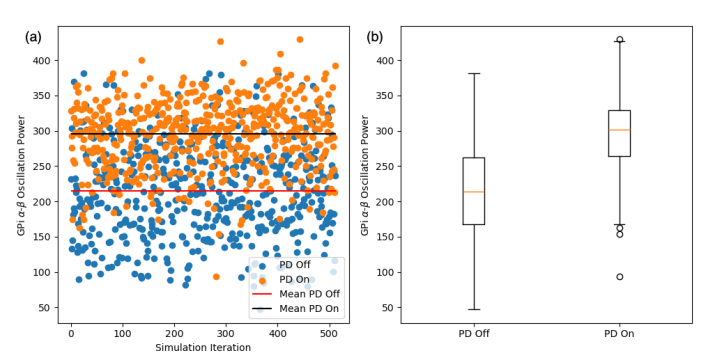
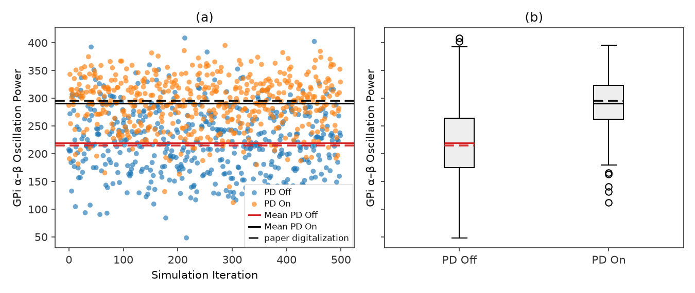
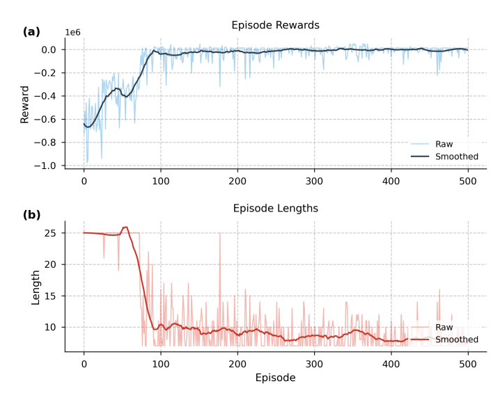
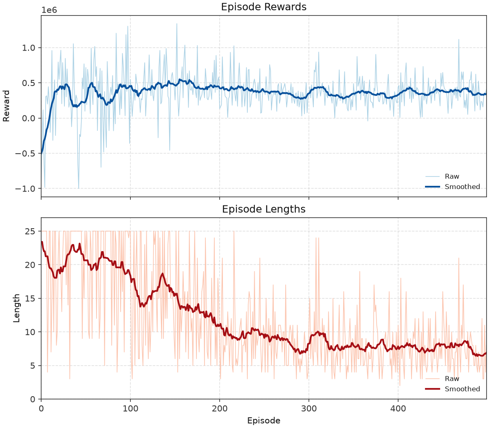
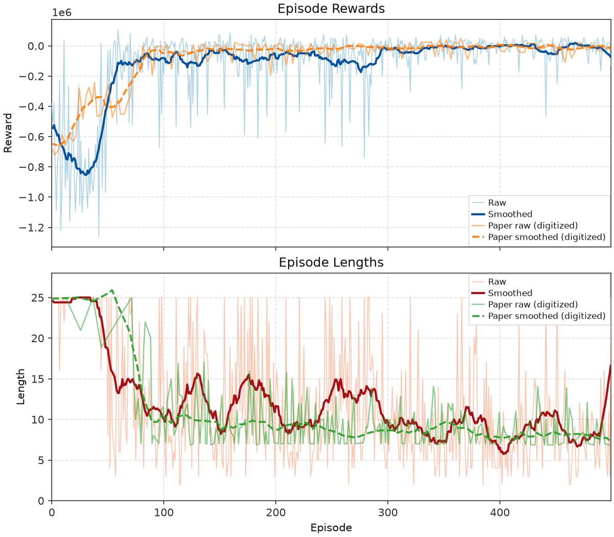
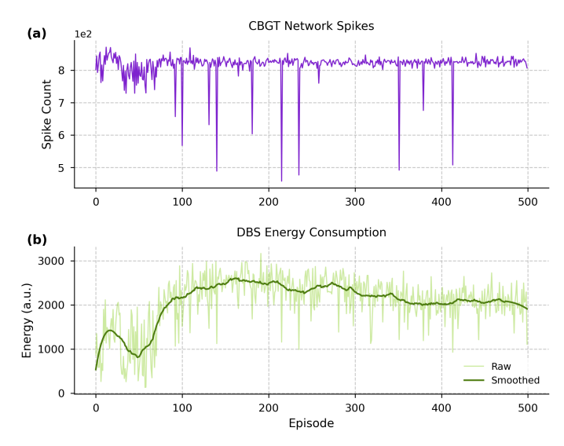
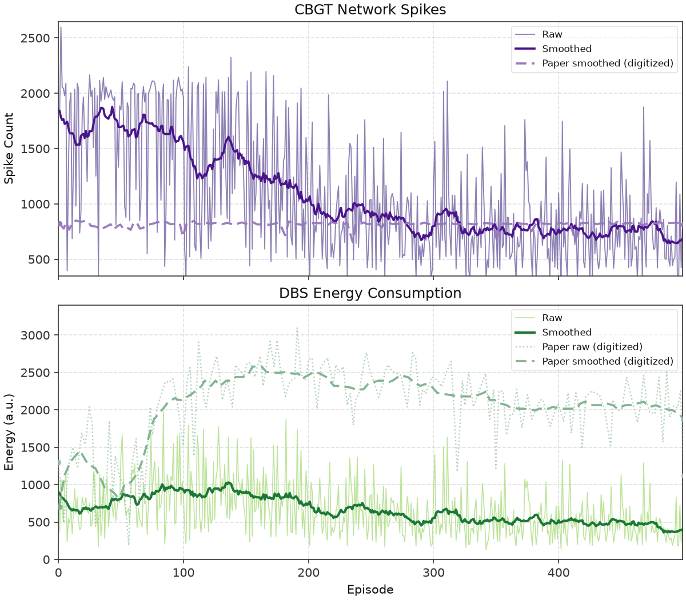
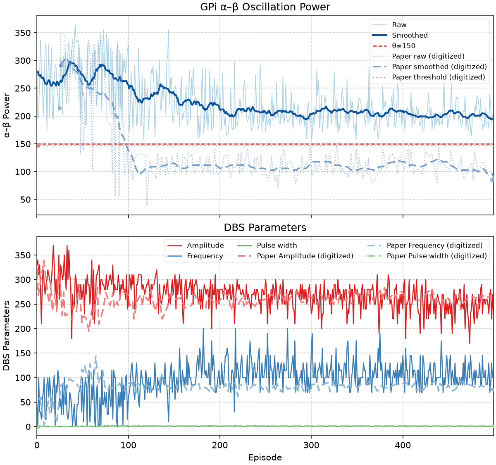
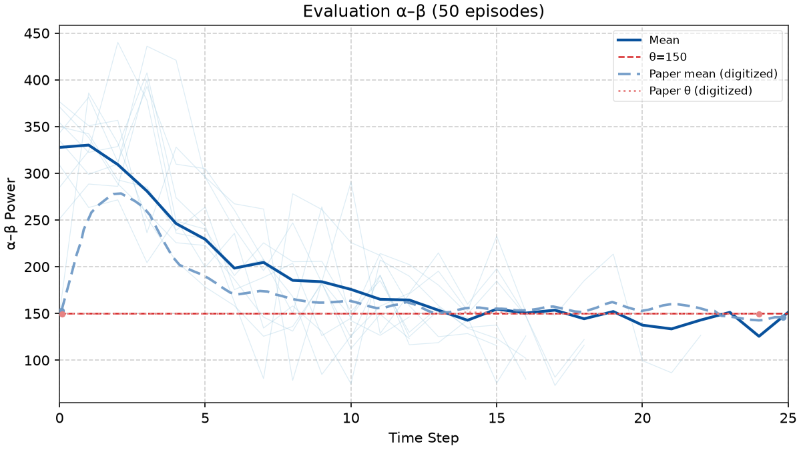

# Nguyen et al. — figure comparisons

**Primary replication tracker** for the DSQN / closed-loop neuromorphic DBS paper. Spec: [controllers/snn/replication.md](../../docs/controllers/snn/replication.md). Work proceeds **in parallel** with Mehregan ([Mehregan replications](../mehregan/replications.md)): each row is an exit criterion with automated gates, a committed `plot.py` (when present), and side-by-side PNGs.

Plot scripts write replication PNGs to `figures/nguyen/images/`; JSON caches to `artifacts/figures/papers/nguyen/`. Paper panels: `figures/nguyen/images/<panel>/paper.png`. Full composites under `figures/nguyen/images/_full/`.

Figs **1–2** are schematics — **not** replication targets.

**Gates:** manifest `gates` in `artifacts/figures/papers/nguyen/<panel>/manifest.json`. Per-panel tables below refresh from manifest on each `promote` run (`scripts/figures/papers/promote.py` `refresh_nguyen_gate_tables`). Every listed check is required for exit. Digitization mirrors from `scripts/digitization/nguyen_gates.py` (`attach_digitization`).

<!-- summary:start -->
| Panel | Description | Status |
|-------|-------------|--------|
| Fig 3 | GPi α–β distribution (PD Off vs PD On) | Pass (rep v22) |
| Fig 4 | Training reward + episode length | Shape OK (full open) |
| Fig 5 | CBGT spikes + DBS energy over training | Fail (`shared_train`) |
| Fig 6 | α–β + DBS parameters over training | Fail (`shared_train`) |
| Fig 7 | 50-episode eval (25 steps) | Fail (`checkpoint_lineage_ok`) |
<!-- summary:end -->

---

## Fig 3 — GPi α–β oscillation power distribution

Distribution of GPi **α–β** oscillation power (**7–35 Hz**) for **PD On** vs **PD Off** (no DBS). **PD On** = parkinsonian (`pd=1`); **PD Off** = healthy (`pd=0`). Reward threshold θ = 150 is **not** drawn on this panel.

### Paper (Nguyen et al.)



### Replication



<!-- caption-3:start -->
**Caption:** GPi α–β (7–35 Hz), 500 iters × 0.1 s; PD On mean=290.8, PD Off mean=219.5, PD On Q1=262.3; ordering_pass=True (v22)

**Manifest:** `artifacts/figures/papers/nguyen/3/manifest.json`
<!-- caption-3:end -->

**Status:** Pass — 500 × 100 ms samples; see `alpha_beta_dist_v22.png`.

<!-- gates-3:start -->
**Gates set** (`artifacts/figures/papers/nguyen/3/manifest.json`; overall **`pass`**: yes, 2026-08-20). Every row is required for exit.

| Key | Description | Pass |
|-----|-------------|------|
| `ordering_pd_on_above_pd_off` | PD On above PD Off | yes |
| `threshold_near_pd_on_q1` | threshold near PD On Q1 (informational) | yes |
| `paper_ordering_pd_on_above_pd_off` | digitization — ordering | yes |
| `paper_mean_ratio_near_paper_readout` | digitization — mean ratio (no curves_fig3 yet) | yes |
| `paper_means_separated` | digitization — means separated (logged) | yes |
<!-- gates-3:end -->

**Run:**

```bash
tmux new-session -d -s fig2-3 \
 "setsid nohup uv run python -m rl_adaptive_dbs.run \
   scripts/figures/papers/nguyen/3/plot.py >> logs/fig2-3.log 2>&1 < /dev/null"
uv run python -m rl_adaptive_dbs.run scripts/figures/papers/nguyen/3/plot.py --n-iterations 50
uv run python -m rl_adaptive_dbs.run scripts/figures/papers/nguyen/3/plot.py --plot-only
```

**Defaults:** 500 iterations per condition, 0.1 s per sample, seeds `0…499`. Writes `alpha_beta_dist_vN.png`.

---

## Fig 4 — Training rewards and lengths

Episode **rewards** (a) and **lengths** (b) over **500** training episodes. Init DBS **40 Hz / 0.3 ms / 300 nA/cm²**; seed **0**; max **25** steps/episode; early-stop streak $t_u=2$ (v10c best); θ = 150.

### Paper (Nguyen et al.)



### Replication (best: v22, v10f)



### Latest attempt (v22, v10f)



<!-- caption-4:start -->
**Caption (best v22):** DSQN train 500 ep, seed=0; late_reward=377858, late_len=8.9; shape_pass=False — best late length so far; timing gates still fail (v22)

**Manifest:** `artifacts/figures/papers/nguyen/4/manifest.json`
<!-- caption-4:end -->

<!-- caption-4-latest:start -->
**Caption:** DSQN train 500 ep, seed=0; late_reward=-42881, late_len=10.1; shape_pass=True pass=False (reward shape=True full=False, length shape=True full=False) (v88)

**Manifest:** `artifacts/figures/papers/nguyen/4/manifest.json`
<!-- caption-4-latest:end -->

**Status:** Timing shape open — latest **v88** (`late_len=10.1`, `shape_pass=True`); see manifest gates.

<!-- gates-4:start -->
**Gates set** (`artifacts/figures/papers/nguyen/4/manifest.json`; **`shape_pass`**: yes, **`pass`**: no, 2026-08-20). Phase 1: **`shape_pass`** (curve shape). Ship exit: **`pass`** (adds digitization polish). Both subplot groups required.

### Reward (panel a) (`shape_pass`: yes | `pass`: no)

| Key | Description | Shape | Full |
|-----|-------------|-------|------|
| `reward_scale_paper` | early |mean| large (started far from plateau) | yes | yes |
| `reward_improves_by_100` | smoothed reward 80–100 better than 0–50 | yes | yes |
| `reward_by_100_near_zero` | smoothed reward 80–100 toward ~0 | yes | yes |
| `late_reward_near_zero` | late mean toward paper ~0 (diagnostic) | — | — |
| `reward_post100_plateau` | smoothed reward flat ep 100+ like paper | — | no |
| `late_reward_above_early` | late mean > first-50 (diagnostic) | — | — |
| `early_high_variance` | early reward variance (logged) | — | — |
| `paper_early_reward_mag_near_paper` | digitization — early reward magnitude (diagnostic) | — | — |
| `paper_reward_improves_like_paper` | digitization — reward improves (diagnostic) | — | — |
| `paper_late_reward_ratio_near_paper` | digitization — late/first-50 reward ratio (diagnostic) | — | — |

### Length (panel b) (`shape_pass`: yes | `pass`: no)

| Key | Description | Shape | Full |
|-----|-------------|-------|------|
| `early_near_max_length` | start at horizon (median first 50 ≥ max−2) | yes | yes |
| `length_early_smoothed_near_horizon` | smoothed length 0–50 still ~25 | yes | yes |
| `length_mid_glide_like_paper` | length drop ep 50–100 like paper | yes | yes |
| `length_by_100_near_paper` | smoothed length 80–100 near digitized ~10 | yes | yes |
| `late_length_paper_band` | late mean length ≤ 12 (diagnostic) | — | — |
| `paper_late_length_near_paper` | late length near digitized ~8 (diagnostic) | — | — |
| `length_post100_plateau` | length plateau ep 100+ like paper | — | no |
| `late_length_no_regression` | smoothed length slope ep 350–490 ≤ 0.02/ep | — | yes |
| `late_timeout_fraction` | raw timeout rate ep 350–500 ≤ 25% | — | yes |
| `late_length_level` | smoothed length median ep 350–500 ≤ 14 | — | yes |
| `length_decreases` | late < early − 1 (diagnostic) | — | — |
| `paper_length_decreases_like_paper` | digitization — length decreases (diagnostic) | — | — |
| `paper_early_near_max_length` | digitization — early near max (diagnostic) | — | — |
<!-- gates-4:end -->

`--smoke` sets `smoke_override` (CI only).

**Run:**

```bash
tmux new-session -d -s fig2-4-train \
 "setsid nohup uv run python -m rl_adaptive_dbs.run \
   scripts/figures/papers/nguyen/4/plot.py >> logs/fig2-4-train.log 2>&1 < /dev/null"
uv run python -m rl_adaptive_dbs.run scripts/figures/papers/nguyen/4/plot.py --plot-only
```

---

## Fig 5 — Network spikes and DBS energy

Per-episode **CBGT spike counts** (a) and **DBS energy** (b, Eq. (6)) from the same **500**-episode train as Fig 4 (`artifacts/figures/papers/nguyen/4/series.json`).

### Paper (Nguyen et al.)



### Replication



<!-- caption-5:start -->
**Caption:** Fig 4 shared train 500 ep, seed=0; spike_mean=1082, energy_mean=657.6; pass=False (v5)

**Manifest:** `artifacts/figures/papers/nguyen/5/manifest.json`
<!-- caption-5:end -->

**Status:** Open — see manifest gates (`spikes_energy_v5.png`).

<!-- gates-5:start -->
**Gates set** (`artifacts/figures/papers/nguyen/5/manifest.json`; overall **`pass`**: no, 2026-08-20). Every row is required for exit.

| Key | Description | Pass |
|-----|-------------|------|
| `shared_train` | Fig 4 passed + same n_episodes | no |
| `spike_series_has_variance` | spike series has variance | yes |
| `energy_series_has_variance` | energy series has variance | yes |
| `energy_not_constant` | energy not constant | yes |
| `spike_in_paper_band` | mean spikes 400–950/ep | no |
| `energy_in_paper_band` | mean 300–3200/ep, max ≤ 3520 | yes |
| `paper_spike_mean_near_paper` | digitization — spike mean | no |
| `paper_energy_mean_near_paper` | digitization — energy mean | no |
| `paper_spike_trend_near_paper` | digitization — spike trend | no |
| `paper_energy_trend_near_paper` | digitization — energy trend | no |
| `paper_spike_series_has_variance` | digitization — spike variance | yes |
| `paper_energy_not_constant` | digitization — energy not constant | yes |
<!-- gates-5:end -->

**Run:** plot from Fig 4 series cache; `scripts/figures/papers/nguyen/5/plot.py --plot-only` after train.

---

## Fig 6 — α–β and DBS parameters over training

GPi **α–β** (a) and DBS amplitude / frequency / pulse width (b) over **500** episodes; shared train with Figs 4–5.

### Paper (Nguyen et al.)


### Replication



<!-- caption-6:start -->
**Caption:** Fig 4 shared train 500 ep; αβ_late=193.3, amp=230; pass=False (v2)

**Manifest:** `artifacts/figures/papers/nguyen/6/manifest.json`
<!-- caption-6:end -->

**Status:** Open — see manifest gates (`alpha_beta_params_v2.png`).

<!-- gates-6:start -->
**Gates set** (`artifacts/figures/papers/nguyen/6/manifest.json`; overall **`pass`**: no, 2026-08-20). Every row is required for exit.

| Key | Description | Pass |
|-----|-------------|------|
| `shared_train` | Fig 4 passed + shared train | no |
| `paper_alpha_beta_decreases_like_paper` | digitization — α–β decreases | — |
| `paper_late_alpha_beta_below_theta` | late mean α–β ≤ 150 | — |
| `paper_late_alpha_beta_near_paper` | digitization — late α–β | — |
| `paper_params_left_init` | amp / freq / pw each >5% off init | — |
| `paper_amp_late_near_paper` | digitization — late amplitude | — |
| `paper_freq_late_near_paper` | digitization — late frequency | — |
| `paper_pw_late_near_paper` | digitization — late pulse width | — |
| `paper_late_params_stable` | std last 50 ep ≤ 20% of mean | — |
<!-- gates-6:end -->

Paper end anchors (~262 nA/cm², ~78.65 Hz, ~1 ms) and ~22% energy vs open-loop 130 Hz are **report** items in manifest metrics, not separate pass keys.

**Run:** shared Fig 4 series; `scripts/figures/papers/nguyen/6/plot.py`.

---

## Fig 7 — Evaluation (50 episodes × 25 steps)

Seeded eval of the trained policy: **50** episodes × **25** steps, different seed per episode.

### Paper (Nguyen et al.)


### Replication



<!-- caption-7:start -->
**Caption:** eval 50×26 steps; mean αβ=188.3; pass=False (v4)

**Manifest:** `artifacts/figures/papers/nguyen/7/manifest.json`
<!-- caption-7:end -->

**Status:** Open — see manifest gates (`eval_50ep_v4.png`).

<!-- gates-7:start -->
**Gates set** (`artifacts/figures/papers/nguyen/7/manifest.json`; overall **`pass`**: no, 2026-08-20). Every row is required for exit.

| Key | Description | Pass |
|-----|-------------|------|
| `checkpoint_lineage_ok` | Fig 4 train passed | no |
| `paper_eval_protocol_ok` | ≥20 steps | — |
| `paper_overall_mean_near_paper` | digitization — overall mean | — |
| `paper_late_early_ratio_near_paper` | digitization — late/early ratio | — |
| `paper_step_series_finite` | step series finite | — |
| `paper_below_fig3_pd_median` | below Fig 3 PD On median when available | — |
| `mean_below_theta` | mean below θ (informational) | — |
<!-- gates-7:end -->

**Run (planned):**

```bash
uv run rl-dbs eval --controller snn --checkpoint artifacts/figures/papers/nguyen/4/checkpoint.pt
uv run python -m rl_adaptive_dbs.run scripts/figures/papers/nguyen/7/plot.py --plot-only
```

---

## Conventions (v1)

Paper-silent knobs — see [snn/replication.md](../../docs/controllers/snn/replication.md) §12 and `SNNConfig`:

| Knob | v1 choice |
|------|-----------|
| Observation | GPi-only binary spike matrix |
| Action head | `factored` (3× ternary argmax) |
| Early-stop streak $t_u$ | 3 |
| LIF θ_th | 1.0 |
| Target net | hard copy on a fixed period |
| Reward coeffs δ, τ | `energy_penalty=0.01`, `threshold_reward=1.0` |
| Fig 3 α–β window | **100 ms** per sample (Nguyen RL step); 500 iterations |
