# Ravivarapu et al. — figure comparisons

**Primary replication tracker** for SEA-DBS (*Sample-Efficient Reinforcement Learning Controller for Deep Brain Stimulation in Parkinson’s Disease*). Work is scheduled by **panel**, not by roadmap phase: each row below is an exit criterion with qualitative gates, a committed `plot.py` (planned until Phase 6 lands), and side-by-side PNGs.

Side-by-side **paper panel** vs **our replication**. Plot scripts write replication PNGs to `figures/ravivarapu/images/`; JSON caches to `artifacts/figures/papers/`. Per-panel gate tables show live **Pass** per check (all required; refreshed by `scripts/digitization/ravivarapu_gate_status.py` on promote / `--plot-only`).

<!-- summary:start -->
| Panel | Description | Status |
|-------|-------------|--------|
| Fig 4a | Training PSD vs episode | Pass (v62) |
| Fig 4b | Training reward vs episode | Pass |
| Fig 5a | Inference @ 50 Hz | Pass |
| Fig 5b | Inference @ 30 Hz | Pass |
| Fig 6 | FP16 PTQ @ 50 Hz | Pass |
| Fig 7 | Ablation (Baseline / +PM / +GS / SEA-DBS) | Pass |
<!-- summary:end -->

Replication PNGs: `figures/ravivarapu/images/`. JSON caches: `artifacts/figures/papers/`. Paper crops: `figures/ravivarapu/images/<panel>/paper.png` (from KB paper-note embeds; Fig 4/5 split from combined panels). Full composites also under `figures/ravivarapu/images/_full/`. Controller spec: [sea_dbs/replication.md](../../docs/controllers/sea_dbs/replication.md). Schematics (paper Figs 1, 3) are **out of scope**. Fig 2 (reward curve) is optional polish, not a gate.

---

## Fig 4a — training PSD vs episode

Panel lab notebook: [docs/figures/ravivarapu/4a.md](../../docs/figures/ravivarapu/4a.md).

Average **beta-band PSD** across **training episodes** for **Baseline (DDPG)** vs **SEA-DBS** (§V.B / Fig. 4(a)). Paper claim: SEA-DBS shows a **more pronounced and consistent** beta suppression over episodes; Baseline declines only modestly.

Related numeric protocol (not a separate panel): **Table II** — seed change every $n \in \{10, 20, 50, 75\}$ steps; SEA-DBS lower avg PSD and higher avg reward than Baseline at each $n$. Track with `sea_dbs_eval` / harness once training exists.

### Paper (Ravivarapu et al.)

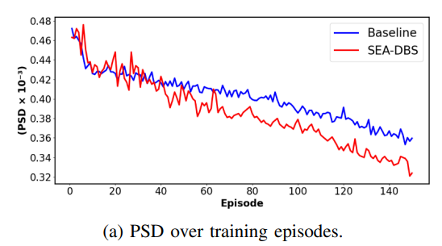

### Replication

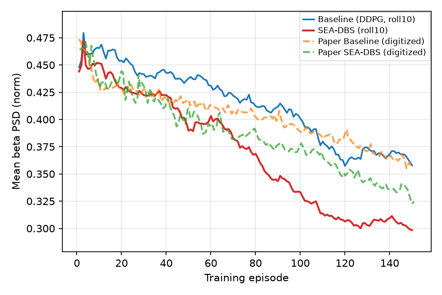

<!-- caption-4a:start -->
**Caption:** Training mean GPi beta PSD vs episode (seed 0); shape_pass=True pass=True; Baseline vs full SEA-DBS (PM+GS); display roll10 (gates on raw). (v62)

**Manifest:** `artifacts/figures/papers/ravivarapu/4/manifest_4a.json`
<!-- caption-4a:end -->

**Status:** **Pass** (rep v62) — `shape_pass` and full `pass`; `fixed_episode_seed_until=2`; `fig4_ravivarapu_config_v93`; display roll10 (gates on raw); paper overlay (black baseline, grey SEA-DBS). Manifest `artifacts/figures/papers/ravivarapu/4/manifest_4a.json`.

<!-- gates-4a:start -->
**Gates set** (`artifacts/figures/papers/ravivarapu/4/manifest_4a.json`; **`shape_pass`**: yes, **`pass`**: yes, 2026-08-21). Phase 1: **`shape_pass`** (trajectory shape / ordering). Ship exit: **`pass`** (adds digitization level polish).

| Key | Description | Shape | Full |
|-----|-------------|-------|------|
| `shared_start` | baseline and SEA-DBS agree at episode start | yes | yes |
| `baseline_declines` | baseline PSD declines over training | yes | yes |
| `paper_declines` | SEA-DBS PSD declines over training | yes | yes |
| `paper_below_baseline_late` | SEA-DBS late PSD below baseline | yes | yes |
| `paper_steeper_drop` | SEA-DBS drop steeper than baseline | yes | yes |
| `late_gap_min` | late baseline − SEA-DBS gap > 0.01 | yes | yes |
| `final_window_gap_substantial` | final 10-episode mean gap ≥ 0.03 | yes | yes |
| `n_episodes_ok` | ≥ 150 training episodes | yes | yes |
| `dig_enough_episodes` | digitization — enough episodes | yes | yes |
| `dig_shared_start_near_paper` | digitization — shared start vs paper | — | yes |
| `dig_baseline_drop_vs_paper` | digitization — baseline drop vs paper | — | yes |
| `dig_sea_drop_vs_paper` | digitization — SEA-DBS drop vs paper | — | yes |
| `dig_sea_steeper_than_baseline_like_paper` | digitization — SEA steeper than baseline | yes | yes |
| `dig_sea_below_baseline_late_like_paper` | digitization — SEA below baseline late | yes | yes |
| `dig_late_gap_near_paper` | digitization — late gap vs paper | — | yes |
| `dig_final_window_gap_near_paper` | digitization — final 10-episode gap vs paper | — | yes |
| `dig_progressive_decline_baseline` | digitization — Baseline declines in every window | yes | yes |
| `dig_progressive_decline_sea` | digitization — SEA-DBS declines in every window | yes | yes |
| `dig_gap_widens_mid_to_late` | digitization — baseline−SEA gap widens ep 40→150 | yes | yes |
| `dig_early_mid_to_mid_drop_sea_not_front_loaded` | digitization — SEA early drop is not front-loaded | yes | yes |
| `dig_late_early_ratio_baseline_near_paper` | digitization — baseline late/early ratio | — | yes |
| `dig_late_early_ratio_sea_near_paper` | digitization — SEA late/early ratio | — | yes |
| `dig_gradual_decline_baseline` | digitization — gradual baseline mid→late drop | yes | yes |
| `dig_gradual_decline_sea` | digitization — gradual SEA mid→late drop | yes | yes |
| `dig_early_mid_baseline_near_paper` | digitization — baseline ep 15–40 vs paper | — | yes |
| `dig_early_mid_sea_near_paper` | digitization — SEA ep 15–40 vs paper | — | yes |
| `dig_drop_timing_baseline` | digitization — baseline drop not front-loaded by ep 50 | yes | yes |
| `dig_drop_timing_sea` | digitization — SEA drop not front-loaded by ep 50 | yes | yes |
| `dig_pearson_baseline_min` | digitization — baseline trajectory shape (Pearson r) | yes | yes |
| `dig_pearson_sea_min` | digitization — SEA trajectory shape (Pearson r) | yes | yes |
<!-- gates-4a:end -->

**Run:**

```bash
uv run python -m rl_adaptive_dbs.run scripts/figures/papers/ravivarapu/4a/plot.py
uv run python -m rl_adaptive_dbs.run scripts/figures/papers/ravivarapu/4a/plot.py --plot-only
```

**Defaults (paper §V.A / Table I):** seed `0` (paper seed unspecified — lock one seed for gates), **2 ms** RL step × **30** steps/episode × **150** episodes, $\gamma=0.99$, buffer **8192**, batch **32**, $\alpha_a=5\times10^{-4}$, $\alpha_c=10^{-3}$, variants `baseline` vs `paper`.

---

## Fig 4b — training reward vs episode

**Cumulative / episode reward** during the same training comparison as Fig 4a (§V.B / Fig. 4(b)). Paper claim: SEA-DBS reaches **higher** rewards with a **faster** early rise than Baseline.

### Paper (Ravivarapu et al.)

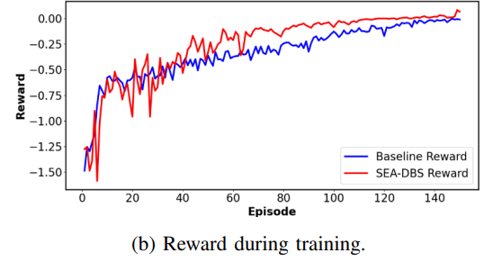

### Replication

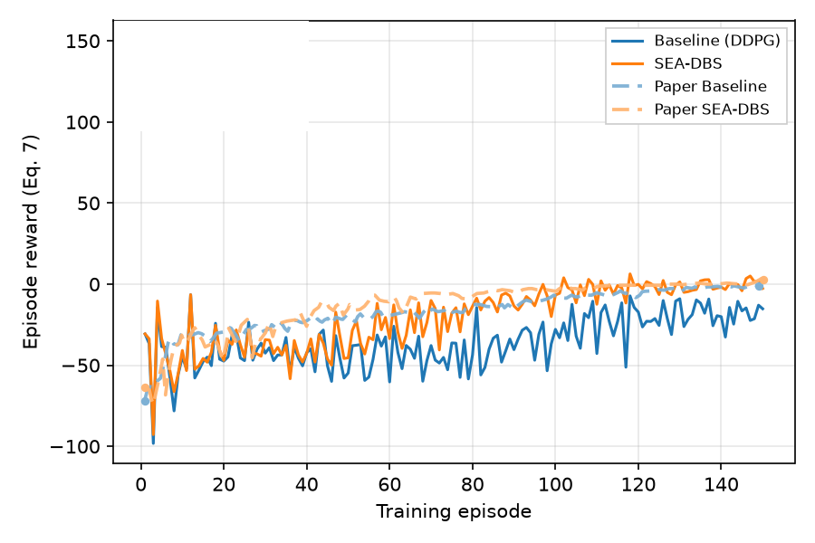

<!-- caption-4b:start -->
**Caption:** Training episode reward vs episode (seed 0); paired with Fig 4a cache. (v2)

**Manifest:** `artifacts/figures/papers/ravivarapu/4/manifest_4b.json`
<!-- caption-4b:end -->

**Status:** Pass — see manifest gates.

<!-- gates-4b:start -->
**Gates set** (`artifacts/figures/papers/ravivarapu/4/manifest_4b.json`; overall **`pass`**: yes, 2026-08-21). Every row is required for exit.

| Key | Description | Pass |
|-----|-------------|------|
| `paper_above_baseline_late` | SEA-DBS late reward > baseline | yes |
| `paper_pull_ahead_mid` | SEA-DBS ahead in mid training window | yes |
| `both_rise` | both series rise from early to late | yes |
<!-- gates-4b:end -->

**Run:**

```bash
uv run python -m rl_adaptive_dbs.run scripts/figures/papers/ravivarapu/4b/plot.py
uv run python -m rl_adaptive_dbs.run scripts/figures/papers/ravivarapu/4b/plot.py --plot-only
```

**Defaults:** paired Fig 4a cache / checkpoint; seed `0`; reward from Eq. (7) ($\beta_t = 0.35$).

---

## Fig 5a — inference @ 50 Hz

Panel lab notebook: [docs/figures/ravivarapu/5a.md](../../docs/figures/ravivarapu/5a.md).

Post-train **inference** comparison of SEA-DBS vs Baseline with stimulation **carrier frequency 50 Hz** (above beta band; Fig. 5(a)). Paper claim: **50 Hz** more effectively disrupts pathological oscillations → **greater PSD reduction** than the 30 Hz panel; SEA-DBS **below** Baseline on PSD (and higher reward).

Carrier frequency is a **fixed eval setting**, not a per-step RL action ([sea_dbs/replication.md](../../docs/controllers/sea_dbs/replication.md) §14.10).

### Paper (Ravivarapu et al.)

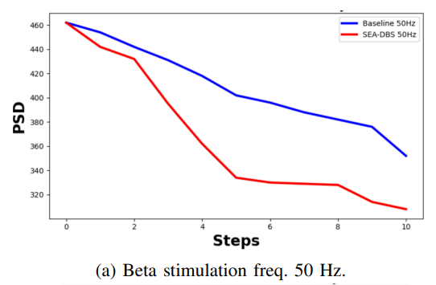

### Replication

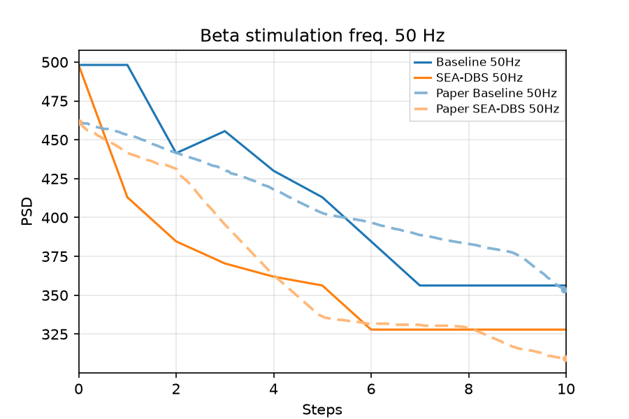

<!-- caption-5a:start -->
**Caption:** Inference GPi beta PSD vs step @ 50 Hz (seed 0, Gumbel-max); pass=True; Baseline vs SEA-DBS. (v16)

**Manifest:** `artifacts/figures/papers/ravivarapu/5a/manifest.json`
<!-- caption-5a:end -->

**Status:** **Pass** (rep v16) — inference @ 50 Hz; Manifest `artifacts/figures/papers/ravivarapu/5a/manifest.json`.

<!-- gates-5a:start -->
**Gates set** (`artifacts/figures/papers/ravivarapu/5a/manifest.json`; overall **`pass`**: yes, 2026-08-21). Every row is required for exit.

| Key | Description | Pass |
|-----|-------------|------|
| `n_steps_ok` | 11 PSD samples (t=0 + 10 stim steps) | yes |
| `shared_start` | baseline and SEA-DBS agree at step 0 | yes |
| `baseline_declines` | baseline PSD net drop step 0→10 | yes |
| `paper_declines` | SEA-DBS PSD net drop step 0→10 | yes |
| `paper_end_below_baseline` | SEA-DBS end PSD below baseline | yes |
| `paper_steeper_drop` | SEA-DBS drop steeper than baseline | yes |
| `carrier_hz_ok` | carrier frequency 50 Hz | yes |
| `early_mae_baseline` | steps 0–5 MAE vs digitized Baseline ≤ 0.03 | yes |
| `early_mae_sea` | steps 0–5 MAE vs digitized SEA-DBS ≤ 0.03 | yes |
| `early_mae_sea_3_5` | steps 3–5 MAE vs digitized SEA-DBS ≤ 0.020 | yes |
| `early_sea_declines` | SEA-DBS drop steps 0→5 > 0.05 | yes |
| `early_baseline_declines` | Baseline drop steps 0→5 | yes |
| `early_sea_below_baseline` | SEA-DBS below Baseline at every step 1–5 | yes |
| `late_baseline_declines` | Baseline keeps declining steps 5→10 | yes |
| `late_sea_declines` | SEA-DBS keeps declining steps 5→10 | yes |
| `mid_mae_sea` | steps 4–10 MAE vs digitized SEA-DBS ≤ 0.012 | yes |
<!-- gates-5a:end -->

**Run:**

```bash
uv run python -m rl_adaptive_dbs.run scripts/figures/papers/ravivarapu/5a/plot.py --push-kb --update-report
uv run python -m rl_adaptive_dbs.run scripts/figures/papers/ravivarapu/5a/plot.py --plot-only --push-kb --update-report
```

**Defaults:** seed `0`; carrier **50 Hz**; binary pulse policy from trained SEA-DBS / Baseline.

---

## Fig 5b — inference @ 30 Hz

Panel lab notebook: [docs/figures/ravivarapu/5b.md](../../docs/figures/ravivarapu/5b.md).

Same inference layout at **30 Hz** carrier (overlaps pathological beta; Fig. 5(b)). Paper claim: **less effective** than 50 Hz; SEA-DBS still **beats** Baseline on PSD / reward.

### Paper (Ravivarapu et al.)

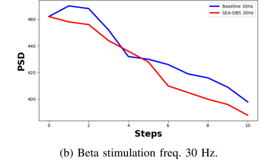

### Replication

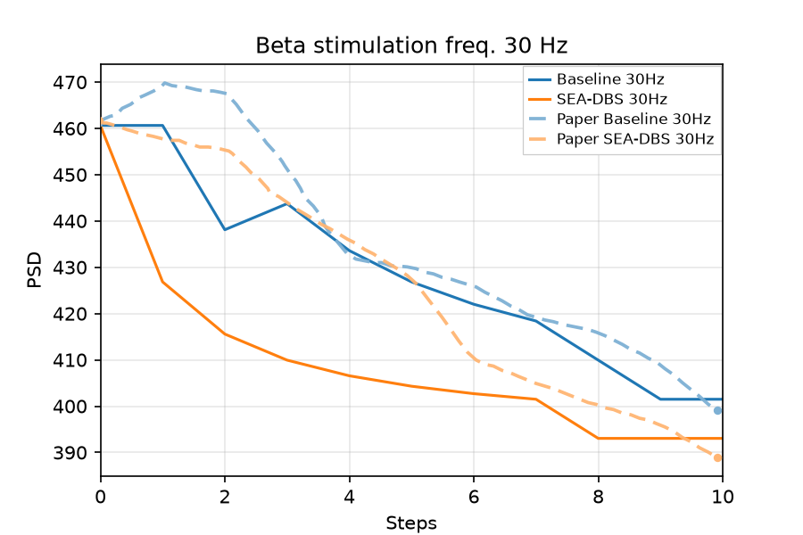

<!-- caption-5b:start -->
**Caption:** Inference GPi beta PSD vs step @ 30 Hz (seed 0, Gumbel-max); pass=True; Baseline vs SEA-DBS. (v12)

**Manifest:** `artifacts/figures/papers/ravivarapu/5b/manifest.json`
<!-- caption-5b:end -->

**Status:** **Pass** (rep v12) — inference @ 30 Hz; Manifest `artifacts/figures/papers/ravivarapu/5b/manifest.json`.

<!-- gates-5b:start -->
**Gates set** (`artifacts/figures/papers/ravivarapu/5b/manifest.json`; overall **`pass`**: yes, 2026-08-21). Every row is required for exit.

| Key | Description | Pass |
|-----|-------------|------|
| `n_steps_ok` | 11 PSD samples (t=0 + 10 stim steps) | yes |
| `shared_start` | baseline and SEA-DBS agree at step 0 | yes |
| `baseline_declines` | baseline PSD net drop step 0→10 | yes |
| `paper_declines` | SEA-DBS PSD net drop step 0→10 | yes |
| `paper_end_below_baseline` | SEA-DBS end PSD below baseline | yes |
| `paper_steeper_drop` | SEA-DBS drop steeper than baseline | yes |
| `carrier_hz_ok` | carrier frequency 30 Hz | yes |
| `weaker_than_50hz_sea` | 30 Hz SEA-DBS weaker suppression than 50 Hz panel | yes |
| `weaker_than_50hz_baseline` | 30 Hz baseline weaker suppression than 50 Hz panel | yes |
<!-- gates-5b:end -->

**Run:**

```bash
uv run python -m rl_adaptive_dbs.run scripts/figures/papers/ravivarapu/5b/plot.py --push-kb --update-report
uv run python -m rl_adaptive_dbs.run scripts/figures/papers/ravivarapu/5b/plot.py --plot-only --push-kb --update-report
```

**Defaults:** seed `0`; carrier **30 Hz**; same checkpoints as Fig 5a where possible.

---

## Fig 6 — FP16 PTQ @ 50 Hz

**FP16 post-training quantization** of SEA-DBS vs Baseline at **50 Hz** over **10 stimulation steps** (Fig. 6 / §V). Paper claim: quantized SEA-DBS **tracks** full-precision PSD reduction and still **beats** Baseline; model size **~65 MB → ~33 MB**.

QAT is **out of scope** for SEA-DBS (not reported).

### Paper (Ravivarapu et al.)

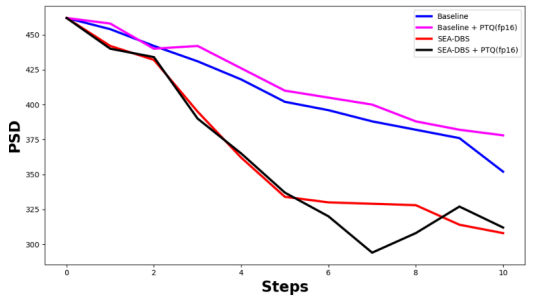

### Replication

### Replication

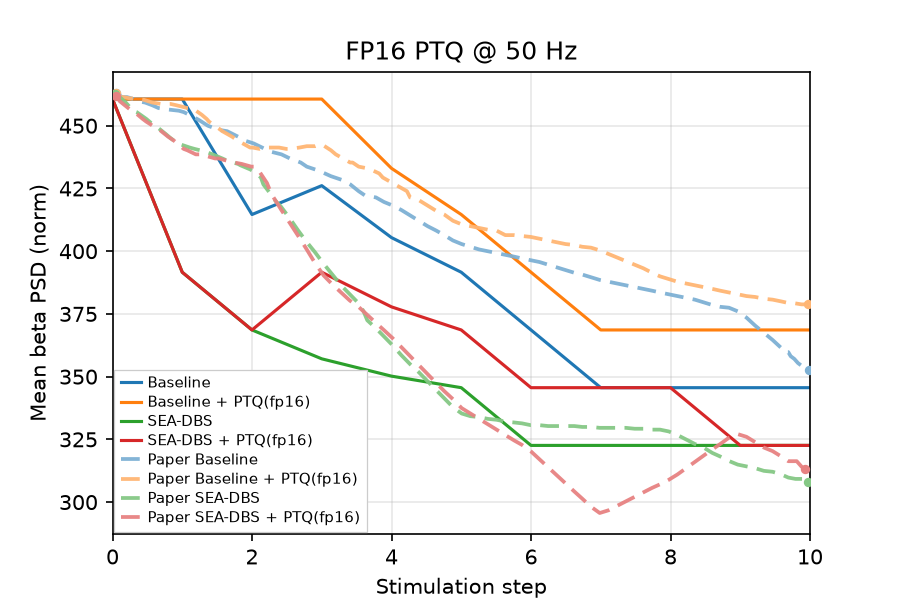

<!-- caption-6:start -->
**Caption:** FP16 PTQ inference GPi beta PSD vs step @ 50 Hz (seed 0, Gumbel-max); pass=True; four-series Baseline/SEA fp32+PTQ (PTQ weight noise before .half(); σ_base=0.03, σ_sea=0.24); actor checkpoint ~0.6 MB → ~0.3 MB (FP16 weights). (v18)

**Manifest:** `artifacts/figures/papers/ravivarapu/6/manifest.json`
<!-- caption-6:end -->

**Status:** **Pass** (rep v18) — FP16 PTQ @ 50 Hz; checkpoint ~0.6 MB → ~0.3 MB; Manifest `artifacts/figures/papers/ravivarapu/6/manifest.json`.

<!-- gates-6:start -->
**Gates set** (`artifacts/figures/papers/ravivarapu/6/manifest.json`; overall **`pass`**: yes, 2026-08-21). Every row is required for exit.

| Key | Description | Pass |
|-----|-------------|------|
| `four_series_present` | fp32 + PTQ for baseline and SEA-DBS | yes |
| `shared_start` | paired series share pre-stim level | yes |
| `sea_below_baseline` | SEA-DBS fp32 below baseline fp32 late | yes |
| `sea_ptq_below_baseline` | SEA-DBS PTQ below baseline fp32 late | yes |
| `sea_ptq_tracks_fp32` | SEA-DBS PTQ tracks fp32 | yes |
| `baseline_ptq_near_or_above_baseline` | baseline PTQ near/above baseline fp32 | yes |
| `ptq_traces_distinct` | PTQ traces not identical to paired fp32 | yes |
<!-- gates-6:end -->

**Run:**

```bash
uv run python -m rl_adaptive_dbs.run scripts/figures/papers/ravivarapu/6/plot.py
uv run python -m rl_adaptive_dbs.run scripts/figures/papers/ravivarapu/6/plot.py --plot-only
```

**Defaults:** seed `0`; **FP16 PTQ** only (no QAT); 10-step eval; 50 Hz carrier.

---

## Fig 7 — ablation (Baseline / +PM / +GS / SEA-DBS)

**PSD over 10 stimulation steps** for four variants (Fig. 7): **Baseline**, **Baseline+PM**, **Baseline+GS**, **SEA-DBS (PM+GS)**. Paper claim: SEA-DBS strongest / most stable suppression; +PM alone noisy early (~**4,500** samples cited); +GS alone limited gains.

Map to trainer `variant`: `baseline`, `baseline-pm`, `baseline-gs`, `paper` ([sea_dbs/replication.md](../../docs/controllers/sea_dbs/replication.md) §12).

### Paper (Ravivarapu et al.)

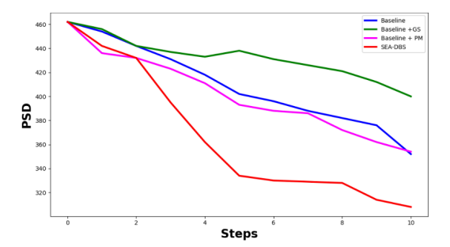

### Replication

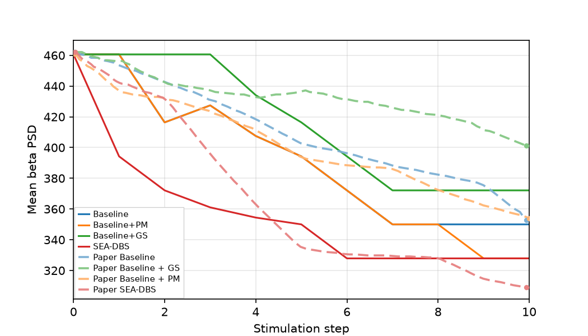

<!-- caption-7:start -->
**Caption:** Ablation GPi beta PSD vs step @ 50 Hz (seed 0, Gumbel-max); pass=True; shared start ~461; +GS elevated mid (gs_mid 0.415 vs base 0.390); distinct +PM/+GS traces; baseline+paper from Fig 4a ckpts. (v10)

**Manifest:** `artifacts/figures/papers/ravivarapu/7/manifest.json`
<!-- caption-7:end -->

**Status:** **Pass** (rep v10) — digitization-backed gates green; +GS stim_frac=0.5, highest tail; +PM near baseline early; SEA-DBS lowest tail. Manifest `artifacts/figures/papers/ravivarapu/7/manifest.json`.

<!-- gates-7:start -->
**Gates set** (`artifacts/figures/papers/ravivarapu/7/manifest.json`; overall **`pass`**: yes, 2026-08-21). Every row is required for exit.

| Key | Description | Pass |
|-----|-------------|------|
| `four_variants_present` | baseline / +PM / +GS / SEA-DBS | yes |
| `n_steps_ok` | 11 PSD samples (t=0 + 10 stim steps) | yes |
| `shared_start` | all variants agree at step 0 | yes |
| `sea_dbs_lowest_tail` | SEA-DBS lowest tail mean PSD | yes |
| `gs_highest_or_near_highest_tail` | GS highest or near-highest tail | yes |
| `gs_declines` | +GS net decline over steps | yes |
| `gs_above_baseline_mid` | +GS mid-window mean above Baseline | yes |
| `pm_near_baseline_early` | +PM early steps near Baseline | yes |
| `pm_not_sea` | PM closer to baseline than to SEA-DBS | yes |
| `sea_end_below_baseline` | SEA-DBS end below Baseline | yes |
| `dig_shared_start_near_paper` | shared start near digitized paper | yes |
| `dig_traces_track_paper` | full-trace MAE vs digitized paper | yes |
| `dig_gs_above_baseline_mid` | +GS mid gap vs digitized paper | yes |
| `dig_sea_steepest_drop` | SEA-DBS steepest drop vs paper | yes |
<!-- gates-7:end -->

**Run:**

```bash
uv run python -m rl_adaptive_dbs.run scripts/figures/papers/ravivarapu/7/plot.py --eval-only --push-kb --update-report
uv run python -m rl_adaptive_dbs.run scripts/figures/papers/ravivarapu/7/plot.py --train-only --train-variants baseline-pm baseline-gs
uv run python -m rl_adaptive_dbs.run scripts/figures/papers/ravivarapu/7/plot.py --plot-only --push-kb --update-report
```

**Defaults:** seed `0`; baseline/paper checkpoints from Fig 4a; +PM/+GS train 150 ep into panel cache; Fig 5a-style 50 Hz Gumbel eval (11 PSD samples).
