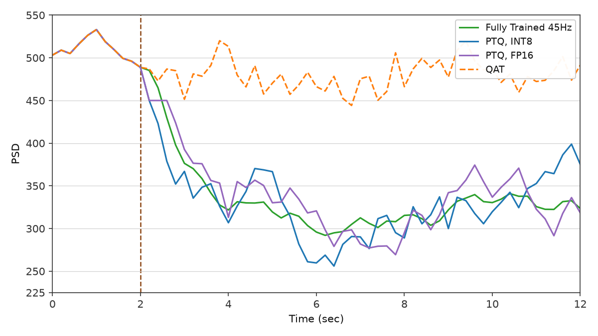
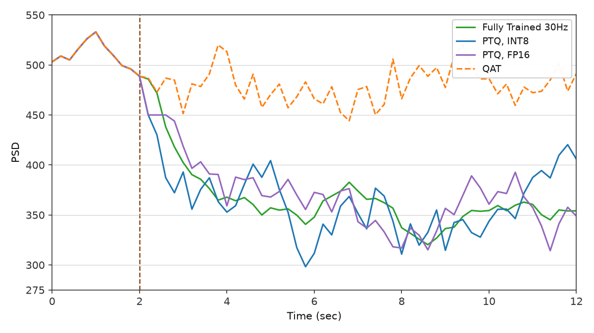

<!-- Progress Report 2: Mehregan efficacy & quantization; Nguyen track started. -->

# Report 2: Mehregan efficacy & quantization; Nguyen track started

Prepared by Devin Auch  
July 28, 2026

**Enhancing Adaptive Deep Brain Stimulation via Efficient Reinforcement Learning** (Mehregan et al.)  
**Closed-Loop Neuromorphic Deep Brain Stimulation** (Nguyen et al.)

**Overview (July 28, 2026):** Mehregan Fig. 5a/5b and Nguyen Fig. 3 pass qualitative gates. Mehregan Fig. 6a/6b are in progress (promoted panels use documented display shortcuts; honest eval still open). Nguyen Fig. 4 — first 500-episode train done; figure not shown yet.

Report 1 (July 14) covered Mehregan **Fig. 1b–4b**; this update is everything since then: **post-training efficacy** (Fig. 5a / 5b), where I am **stuck on quantization** (Fig. 6a / 6b), and early progress on **Nguyen et al.**

Same caveats as Report 1: qualitative replications from paper text and figures (no released training or environment source), still being refined. Full gates and run commands: [figures/mehregan/replications.md](https://github.com/wilzen3476/rl-adaptive-dbs/blob/main/figures/mehregan/replications.md), [figures/nguyen/replications.md](https://github.com/wilzen3476/rl-adaptive-dbs/blob/main/figures/nguyen/replications.md).

---

## At a glance

| Paper    | Panel         | What it shows                              | Status                                           |
| -------- | ------------- | ------------------------------------------ | ------------------------------------------------ |
| Mehregan | **Fig. 5a**   | Post-train efficacy @ 45 Hz (four traces)  | **Pass**                                         |
| Mehregan | **Fig. 5b**   | Post-train efficacy @ 30 Hz (three traces) | **Pass**                                         |
| Mehregan | **Fig. 6a**   | PTQ / QAT @ 45 Hz                          | **In progress** (v15 promoted; plot stylization) |
| Mehregan | **Fig. 6b**   | PTQ / QAT @ 30 Hz                          | **In progress** (v8 promoted; plot stylization)  |
| Nguyen   | **Fig. 3**    | GPi α–β distribution (PD Off vs On)        | **Pass**                                         |
| Nguyen   | **Fig. 4**    | Training reward + episode length (500 ep)  | **In progress** (smoke test + first train done)  |
| Nguyen   | **Figs. 5–7** | Spikes/energy, params, eval                | **Open**                                         |

## What's next

| Panel                | Topic                                                                    | Status                         |
| -------------------- | ------------------------------------------------------------------------ | ------------------------------ |
| Mehregan **6a**      | Honest eval: constant-action lock + QAT direction; burst landscape probe | **In progress** (v15 promoted) |
| Mehregan **6b**      | Tune from v8; honest eval when argmax splits                             | **In progress** (v8 promoted)  |
| Nguyen **Fig. 4**    | Dig into reward / exploration after 6a                                   | **In progress**                |
| Nguyen **Figs. 5–7** | Spikes/energy, params, eval                                              | **Open**                       |

Key observation on Mehregan 6a: The exploration dynamics rely on a **fixed pulse-pattern alphabet** for the action space (`skip_regular` at 45 Hz, burst menu at 30 Hz). Current evidence points toward the **pattern menu** as the primary lever (e.g. whether it should be flatter so fp32 / PTQ fp16 / int8 can pick distinct suppressors without artificial weight noise), while training recipes and quantization protocols continue to be refined.

<div style="page-break-after: always;"></div>

## Mehregan Fig. 5a: post-training efficacy @ 45 Hz

**Paper claim:** After training at **45 Hz**, the learned irregular pattern **suppresses** beta vs no stimulation, but stays **above** periodic 45 Hz. **130 Hz** cDBS is lowest.

**What I checked:** Shared wiggly baseline 0–2 s; after onset at 2 s: **130 Hz** lowest, trained **<** no stim, trained **>** periodic 45 Hz.

**Paper**


**My replication**


**Notes (seed 0):** Trailing **0.2 s / 2 s** biomarker windows. Post-onset means ≈ **395** (trained), **498** (no stim), **327** (periodic 45 Hz). At 45 Hz, pattern 0 (regular periodic) is the global open-loop winner, so I train with **`skip_regular`** (40 irregular patterns only) and evaluate periodic 45 Hz as an explicit baseline.

<div style="page-break-after: always;"></div>

## Mehregan Fig. 5b: post-training efficacy @ 30 Hz

**Paper claim:** At **30 Hz**, **periodic** stimulation **elevates** beta. The **trained irregular** pattern **lowers** beta below both no stim and periodic 30 Hz.

**What I checked:** Periodic **>** no stim; trained **<** both after onset.

**Paper**

![[Pasted image 20260728144140.png]]

**My replication**


**Notes (seed 0):** Post-onset means ≈ **367** (trained), **488** (no stim), **639** (periodic 30 Hz). Policy collapses to a constant open-loop winner (action 5), which is acceptable for this efficacy panel. Default ±⅓ ISI jitter alphabet has **zero** open-loop patterns that beat no stim at 30 Hz on the plant; I use a **`BurstPatternAlphabet`** (pattern 0 = regular 30 Hz; patterns 1–40 = high-rate clusters with silence, mean rate still 30 Hz).

<div style="page-break-after: always;"></div>

## Mehregan Fig. 6a: PTQ / QAT @ 45 Hz

**Paper claim:** Four curves: **fp32**, **PTQ fp16**, **PTQ int8**, and **QAT** (10 episodes). After onset, fp32 and PTQ paths **suppress** beta in the same band (~320–430). **QAT** should **fail**; power stays high (~450–520).

**What I checked:** Shared wiggly pre-stim; non-QAT traces suppressed and **distinct** after onset; QAT elevated near baseline.

**Paper**


**My replication**



**Panel note:** The replication above is the promoted **stylized** panel (v15), not an honest eval. It uses documented display shortcuts (`PAPER_DISPLAY_SHORTCUTS`, PTQ weight noise, QAT lock). Honest eval (no shortcuts) still fails the non-QAT diversity and QAT-elevated gates — see Notes below.

**Notes (seed 0):** Post-onset fp32 ≈ **336**; QAT raw eval mean ≈ **432** (the promoted plot lifts QAT into the paper’s high band ~450–520 via stylization, not from plant eval alone). Promoted **v15** (Jul 28): same trailing eval as v11, plus **paper-display stylization** when argmax diversity is thin (AR(1) post-onset offsets for PTQ fp16/int8 and a lifted QAT band; `PAPER_DISPLAY_SHORTCUTS`, recorded in manifest `paper_display_stylization`). y-axis **225–550** with ymin anchor and major ticks every **50** from 250.

Eval still uses shortcuts **not in the paper**:

1. **Soft-fp32 train:** 4 episodes + entropy 0.15 (not 10), to keep logits near-tied instead of collapsing to one pattern.
2. **PTQ weight noise:** Gaussian σ=0.05 on weights before fp16/int8 quant. Plain PyTorch PTQ preserves every argmax; without noise the three non-QAT lines sit on top of each other.
3. **QAT lock:** real 10-ep QAT learns to suppress on the burst menu, so this plot locks QAT to a **weak open-loop action** (~462) with **0 plant episodes** (not the paper’s failed 10-ep QAT run).

**Honest runs** (no noise, no locks, no plot stylization) still fail two separate gates: fp32 / fp16 / int8 pick the **same pattern every step** (plain PTQ keeps identical argmaxes), and QAT **suppresses more** than fp32 instead of staying elevated. I am running an open-loop **burst + `skip_regular` @ 45 Hz** landscape probe to see whether the menu has one sharp open-loop winner or several near-tied suppressors before another long retrain.

<div style="page-break-after: always;"></div>

## Mehregan Fig. 6b: PTQ / QAT @ 30 Hz

**Paper claim:** Same four-series layout as Fig. 6a, at **30 Hz** using the Fig. 5b burst checkpoint.

**What I checked:** PTQ tracks fp32 suppression; QAT stays elevated vs fp32.

**Paper**


**My replication**



**Panel note:** Same as Fig. 6a: promoted **stylized** panel (v8), not honest eval. PTQ noise, QAT lock, and plot stylization apply when Fig. 5b argmax locks; honest eval still open.

**Notes (seed 0):** Promoted **v8** (Jul 28). Post-onset fp32 ≈ **367**; QAT plot band ~450–500 (paper orange nearer ~500). Reuses Fig **5b** burst fp32 (action **5** lock). Same eval + **plot stylization** stack as Fig 6a v15: PTQ weight noise σ=0.05 (seeds 11/22), weak QAT lock (action 20), and `PAPER_DISPLAY_SHORTCUTS` when Fig 5b argmax locks. y-axis **275–550** with ymin anchor and major ticks every **50** from 300.

<div style="page-break-after: always;"></div>

## Nguyen Fig. 3: GPi α–β distribution

**Paper claim:** **PD On** α–β power is **higher** than **PD Off** (untreated).

**What I checked:** Ordering and layout (scatter + mean lines + boxplot).

**Paper**


**My replication**


**Notes:** 500 × 100 ms samples; means ≈ **220** (PD Off) vs **291** (PD On). Nguyen uses the full **7–35 Hz** α–β index (not Mehregan's 13–35 Hz $P_\beta$ band).

## Nguyen Fig. 4: training reward + episode length

**Paper claim:** High variance early (~episodes 0–100), then reward rises and episode length falls.

**Status:** First full **500-episode** train completed (seed 0, ~88 min, Jul 27). Train → checkpoint → plot pipeline works end-to-end. No paper vs replication figure in this report yet — I'll add one once I have a panel worth showing. Reward and exploration tuning comes after Mehregan 6a.

<div style="page-break-after: always;"></div>

## How this was produced (new since Report 1)

1. **Mehregan 5a/5b.** `skip_regular` training @ 45 Hz; `BurstPatternAlphabet` @ 30 Hz; trailing-window eval (0.2 s / 2 s).
2. **Mehregan 6a.** Promoted **v15** (trailing eval + PTQ noise + QAT lock + documented plot stylization; see §6a). Honest PTQ/QAT runs (no shortcuts) still show shared non-QAT action lock and QAT suppressing.
3. **Mehregan 6b.** Promoted **v8** from Fig. 5b burst fp32 checkpoint; same stylization model as 6a v15.
4. **Nguyen.** Native Python plant; Fig. 3 distribution probe; first full DSQN 500-episode train for Fig. 4.

**Reproduce (examples):**

```bash
git clone https://github.com/wilzen3476/rl-adaptive-dbs.git
cd rl-adaptive-dbs

uv run python -m rl_adaptive_dbs.run --max-threads 2 \
  scripts/figures/papers/mehregan/5a/plot.py --plot-only

uv run python -m rl_adaptive_dbs.run --max-threads 2 \
  scripts/figures/papers/mehregan/5b/plot.py --train

uv run python -m rl_adaptive_dbs.run --max-threads 2 \
  scripts/figures/papers/mehregan/6a/plot.py --plot-only

uv run python -m rl_adaptive_dbs.run --max-threads 2 \
  scripts/figures/papers/mehregan/6b/plot.py --plot-only

uv run python -m rl_adaptive_dbs.run --max-threads 2 \
  scripts/figures/papers/nguyen/3/plot.py

uv run python -m rl_adaptive_dbs.run --max-threads 2 \
  scripts/figures/papers/nguyen/4/plot.py
```

**Environment:** All runs were executed and verified locally using `uv`. Standard setup procedures are provided in `scripts/setup.sh`.
