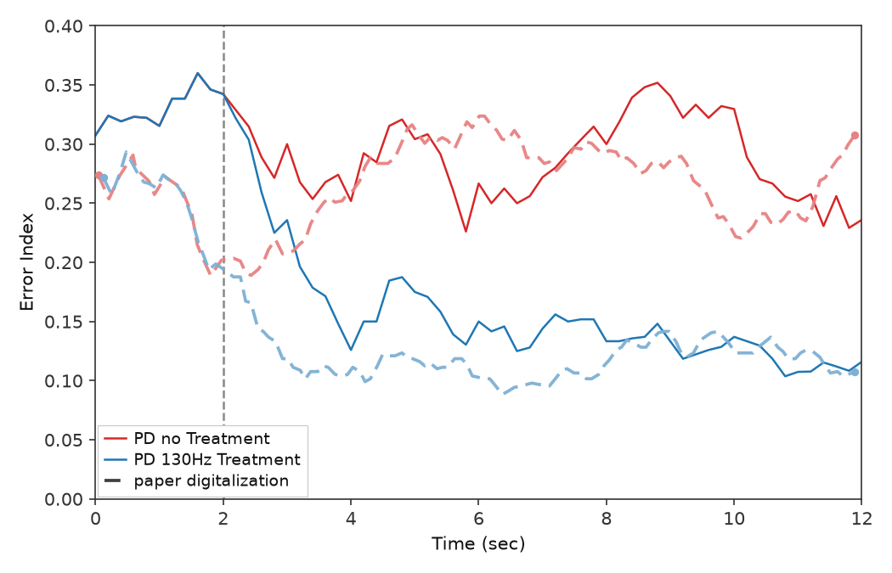
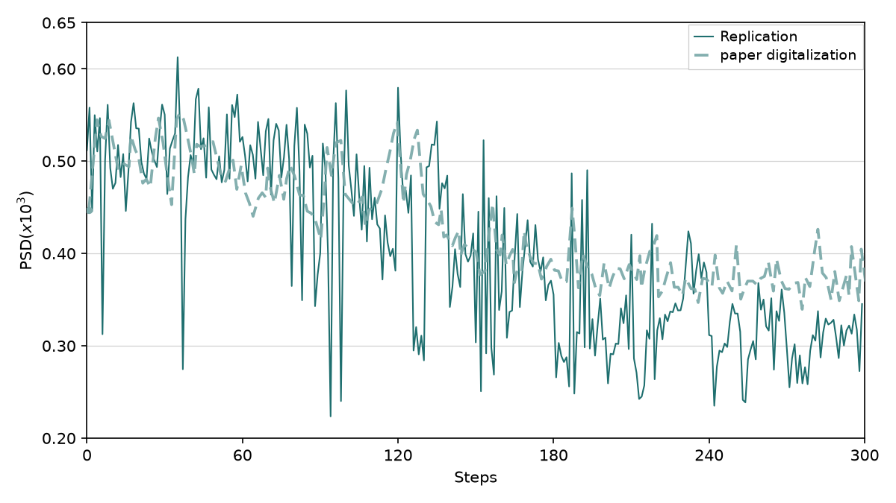
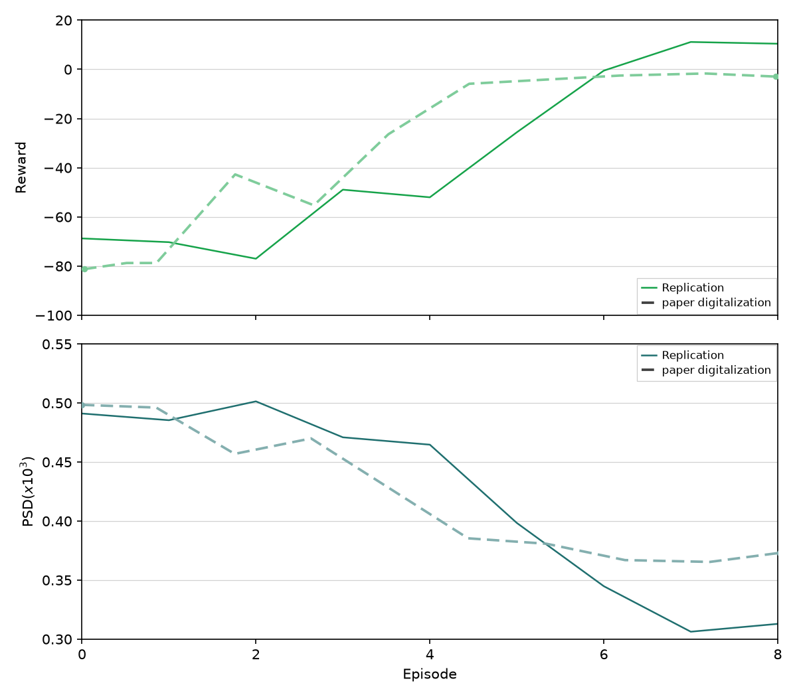
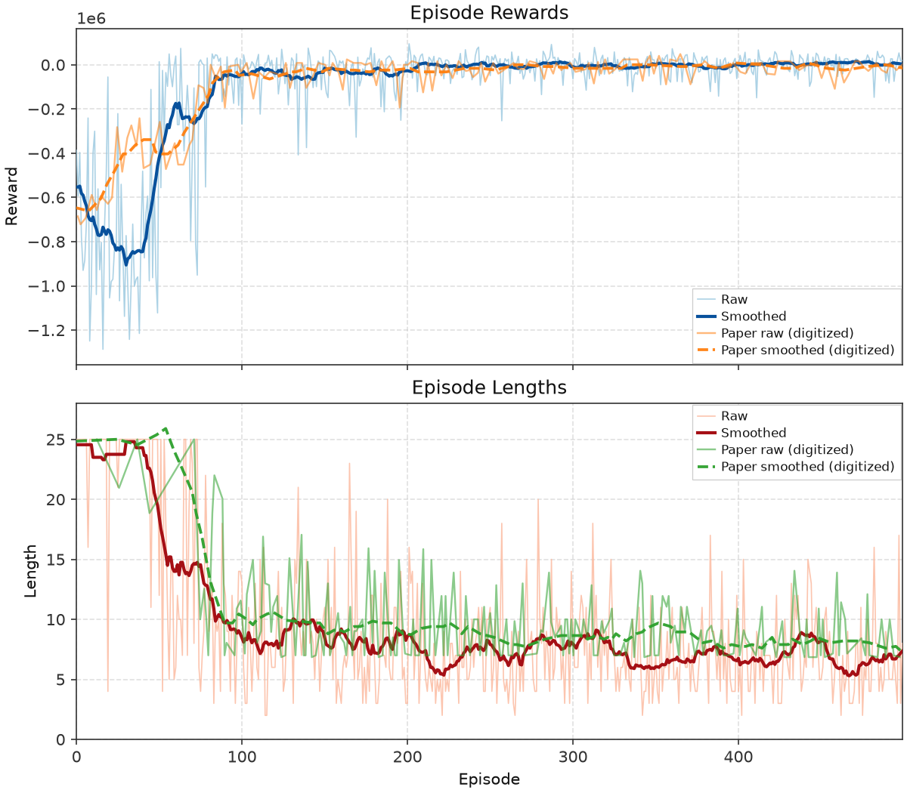
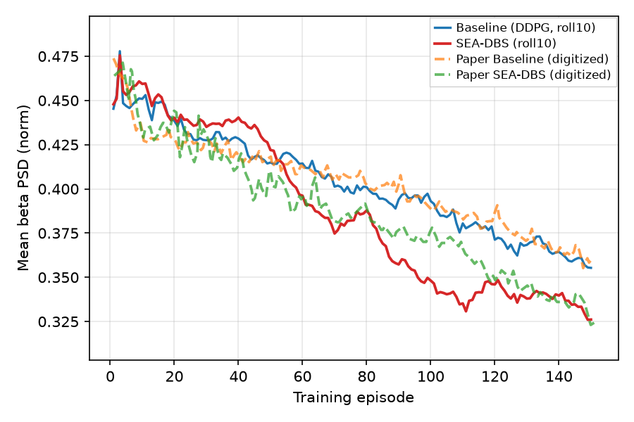

<!-- Progress Report 3: Full panel gallery, quantization panels, and paper-curve digitization. -->

# Report 3: Full panel gallery, quantization panels, paper-curve digitization

Prepared by Devin Auch  
August 10, 2026

**Enhancing Adaptive Deep Brain Stimulation via Efficient Reinforcement Learning** (Mehregan et al.)  
**Closed-Loop Neuromorphic Deep Brain Stimulation** (Nguyen et al.)  
**Sample-Efficient Reinforcement Learning Controller for Deep Brain Stimulation in Parkinson’s Disease** (Ravivarapu et al.)

**Overview (August 10, 2026):** **Mehregan**: Fig. 1b–6b **Pass** on current automated gates; Fig. 4a–4b flagged for revisit since the digitizations. **Nguyen**: Fig. 3 **Pass**; Fig. 4 **in progress** (reward-plateau shape gates). **Ravivarapu**: Fig. 4a **in progress** (shape gates still fail). Process upgrade since Report 2: **paper-curve digitization**: quantify against refined digitized curves instead of eyeballing PNGs.

Same caveats as before: replications from paper text and figures (no released training / environment source), shared plant = Python reconstruction of **Kumaravelu et al. (2016)** cortex–basal ganglia–thalamus biophysical model (6-OHDA lesioned rat, *J. Comput. Neurosci.*). Full gates and run commands: [figures/mehregan/replications.md](https://github.com/wilzen3476/rl-adaptive-dbs/blob/main/figures/mehregan/replications.md), [figures/nguyen/replications.md](https://github.com/wilzen3476/rl-adaptive-dbs/blob/main/figures/nguyen/replications.md), [figures/ravivarapu/replications.md](https://github.com/wilzen3476/rl-adaptive-dbs/blob/main/figures/ravivarapu/replications.md).

---

## Paper-curve digitization (new since Report 2)

### Why

Earlier reports judged “close enough” mostly by eye: ordering, onset timing, training shape. That works for coarse claims, but it fails when the question is *how suppressed*, *how gradual*, or *how high* a curve sits relative to the paper.

I now **digitize the paper curves into numeric series** and use those as the measurement ruler for gates and iteration.

### Workflow (short)

1. **PIL color-mask hypothesis**: fast automated trace from the paper crop (`scripts/digitization/extract_pil.py` + a per-panel axis/color config).
2. **Seed WebPlotDigitizer**: turn the PIL points into a one-click `.tar` project (`pil_to_wpd.py`) so a human opens WPD with image + points already loaded.
3. **Human cleanup in WPD**: fix missed peaks, legend pollution, axis calibration; save a **refined** project.
4. **Normalize**: `normalize_wpd.py` reads the refined WPD **project JSON** (or a WPD CSV export), pulls each series’ **already-calibrated** `(x, y)` pairs from WPD’s stored `value` fields (it does **not** remap pixels through axes again), optionally renames legend labels to canonical keys (e.g. `pd`, `pd_130hz`), and writes `curves_wpd_refined*.json`: per series, `n`, full `xy` in paper data units, and `color_rgba` when WPD has it. No baked-in early/late means; gates slice `xy` by real x-windows later.
5. **Gate & overlay**: panel `plot.py` loads the refined JSON, computes **x-window** means / ratios / drops, and draws a dashed **Paper (digitized)** overlay next to my solid replication traces.

### How it improves iteration

| Before | After |
|--------|--------|
| “Looks a bit low at the end” | Late-window mean ratio vs digitized paper (pass/fail with a number) |
| Tune until the PNG *feels* right | Abort early when a digitized ratio is already impossible |
| Vague pass/fail from eyeballing | Gates use the same numeric series as overlays on replication plots |
| Vague feedback across seeds | Same x-windows and series names for every replot |

All gallery panels below have refined WPD anchors in each panel’s `paper_digitization/` folder (Mehregan: `curves_wpd_refined*.json`; Nguyen and Ravivarapu: normalized `curves_fig*.json` from refined WPD exports). Replication plots draw dashed **Paper (digitized)** overlays on the same axes during tuning.

---
## Gallery: Mehregan et al.

### Fig. 1b: GPi power spectral density

<!-- report3-claim-rep-1b:start -->
**Paper claim:** PD elevates GPi beta vs healthy; **130 Hz** cDBS suppresses that elevation.
<!-- report3-claim-rep-1b:end -->

<!-- report3-status-rep-1b:start -->
**Status:** Pass: ordering and beta-peak shape match (seeds 0–9 mean).
<!-- report3-status-rep-1b:end -->


<!-- paper-caption-rep-1b:start -->
> "Oscillatory activity of model neurons in the GPi under the healthy state, PD state, and PD state with $130\text{Hz}$ conventional stimulation."
> *Mehregan et al.*
<!-- paper-caption-rep-1b:end -->

<!-- report3-gates-rep-1b:start -->
**Gates example:** PD > healthy on beta; 130 Hz cDBS < untreated PD; suppression ratio and beta levels within band of digitized paper.
<!-- report3-gates-rep-1b:end -->

---

### Fig. 2a: GPi beta power time series

<!-- report3-claim-rep-2a:start -->
**Paper claim:** After cDBS onset at **2 s**, treated (blue) falls and stays below untreated PD (red); shared pre-stim baseline.
<!-- report3-claim-rep-2a:end -->

<!-- report3-status-rep-2a:start -->
**Status:** Pass: blue-below-red after $t=2$, shared 0–2 s baseline, dense trailing protocol.
<!-- report3-status-rep-2a:end -->


<!-- paper-caption-rep-2a:start -->
> "cDBS effects on beta power of GPi neurons"
> *Mehregan et al.*
<!-- paper-caption-rep-2a:end -->

<!-- report3-gates-rep-2a:start -->
**Gates example:** Shared pre-onset baseline; treated < untreated after onset; late ratio and suppression drop vs digitized paper.
<!-- report3-gates-rep-2a:end -->

---
### Fig. 2b: Error Index time series

<!-- report3-claim-rep-2b:start -->
**Paper claim:** Same timing as 2a; Error Index (thalamic spike-timing) lower under cDBS after onset.
<!-- report3-claim-rep-2b:end -->

<!-- report3-status-rep-2b:start -->
**Status:** Pass: hybrid So-style SMC → thalamus on the Kumaravelu body (documented plant convention).
<!-- report3-status-rep-2b:end -->



<!-- paper-caption-rep-2b:start -->
> "cDBS effects on error."
> *Mehregan et al.*
<!-- paper-caption-rep-2b:end -->

<!-- report3-gates-rep-2b:start -->
**Gates example:** Same timing gates as Fig. 2a on the Error Index biomarker (pre-onset, late ordering, digitization ratios).
<!-- report3-gates-rep-2b:end -->

---
### Fig. 4a: Training beta vs step

<!-- report3-claim-rep-4a:start -->
**Paper claim:** Noisy early β, sharp mid-run drop, lower late plateau (45 Hz DDPG training).
<!-- report3-claim-rep-4a:end -->

<!-- report3-status-rep-4a:start -->
**Status:** Revisit in progress: pair with 4b; softmax τ 3→1.4 to avoid pattern-0 collapse (locked v18 was τ→1.0).
<!-- report3-status-rep-4a:end -->



<!-- paper-caption-rep-4a:start -->
> "The average power of the beta frequency band for each step during training of the $45\text{Hz}$ average frequency model."
> *Mehregan et al.*
<!-- paper-caption-rep-4a:end -->

<!-- report3-gates-rep-4a:start -->
**Gates example:** Training trend down; mid-run fade and late/early ratio vs digitized paper; drop magnitude ≥ 70% of paper drop.
<!-- report3-gates-rep-4a:end -->

---
### Fig. 4b: Training reward and episode-mean beta

<!-- report3-claim-rep-4b:start -->
**Paper claim:** Over episodes 0–8, reward rises toward zero while episode-mean β falls.
<!-- report3-claim-rep-4b:end -->

<!-- report3-status-rep-4b:start -->
**Status:** Revisit in progress: match digitized late PSD floor (~0.37, above β_t) so reward approaches 0 from below; paired with latest Fig. 4a series.
<!-- report3-status-rep-4b:end -->



<!-- paper-caption-rep-4b:start -->
> "Beta power in GPi during each episode of training of the $45\text{Hz}$ (top) and accumulated reward of each training episode for the $45\text{Hz}$ (bottom)."
> *Mehregan et al.*
<!-- paper-caption-rep-4b:end -->

<!-- report3-gates-rep-4b:start -->
**Gates example:** Reward rises from negative early values; episode-mean PSD falls; rise timing and PSD drop ratio vs digitized paper; late PSD ≥ 0.35 and within 15% of paper; late reward in (−10, 2].
<!-- report3-gates-rep-4b:end -->

---

### Fig. 5a: Post-train efficacy @ 45 Hz

<!-- report3-claim-rep-5a:start -->
**Paper claim:** Trained irregular pattern suppresses β vs no stim, but stays above periodic 45 Hz; **130 Hz** lowest.
<!-- report3-claim-rep-5a:end -->

<!-- report3-status-rep-5a:start -->
**Status:** Pass: `skip_regular` alphabet; four-series trailing eval.
<!-- report3-status-rep-5a:end -->


<!-- paper-caption-rep-5a:start -->
> "Performance of the fully trained model at $45 \text{ Hz}$."
> *Mehregan et al.*
<!-- paper-caption-rep-5a:end -->

<!-- report3-gates-rep-5a:start -->
**Gates example:** Shared baseline; ordering 130 Hz < trained < no stim < periodic 45 Hz; late trained/no-stim and periodic/no-stim ratios vs digitized paper.
<!-- report3-gates-rep-5a:end -->

---
### Fig. 5b: Post-train efficacy @ 30 Hz

<!-- report3-claim-rep-5b:start -->
**Paper claim:** Periodic 30 Hz *elevates* β; trained irregular pattern goes **below** both no stim and periodic.
<!-- report3-claim-rep-5b:end -->

<!-- report3-status-rep-5b:start -->
**Status:** Pass: burst-pattern alphabet (mean rate still 30 Hz).
<!-- report3-status-rep-5b:end -->


<!-- paper-caption-rep-5b:start -->
> "Performance of the fully trained model at $30 \text{ Hz}$."
> *Mehregan et al.*
<!-- paper-caption-rep-5b:end -->

<!-- report3-gates-rep-5b:start -->
**Gates example:** Periodic elevates vs no stim; trained below both; late ratios vs digitized paper.
<!-- report3-gates-rep-5b:end -->

---

### Fig. 6a: PTQ / QAT @ 45 Hz

<!-- report3-claim-rep-6a:start -->
**Paper claim:** fp32 / PTQ fp16 / PTQ int8 suppress in a shared band after onset; **QAT fails** (stays elevated).
<!-- report3-claim-rep-6a:end -->

<!-- report3-status-rep-6a:start -->
**Status:** Pass: trailing eval; PTQ tracks fp32; QAT elevated vs digitized paper band.
<!-- report3-status-rep-6a:end -->


<!-- paper-caption-rep-6a:start -->
> "Performance PTQ and QAT at $45 \text{ Hz}$."
> *Mehregan et al.*
<!-- paper-caption-rep-6a:end -->

<!-- report3-gates-rep-6a:start -->
**Gates example:** fp32 suppresses; PTQ fp16/int8 track fp32 and stay distinct; QAT elevated vs fp32 and near baseline; digitization-backed level gates for all four series.
<!-- report3-gates-rep-6a:end -->

---

### Fig. 6b: PTQ / QAT @ 30 Hz

<!-- report3-claim-rep-6b:start -->
**Paper claim:** Same four-series story as 6a at **30 Hz**.
<!-- report3-claim-rep-6b:end -->

<!-- report3-status-rep-6b:start -->
**Status:** Pass: tier PTQ; weak QAT lock for failed-QAT claim.
<!-- report3-status-rep-6b:end -->


<!-- paper-caption-rep-6b:start -->
> "Performance PTQ and QAT at $30 \text{ Hz}$."
> *Mehregan et al.*
<!-- paper-caption-rep-6b:end -->

<!-- report3-gates-rep-6b:start -->
**Gates example:** Same qualitative split as 6a at 30 Hz: PTQ tracks fp32; QAT elevated; digitization level gates.
<!-- report3-gates-rep-6b:end -->

---
## Gallery: Nguyen et al.

### Fig. 3: GPi α–β distribution

<!-- report3-claim-rep-n3:start -->
**Paper claim:** PD On α–β power higher than PD Off.
<!-- report3-claim-rep-n3:end -->

<!-- report3-status-rep-n3:start -->
**Status:** Pass: 500 × 100 ms samples; 7–35 Hz α–β index (not Mehregan's 13–35 Hz $P_\beta$).
<!-- report3-status-rep-n3:end -->


<!-- paper-caption-rep-n3:start -->
> "Distribution of GPi $\alpha$-$\beta$ oscillation power values for PD and no-PD; each sample (scatter) and summarized as a boxplot."
> *Nguyen et al.*
<!-- paper-caption-rep-n3:end -->

<!-- report3-gates-rep-n3:start -->
**Gates example:** PD On > PD Off; ordering and mean ratio vs digitized paper readout.
<!-- report3-gates-rep-n3:end -->

---

### Fig. 4: Training reward + episode length

<!-- report3-claim-rep-n4:start -->
**Paper claim:** High early variance; reward rises and episode length falls over 500 episodes.
<!-- report3-claim-rep-n4:end -->

<!-- report3-status-rep-n4:start -->
**Status:** **In progress:** reward-plateau **shape** gates still fail.
<!-- report3-status-rep-n4:end -->



<!-- paper-caption-rep-n4:start -->
> "Training rewards and episode lengths over 500 episodes, showing progression from exploration to optimization."
> *Nguyen et al.*
<!-- paper-caption-rep-n4:end -->

<!-- report3-gates-rep-n4:start -->
**Gates example:** Reward: scale + late > early (shape pass); reward plateau ep 100–450 still fails. Length: decreases + late ≤ 12 (shape pass); mid glide / post-100 plateau still fail.
<!-- report3-gates-rep-n4:end -->

---
## Gallery: Ravivarapu et al.

### Fig. 4a: Training PSD (Baseline vs SEA-DBS)

<!-- report3-claim-rep-r4a:start -->
**Paper claim:** SEA-DBS shows stronger, more consistent β suppression over episodes than Baseline DDPG.
<!-- report3-claim-rep-r4a:end -->

<!-- report3-status-rep-r4a:start -->
**Status:** **In progress:** **shape** gates still fail; digitized paper overlay on the same axes.
<!-- report3-status-rep-r4a:end -->



<!-- paper-caption-rep-r4a:start -->
> "PSD over training episodes (SEA-DBS vs Baseline)."
> *Ravivarapu et al.*
<!-- paper-caption-rep-r4a:end -->

<!-- report3-gates-rep-r4a:start -->
**Gates example:** SEA-DBS declines steeper than baseline; late SEA below baseline; trajectory shape + digitization trajectory gates (`shape_pass` and full `pass`).
<!-- report3-gates-rep-r4a:end -->

<div style="page-break-after: always;"></div>

## What’s next

| Focus | Notes |
|-------|--------|
| **Digitization workflow** | Refine PIL → WPD → normalize; keep overlays aligned with gate math |
| **Gating** | Improve panel gates as digitization anchors mature |
| **Hardware (next month)** | Upgrade PC: better CPU and more RAM for quicker trains and parallel work |
| **Repo architecture** | Clean up layout and scripts so panel work stays on the ship surface |
| **TUI (`rl-dbs-tui`)** | Update to match how I actually work: panel `plot.py` + `rl-dbs` CLI for the past month |
| **Docs** | Keep `docs/` and figure trackers aligned with current behavior and gates |
| **Setup verification** | Re-run `scripts/setup.sh` on a clean machine and fix anything that breaks |
| **Nguyen Fig. 4 (p2f4)** | Close reward/length **shape** gates (in progress) |
| **Ravivarapu Fig. 4a (p3f4a)** | Finish SEA-DBS vs Baseline training panel (in progress) |
| **Nguyen Fig. 5–7** | Remaining Nguyen panels after Fig. 4 |
| **Ravivarapu Fig. 4b–7** | Remaining Ravivarapu panels after Fig. 4a |
| **Mehregan Fig. 4a–4b** | Revisit since the digitizations (Pass on gates today) |

---

## How this was produced (delta since Report 2)

1. **Digitization stack**: PIL → WPD seed → refined normalize → `paper_gates` / panel overlays across all three papers.
2. **Mehregan 6a/6b**: Pass on digitization-backed quantization gates.
3. **Nguyen**: Fig. 3 Pass; Fig. 4 **in progress** (reward/length shape gates).
4. **Ravivarapu**: Fig. 4a **in progress** (shape gates still fail).

**Reproduce (examples):**

Full per-panel commands live in [figures/mehregan/replications.md](https://github.com/wilzen3476/rl-adaptive-dbs/blob/main/figures/mehregan/replications.md), [figures/nguyen/replications.md](https://github.com/wilzen3476/rl-adaptive-dbs/blob/main/figures/nguyen/replications.md), and [figures/ravivarapu/replications.md](https://github.com/wilzen3476/rl-adaptive-dbs/blob/main/figures/ravivarapu/replications.md). Long trains are best run in **tmux** (see tracker **Run** sections).

```bash
git clone https://github.com/wilzen3476/rl-adaptive-dbs.git
cd rl-adaptive-dbs

bash scripts/setup.sh

# Mehregan Fig. 6a (45 Hz PTQ/QAT): train QAT if needed, run trailing eval, plot (~30–90 min)
uv run python -m rl_adaptive_dbs.run scripts/figures/papers/mehregan/6a/plot.py --seed 0

# Replot from cached eval.json (no train/eval)
uv run python -m rl_adaptive_dbs.run scripts/figures/papers/mehregan/6a/plot.py --plot-only

# Nguyen Fig. 4: 500-episode DSQN train + plot (long run)
uv run python -m rl_adaptive_dbs.run scripts/figures/papers/nguyen/4/plot.py

# Replot from cached training series (no train)
uv run python -m rl_adaptive_dbs.run scripts/figures/papers/nguyen/4/plot.py --plot-only

# Ravivarapu Fig. 4a: 150-episode Baseline vs SEA-DBS train + plot
uv run python -m rl_adaptive_dbs.run scripts/figures/papers/ravivarapu/4a/plot.py

# Replot from cached series / checkpoints (no train)
uv run python -m rl_adaptive_dbs.run scripts/figures/papers/ravivarapu/4a/plot.py --plot-only
```

**Environment:** All runs were executed and verified locally using `uv`. Setup instructions and dependencies are documented in `scripts/setup.sh` and the repository README.

---

## Prior reports

- **Report 1 (July 14, 2026):** First showcase for Mehregan et al.: plant panels (Fig. 1b, 2a, 2b) and 45 Hz training panels (Fig. 4a, 4b). All five passed qualitative gates; post-train efficacy (Fig. 5) and quantization (Fig. 6) were still open.

- **Report 2 (July 28, 2026):** Mehregan post-train efficacy **Pass** (Fig. 5a, 5b); quantization panels (Fig. 6a, 6b) still in progress. Started Nguyen et al.: Fig. 3 **Pass**; first 500-episode Fig. 4 train completed without a replication figure in the report.
